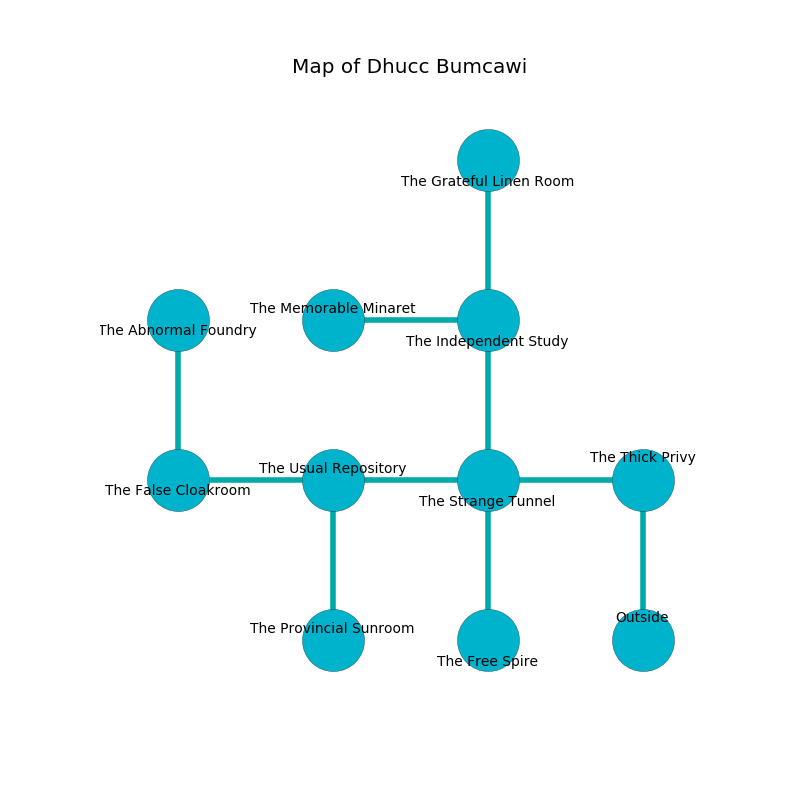

%Ruin Dogs

##Dhucc Bumcawi
###Overview
Dhucc Bumcawi is located in a poisoned mountain. Parts of it are inaccessible. A blizzard is happening outside. It is occupied by Githyanki. Efren Beckman The Compulsive, a Drow Priestess of Lolth is here. The Githyanki are the minions of Efren Beckman The Compulsive. He  is trying to exploit [Ceffaeeha](#Ceffaeeha). 

###Artifact
####Ceffaeeha

Ceffaeeha looks like a hard doll. When picked up it becomes a deadly projectile. 

###Locations

####the thick privy
Yellow lichens are sprouting in a patch on the floor. The obsidion walls are covered in mold. 

* To the west a hazy cave opens to [the strange tunnel](#the-strange-tunnel).
* To the south is the entrance.

####the strange tunnel
The wooden walls are pristine. 

* To the west a dripping passageway opens to [the usual repository](#the-usual-repository).
* To the east a hazy cave connects to [the thick privy](#the-thick-privy).
* To the north a torchlit path connects to [the independent study](#the-independent-study).
* To the south a flooded hall opens to [the free spire](#the-free-spire).

####the usual repository
There are a Wight, a Wererat, a Will-O’-Wisp, and a Giant Elk here. The floor is cluttered with broken glass. The air smells like nut flesh here. 

* [Efren Beckman The Compulsive](#Efren-Beckman-The-Compulsive) is here.
* To the west a torchlit threshold leads to [the false cloakroom](#the-false-cloakroom).
* To the east a dripping passageway leads to [the strange tunnel](#the-strange-tunnel).
* To the south a windy hallway connects to [the provincial sunroom](#the-provincial-sunroom).

####the independent study
Green mushrooms are growing in a patch on the floor. The obsidion walls are caving in. The air smells like medicine here. 

* [Ceffaeeha](#Ceffaeeha) is here.
* To the west a dripping walkway opens to [the memorable minaret](#the-memorable-minaret).
* To the north a flooded path connects to [the grateful linen room](#the-grateful-linen-room).
* To the south a torchlit path connects to [the strange tunnel](#the-strange-tunnel).

####the free spire
There are an Otyugh, a Hezrou, and a Pteranodon here. The floor is glossy. 

* To the north a flooded hall leads to [the strange tunnel](#the-strange-tunnel).

####the false cloakroom
The floor is cluttered with bones. 

* To the east a torchlit threshold opens to [the usual repository](#the-usual-repository).
* To the north a windy passageway opens to [the abnormal foundry](#the-abnormal-foundry).

####the abnormal foundry
The air tastes like magnolia here. There are a Frog, a Couatl, a Chuul, a Hawk, a Werewolf, and a Giant Crab here. The crystal walls are caving in. The floor is sticky. 

* To the south a windy passageway connects to [the false cloakroom](#the-false-cloakroom).

####the provincial sunroom
There are three Githyanki Warriors here. The air tastes like honeydew here. One of the Githyanki is working a mechanism that can launch acid at the Ruin Dogs. 

* To the north a windy hallway connects to [the usual repository](#the-usual-repository).

####the memorable minaret
The mirrored walls are pristine. The air smells like lily here. The floor is glossy. 

* To the east a dripping walkway opens to [the independent study](#the-independent-study).

####the grateful linen room
The floor is cluttered with bones. There are three Githyanki Warriors here. The Githyanki are willing to negotiate. 

* There is a triptych here.
* There is a bell here.
* To the south a flooded path opens to [the independent study](#the-independent-study).

