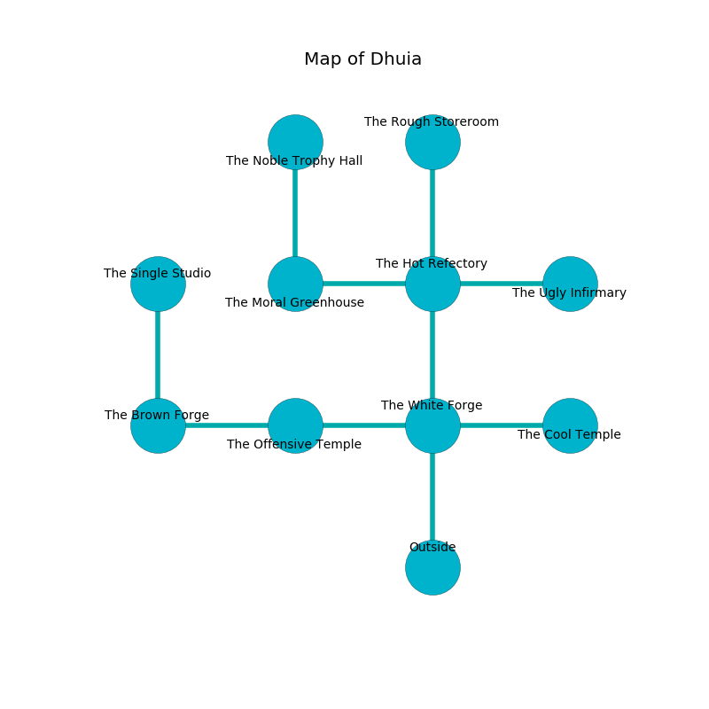

%Ruin Dogs

##Dhuia
###Overview
Dhuia is located under a volcanic rift. Some areas of Dhuia are cursed. A massive flood is happening outside. It is occupied by Satyrs. Jamel Pugh The Truculent, a Sahuagin Baron is here. The Satyrs are the minions of Jamel Pugh The Truculent. He  is trying to hide [Bafaed Aebdecd](#Bafaed-Aebdecd). 

###Artifact
####Bafaed Aebdecd

Bafaed Aebdecd looks like a transparent monument. It smells like root beer. It is a sickly green color. When picked up it turns surrounding objects to ashes. 

###Locations

####the white forge
The floor is smooth. Gray moss is growing from the walls. There are a Monodrone, a Tiger, a Bugbear, a Blue Dragon Wyrmling, a Lizardfolk, a Constrictor Snake, and a Scorpion here. 

* To the west a dark corridor connects to [the offensive temple](#the-offensive-temple).
* To the east a windy pathway opens to [the cool temple](#the-cool-temple).
* To the north a torchlit path connects to [the hot refectory](#the-hot-refectory).
* To the south is the entrance.

####the hot refectory
The floor is bloodstained. The air smells like roasted hazelnut here. There is a trap here. When activated, a magical sound detector will ring a bell. 

* To the west a small artery leads to [the moral greenhouse](#the-moral-greenhouse).
* To the east a narrow gap opens to [the ugly infirmary](#the-ugly-infirmary).
* To the north a long opening connects to [the rough storeroom](#the-rough-storeroom).
* To the south a torchlit path leads to [the white forge](#the-white-forge).

####the cool temple
The obsidion walls are ruined. 

* There is a match here.
* To the west a windy pathway leads to [the white forge](#the-white-forge).

####the moral greenhouse
The floor is flooded with two inch deep cool water. The air tastes like dry	durian here. There are a Will-O’-Wisp, a Kenku, and a Grell here. The metallic walls are bloodstained. 

There is an engraving on a tablet written in Satyrs Script. 

> Poor me! weak fate
>
> afraid and slow
>
> yet late
>
> hope is low
>

* To the east a small artery leads to [the hot refectory](#the-hot-refectory).
* To the north a small hallway connects to [the noble trophy hall](#the-noble-trophy-hall).

####the noble trophy hall
The floor is glossy. There are a Wereboar and an Allosaurus here. The obsidion walls are unsettled. 

There is an engraving on the ceiling written in common. 

> I tried fighting.
>

* To the south a small hallway connects to [the moral greenhouse](#the-moral-greenhouse).

####the rough storeroom
White ferns are growing in a patch on the floor. There are a Warhorse, a Piercer, a Giant Elk, a Killer Whale, and a Giant Goat here. 

* To the south a long opening leads to [the hot refectory](#the-hot-refectory).

####the ugly infirmary
Gray ferns are decaying in broken urns. The air tastes like hops here. 

* To the west a narrow gap leads to [the hot refectory](#the-hot-refectory).

####the offensive temple
The floor is sticky. There is a trap here. When activated, a pressure plate will cast a curse. Red mushrooms are decaying from the walls. 

There is an engraving on the wall written in common. 

> All of us are lost
>
> always hilarious
>
> respectable, abstract, charismatic
>

* To the west a narrow corridor leads to [the brown forge](#the-brown-forge).
* To the east a dark corridor leads to [the white forge](#the-white-forge).

####the brown forge

* [Bafaed Aebdecd](#Bafaed-Aebdecd) is here.
* [Jamel Pugh The Truculent](#Jamel-Pugh-The-Truculent) is here.
* To the east a narrow corridor connects to [the offensive temple](#the-offensive-temple).
* To the north a flooded opening leads to [the single studio](#the-single-studio).

####the single studio
There are a Giant Wasp, a Barbed Devil, a Dire Wolf, and a Violet Fungus here. White ferns are decaying from the walls. The air smells like juniper here. The wooden walls are bloodstained. 

* To the south a flooded opening connects to [the brown forge](#the-brown-forge).

