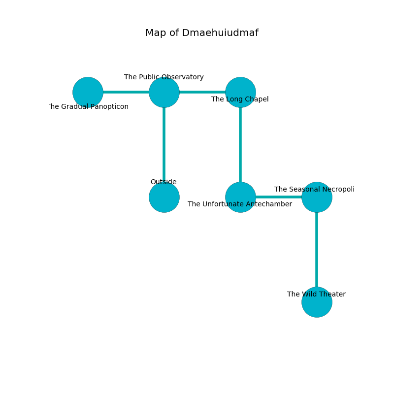

%Ruin Dogs

##Dmaehuiudmaf
###Overview
Dmaehuiudmaf is located under a broken city. Parts of it are flooded. The ruin is larger on the inside than the outside. It is occupied by Centaurs. Sebrina Logue The Untrustworthy, a Veteran is here. The Centaurs worship Sebrina Logue The Untrustworthy. She  is trying to find [Hoaela](#Hoaela). 

###Artifact
####Hoaela

Hoaela is a powerful artifact in the shape of a transparent blade. When eaten it dissappears. 

###Locations

####the public observatory
The air tastes like herbs here. The floor is glossy. 

* To the west a torchlit pathway opens to [the gradual panopticon](#the-gradual-panopticon).
* To the east a small threshold leads to [the long chapel](#the-long-chapel).
* To the south is the entrance.

####the gradual panopticon
The air smells like rancid butter here. The glass walls are covered in mold. There are an Ankylosaurus and a Piercer here. 

* To the east a torchlit pathway leads to [the public observatory](#the-public-observatory).

####the long chapel
There are two Centaurs here. If the Centaurs notice the Ruin Dogs, one of them will retreat and alert [Sebrina Logue](#Sebrina-Logue). 

* To the west a small threshold opens to [the public observatory](#the-public-observatory).
* To the south a torchlit threshold connects to [the unfortunate antechamber](#the-unfortunate-antechamber).

####the unfortunate antechamber
There are two Centaurs here. The floor is cluttered with rocks. Gray ferns are swaying from the walls. The metallic walls are pristine. The air tastes like castoreum here. One of the Centaurs is on watch, the rest are sleeping. 

* There is a cord here.
* To the east a hazy cavern opens to [the seasonal necropolis](#the-seasonal-necropolis).
* To the north a torchlit threshold leads to [the long chapel](#the-long-chapel).

####the seasonal necropolis
The metallic walls are unsettled. The air tastes like roasted chicken here. The floor is smooth. 

* [Hoaela](#Hoaela) is here.
* [Sebrina Logue The Untrustworthy](#Sebrina-Logue-The-Untrustworthy) is here.
* To the west a hazy cavern opens to [the unfortunate antechamber](#the-unfortunate-antechamber).
* To the south a long artery opens to [the wild theater](#the-wild-theater).

####the wild theater
The floor is cluttered with bones. The air tastes like strawberry here. White ferns are swaying from the ceiling. There is a trap here. When activated, a magical rune will launch stone blocks from the ceiling. 

There is an engraving on the floor written in common. 

> Run away.
>

* There is a sceptre here.
* To the north a long artery connects to [the seasonal necropolis](#the-seasonal-necropolis).

