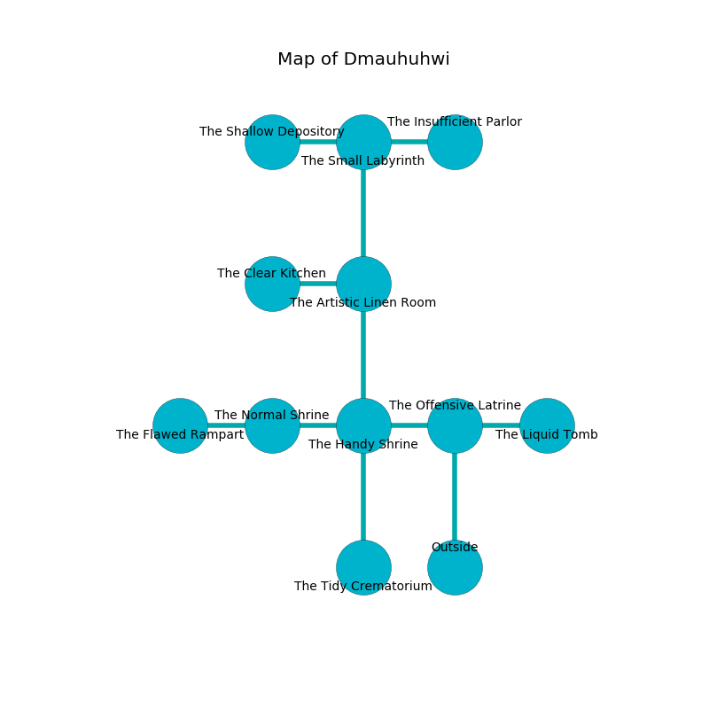

%Ruin Dogs

##Dmauhuhwi
###Overview
Dmauhuhwi is constructed on a flooded city. Some rooms of Dmauhuhwi are flooded. A massive flood is happening outside. It is occupied by Satyrs. Israel Hoppe The Pompous, a Succubus is here. The Satyrs have been charmed by Israel Hoppe The Pompous. He  is founding a new religion. 

###Artifact
####Deia

Deia is a powerful artifact in the shape of a cold orb. It smells like dates. Fire pours away from it. It is a dark black color. When worn it becomes hot. 

###Locations

####the offensive latrine
Yellow razorgrass is swaying from the walls. There is a trap here. When activated, a magical proximity detector will launch an arrow. There are eight Satyrs here. One of the Satyrs is on watch, the rest are sleeping. 

* [Israel Hoppe The Pompous](#Israel-Hoppe-The-Pompous) is here.
* To the west a torchlit pathway connects to [the handy shrine](#the-handy-shrine).
* To the east a hazy cavern leads to [the liquid tomb](#the-liquid-tomb).
* To the south is the entrance.

####the handy shrine
The concrete walls are caving in. 

* To the west a windy opening connects to [the normal shrine](#the-normal-shrine).
* To the east a torchlit pathway leads to [the offensive latrine](#the-offensive-latrine).
* To the north a flooded threshold connects to [the artistic linen room](#the-artistic-linen-room).
* To the south a small walkway connects to [the tidy crematorium](#the-tidy-crematorium).

####the artistic linen room
The floor is sticky. The concrete walls are ruined. 

* To the west a hazy artery connects to [the clear kitchen](#the-clear-kitchen).
* To the north a narrow passageway leads to [the small labyrinth](#the-small-labyrinth).
* To the south a flooded threshold leads to [the handy shrine](#the-handy-shrine).

####the normal shrine
The metallic walls are pristine. Green mushrooms are sprouting in cracks in the floor. 

* There is a drawer here.
* To the west a dripping path connects to [the flawed rampart](#the-flawed-rampart).
* To the east a windy opening connects to [the handy shrine](#the-handy-shrine).

####the tidy crematorium
The floor is bloodstained. There is a trap here. When activated, a magical proximity detector will fire a scything blade. 

* To the north a small walkway leads to [the handy shrine](#the-handy-shrine).

####the flawed rampart
The air tastes like black currant here. Gray ferns are growing in broken urns. The floor is cluttered with ashes. 

* There is a bee here.
* There is a rat here.
* There is a trousers here.
* There is a demon here.
* To the east a dripping path opens to [the normal shrine](#the-normal-shrine).

####the small labyrinth
Red razorgrass is swaying in a patch on the floor. The air tastes like cologne here. The floor is bloodstained. 

* [Deia](#Deia) is here.
* To the west a dripping corridor leads to [the shallow depository](#the-shallow-depository).
* To the east a torchlit walkway opens to [the insufficient parlor](#the-insufficient-parlor).
* To the south a narrow passageway leads to [the artistic linen room](#the-artistic-linen-room).

####the shallow depository
The air tastes like incense here. The mirrored walls are caving in. 

There is an engraving on a monolith written in Satyrs Script. 

> O everything is inhumane
>
> absent and main
>
> funny, weak, old
>
> the world is cold
>

* There is a knot here.
* To the east a dripping corridor opens to [the small labyrinth](#the-small-labyrinth).

####the clear kitchen
There are eight Satyrs here. The floor is bloodstained. The air tastes like graham cracker here. The glass walls are pristine. The Satyrs are willing to negotiate. 

* To the east a hazy artery connects to [the artistic linen room](#the-artistic-linen-room).

####the liquid tomb
The floor is flooded with three inch deep hot water. The wooden walls are bloodstained. There are eight Satyrs here. The Satyrs are performing a ritual. If not interrupted, the ruin dogs will be weakened. 

There is an engraving on the floor written in common. 

> [Deia](#Deia)
>
> cool, unique, lazy
>
> yet comprehensive
>
> color-blind, happy, good
>

* To the west a hazy cavern leads to [the offensive latrine](#the-offensive-latrine).

####the insufficient parlor
The air smells like styrene here. 

* To the west a torchlit walkway connects to [the small labyrinth](#the-small-labyrinth).

