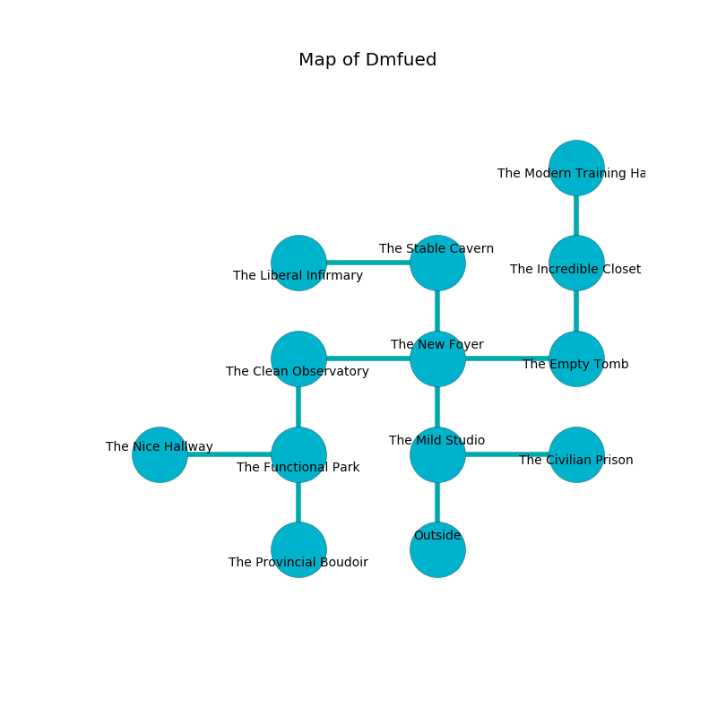

%Ruin Dogs

##Dmfued
###Overview
Dmfued is located in a flooded tree. Some areas of Dmfued are flooded. The ruin is collapsing slowly. It is occupied by Sahuagin. Clare Oswald The Conservative, a Hobgoblin Captain is here. The Sahuagin worship Clare Oswald The Conservative. She  is trying to research [The Legislative Power](#The-Legislative-Power). 

###Artifact
####The Legislative Power

The Legislative Power is a powerful artifact in the shape of a broken rock. It smells like passion fruit. When eaten it glows with an eerie light. 

###Locations

####the mild studio
The glass walls are bloodstained. 

There is an engraving on the ceiling written in common. 

> All of us are hidden
>
> professional, competent, implicit
>
> All of us are hidden
>

* To the east a flooded corridor leads to [the civilian prison](#the-civilian-prison).
* To the north a dark hallway connects to [the new foyer](#the-new-foyer).
* To the south is the entrance.

####the new foyer
The glass walls are pristine. 

* [Clare Oswald The Conservative](#Clare-Oswald-The-Conservative) is here.
* To the west a narrow path leads to [the clean observatory](#the-clean-observatory).
* To the east a torchlit corridor leads to [the empty tomb](#the-empty-tomb).
* To the north a hazy opening connects to [the stable cavern](#the-stable-cavern).
* To the south a dark hallway opens to [the mild studio](#the-mild-studio).

####the empty tomb
The floor is cluttered with bones. 

* To the west a torchlit corridor opens to [the new foyer](#the-new-foyer).
* To the north a dark hall leads to [the incredible closet](#the-incredible-closet).

####the clean observatory
There is a trap here. When activated, a pressure plate will launch a hail of needles. There are four Sahuagin here. White lichens are decaying in broken urns. The air tastes like starfruit here. The crystal walls are bloodstained. The floor is bloodstained. One of the Sahuagin is on watch, the rest are caring for babies. 

* To the east a narrow path leads to [the new foyer](#the-new-foyer).
* To the south a small pathway connects to [the functional park](#the-functional-park).

####the civilian prison
The air smells like acrylate here. 

* To the west a flooded corridor connects to [the mild studio](#the-mild-studio).

####the functional park
There is a Pentadrone here. The air smells like flesh here. Green razorgrass is swaying in broken urns. 

There is an engraving on the floor written in Sahuagin Script. 

> Dear me! sad soul
>
> it is never effective
>
> interesting, harsh, whole
>
> cruelty is objective
>

* There is a feather here.
* [The Legislative Power](#The-Legislative-Power) is here.
* To the west a dark corridor opens to [the nice hallway](#the-nice-hallway).
* To the north a small pathway opens to [the clean observatory](#the-clean-observatory).
* To the south a dripping corridor opens to [the provincial boudoir](#the-provincial-boudoir).

####the stable cavern
The wooden walls are caving in. 

* There is a plow here.
* To the west a flooded path connects to [the liberal infirmary](#the-liberal-infirmary).
* To the south a hazy opening opens to [the new foyer](#the-new-foyer).

####the provincial boudoir
Green mushrooms are swaying in cracks in the floor. The floor is flooded with eight inch deep cold water. The brick walls are scratched. 

There is an engraving on a stone written in Sahuagin Script. 

> I am afraid.
>

* To the north a dripping corridor connects to [the functional park](#the-functional-park).

####the liberal infirmary
The air tastes like licorice here. White razorgrass is decaying in cracks in the floor. 

* There is a bottle here.
* There is a sock here.
* To the east a flooded path opens to [the stable cavern](#the-stable-cavern).

####the incredible closet
There are four Sahuagin here. One of the Sahuagin is on watch, the rest are feasting. 

* To the north a dark hall leads to [the modern training hall](#the-modern-training-hall).
* To the south a dark hall opens to [the empty tomb](#the-empty-tomb).

####the modern training hall

* To the south a dark hall connects to [the incredible closet](#the-incredible-closet).

####the nice hallway
The air smells like boysenberry here. 

There is an engraving on the wall written in Sahuagin Script. 

> A trap ahead.
>

* To the east a dark corridor connects to [the functional park](#the-functional-park).

