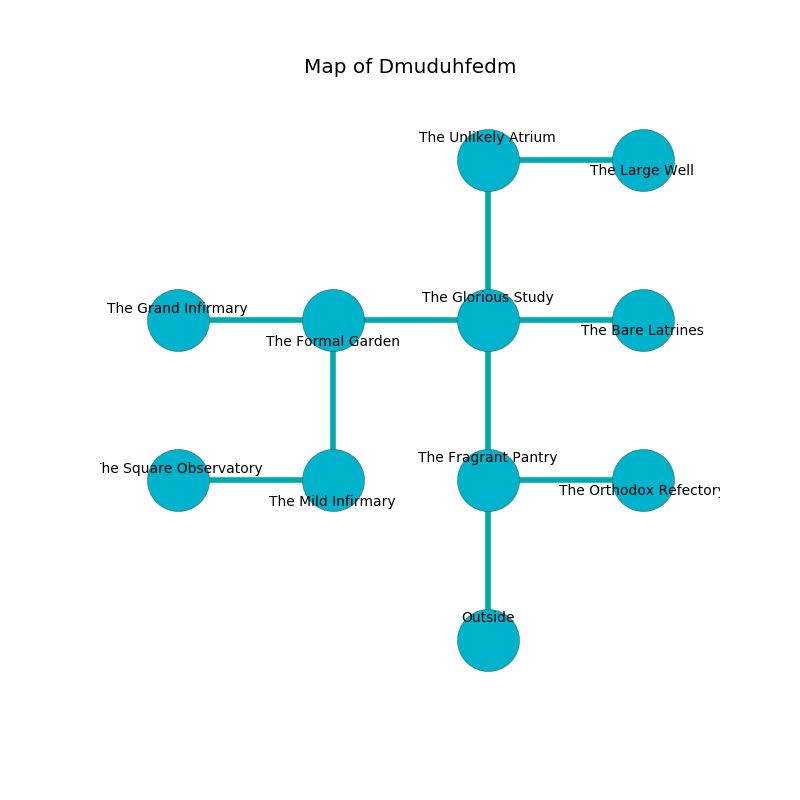

%Ruin Dogs

##Dmuduhfedm
###Overview
Dmuduhfedm is located under a volcanic rift. Parts of Dmuduhfedm are flooded. The ruin is coming to life. It is occupied by Orc. Melina Mccormack The Interfering, a Bandit Captain is here. The Orc are ruled by Melina Mccormack The Interfering. She  is founding a new religion. 

###Artifact
####Aemdamdaeum Bemogecdofaf

Aemdamdaeum Bemogecdofaf is a powerful artifact in the shape of a warm gem. It is a dark yellow color. It smells like plastic. Power slides near it. When thrown it burns the mind. 

###Locations

####the fragrant pantry
The air tastes like pomegranate here. There is a Mummy here. The floor is cluttered with rocks. 

* [Aemdamdaeum Bemogecdofaf](#Aemdamdaeum-Bemogecdofaf) is here.
* To the east a dark passageway connects to [the orthodox refectory](#the-orthodox-refectory).
* To the north a small artery leads to [the glorious study](#the-glorious-study).
* To the south is the entrance.

####the glorious study
There are a Blink Dog, a Swarm of Ravens, a Warhorse Skeleton, a Mimic, a Kuo-Toa, a Pixie, a Sea Horse, a Goat, an Orc, a Scorpion, and a Swarm of Insects here. Green ferns are decaying in broken urns. The floor is glossy. 

There is an engraving on a tablet written in Orc Script. 

> A house is a drawing
>
> yet tender
>
> A skin is a wind
>
> historical, religious, steep
>
> rural, oral, skilled
>
> objective, dangerous, innocent
>

* To the west a narrow cave connects to [the formal garden](#the-formal-garden).
* To the east a dripping hall opens to [the bare latrines](#the-bare-latrines).
* To the north a small passageway opens to [the unlikely atrium](#the-unlikely-atrium).
* To the south a small artery connects to [the fragrant pantry](#the-fragrant-pantry).

####the formal garden
The stone walls are pristine. 

* To the west a dripping cavern connects to [the grand infirmary](#the-grand-infirmary).
* To the east a narrow cave connects to [the glorious study](#the-glorious-study).
* To the south a torchlit pathway leads to [the mild infirmary](#the-mild-infirmary).

####the bare latrines
Gray ferns are growing in cracks in the floor. 

* To the west a dripping hall leads to [the glorious study](#the-glorious-study).

####the unlikely atrium
The air tastes like menthol here. The floor is smooth. The brick walls are ruined. 

* To the east a dark opening leads to [the large well](#the-large-well).
* To the south a small passageway opens to [the glorious study](#the-glorious-study).

####the large well
The air smells like hazelnut here. 

There is an engraving on a tablet written in common. 

> I tried leaving.
>

* There is a shirt here.
* To the west a dark opening opens to [the unlikely atrium](#the-unlikely-atrium).

####the grand infirmary
There are a Lion, a Bugbear Chief, a Young Faerie Dragon, a Scorpion, and a Magmin here. 

* To the east a dripping cavern connects to [the formal garden](#the-formal-garden).

####the mild infirmary
The stone walls are bloodstained. The air tastes like pork here. The floor is glossy. 

There is an engraving on the floor written in common. 

> A frame is a ghost
>
> ambiguous, dynamic, whole
>

* To the west a torchlit cavern leads to [the square observatory](#the-square-observatory).
* To the north a torchlit pathway connects to [the formal garden](#the-formal-garden).

####the square observatory
There is a trap here. When activated, a tripwire will launch a ceiling pendulum. The air smells like eggs here. Blue razorgrass is sprouting from the ceiling. There are six Orcs here. If the Orc notice the Ruin Dogs, one of them will retreat and alert the others. 

There is an engraving on a monolith written in Orc Script. 

> O dire fate
>
> yet never great
>
> it is always shy
>
> everything is dry
>

* To the east a torchlit cavern leads to [the mild infirmary](#the-mild-infirmary).

####the orthodox refectory

* There is a pendant here.
* [Melina Mccormack The Interfering](#Melina-Mccormack-The-Interfering) is here.
* To the west a dark passageway opens to [the fragrant pantry](#the-fragrant-pantry).

