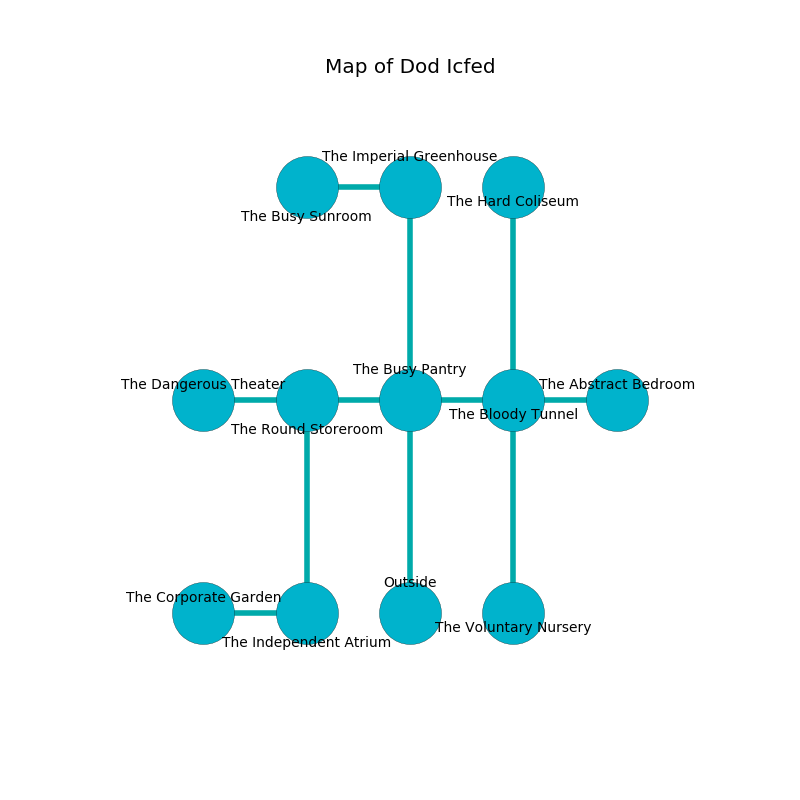

%Ruin Dogs

##Dod Icfed
###Overview
Dod Icfed is located under a crystal rift. Some rooms of Dod Icfed are flooded. A windstorm is happening outside. It is occupied by Humans. Migdalia Beaty The Aloof, an Assassin is here. The Humans are battling Migdalia Beaty The Aloof. She  is founding a new religion. 

###Artifact
####Gufob Baed

Gufob Baed has the form of a wet prism. Light shifts around it. It smells like cinnamon. It is a dark yellow color. When worshipped it sings the hymn of the damned. 

###Locations

####the busy pantry
Gray lichens are growing from the walls. The floor is glossy. There are a Chuul, a Revenant, a Giant Elk, and a Half-Ogre here. The wooden walls are scratched. 

* To the west a long pathway connects to [the round storeroom](#the-round-storeroom).
* To the east a hazy pathway connects to [the bloody tunnel](#the-bloody-tunnel).
* To the north a small threshold leads to [the imperial greenhouse](#the-imperial-greenhouse).
* To the south is the entrance.

####the round storeroom
The floor is sticky. The obsidion walls are bloodstained. 

* To the west a hazy corridor opens to [the dangerous theater](#the-dangerous-theater).
* To the east a long pathway leads to [the busy pantry](#the-busy-pantry).
* To the south a hazy path opens to [the independent atrium](#the-independent-atrium).

####the imperial greenhouse
The floor is cluttered with shells. Yellow lichens are decaying in cracks in the floor. 

* To the west a small artery leads to [the busy sunroom](#the-busy-sunroom).
* To the south a small threshold leads to [the busy pantry](#the-busy-pantry).

####the bloody tunnel
The air smells like turmeric here. The floor is glossy. Yellow ferns are sprouting in cracks in the floor. The wooden walls are pristine. 

* To the west a hazy pathway connects to [the busy pantry](#the-busy-pantry).
* To the east a dripping corridor opens to [the abstract bedroom](#the-abstract-bedroom).
* To the north a windy gap opens to [the hard coliseum](#the-hard-coliseum).
* To the south a dripping cavern connects to [the voluntary nursery](#the-voluntary-nursery).

####the dangerous theater
The air smells like orange here. The metallic walls are ruined. The floor is smooth. There are an Assassin, a Commoner, a Druid, and a Gladiator here. If the Humans notice the Ruin Dogs, one of them will retreat and alert [Migdalia Beaty](#Migdalia-Beaty). 

* To the east a hazy corridor connects to [the round storeroom](#the-round-storeroom).

####the busy sunroom
Gray moss is sprouting in a patch on the floor. There is a trap here. When activated, a magical rune will extend a spring loaded spear. 

There is an engraving on the ceiling written in common. 

> I am lost.
>

* There is a goat here.
* To the east a small artery connects to [the imperial greenhouse](#the-imperial-greenhouse).

####the independent atrium
Blue razorgrass is growing from the ceiling. There are a Drow, a Red Dragon Wyrmling, a Commoner, a Revenant, and a Giant Vulture here. The air tastes like ham here. The metallic walls are caving in. 

There is an engraving on the wall written in Humans Script. 

> I am defending Dod Icfed.
>

* [Gufob Baed](#Gufob-Baed) is here.
* [Migdalia Beaty The Aloof](#Migdalia-Beaty-The-Aloof) is here.
* To the west a small threshold connects to [the corporate garden](#the-corporate-garden).
* To the north a hazy path opens to [the round storeroom](#the-round-storeroom).

####the abstract bedroom
The air smells like violet here. 

* To the west a dripping corridor opens to [the bloody tunnel](#the-bloody-tunnel).

####the voluntary nursery
The air smells like dried fruit here. The floor is smooth. 

* There is a worm here.
* There is a key here.
* To the north a dripping cavern opens to [the bloody tunnel](#the-bloody-tunnel).

####the hard coliseum
The floor is sticky. The air tastes like fenugreek here. 

* To the south a windy gap opens to [the bloody tunnel](#the-bloody-tunnel).

####the corporate garden
The floor is glossy. 

There is an engraving on the wall written in common. 

> I am starving.
>
> Try jumping.
>

* To the east a small threshold connects to [the independent atrium](#the-independent-atrium).

