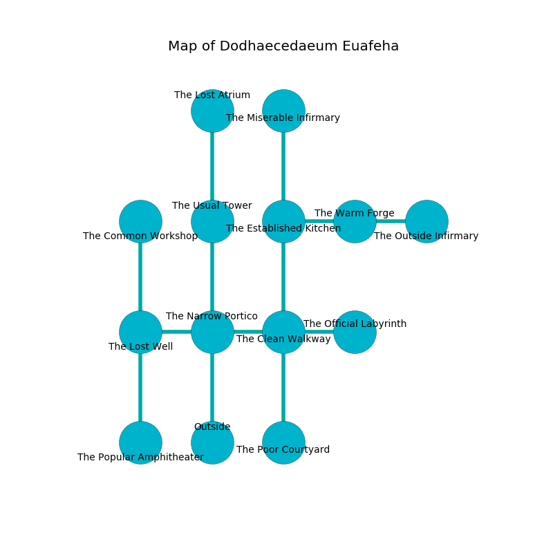

%Ruin Dogs

##Dodhaecedaeum Euafeha
###Overview
Dodhaecedaeum Euafeha is located in an alien plain. Some areas of it are inaccessible. A windstorm is happening outside. It is occupied by Quaggoths. Gregorio Ellsworth The Arrogant, a Fire Giant is here. The Quaggoths are battling Gregorio Ellsworth The Arrogant. He  is founding a new religion. 

###Artifact
####The Eligible Administrator

The Eligible Administrator looks like a transparent cube. When thrown it becomes a shielding force. 

###Locations

####the narrow portico
The wooden walls are covered in mold. Blue ferns are growing from the walls. The floor is sticky. 

There is an engraving on a stone written in Quaggoths Script. 

> A drain is a flu
>
> tired and musical
>
> All of us are frozen
>
> historical and closed
>
> All of us are free
>
> yet stupid
>
> A nail is a grass
>
> geological and archaeological
>
> A drain is a flu
>

* To the west a dripping passageway leads to [the lost well](#the-lost-well).
* To the east a twisted passageway connects to [the clean walkway](#the-clean-walkway).
* To the north a small hallway connects to [the usual tower](#the-usual-tower).
* To the south is the entrance.

####the lost well
The air tastes like cooked onion here. 

* There is a worm here.
* There is a glove here.
* There is a cord here.
* [The Eligible Administrator](#The-Eligible-Administrator) is here.
* To the east a dripping passageway leads to [the narrow portico](#the-narrow-portico).
* To the north a torchlit hall leads to [the common workshop](#the-common-workshop).
* To the south a windy cavern connects to [the popular amphitheater](#the-popular-amphitheater).

####the common workshop
The air smells like spruce here. The floor is smooth. 

* To the south a torchlit hall connects to [the lost well](#the-lost-well).

####the clean walkway
Gray moss is decaying in cracks in the floor. There is a trap here. When activated, a tripwire will make the ceiling slowly lower. The floor is sticky. The crystal walls are covered in mold. There are a Half-Red Dragon Veteran, a Wererat, a Warhorse Skeleton, a Silver Dragon Wyrmling, and a Young Red Dragon here. The air tastes like vinegar here. 

* To the west a twisted passageway connects to [the narrow portico](#the-narrow-portico).
* To the east a windy hall opens to [the official labyrinth](#the-official-labyrinth).
* To the north a twisted artery connects to [the established kitchen](#the-established-kitchen).
* To the south a dripping pathway opens to [the poor courtyard](#the-poor-courtyard).

####the usual tower
The air smells like deertongue here. White lichens are decaying from the walls. 

There is an engraving on the floor written in Quaggoths Script. 

> I found [The Eligible Administrator](#The-Eligible-Administrator).
>
> Do not try hiding.
>

* To the north a hazy corridor connects to [the lost atrium](#the-lost-atrium).
* To the south a small hallway opens to [the narrow portico](#the-narrow-portico).

####the official labyrinth
There are two Quaggoth Thonots and two Quaggoths here. The floor is glossy. Gray moss is growing in broken urns. The Quaggoths are willing to fight to the death. 

There is an engraving on the ceiling written in Quaggoths Script. 

> O! the world is woe
>
> it is always low
>
> always low
>
> all is slow
>

* To the west a windy hall opens to [the clean walkway](#the-clean-walkway).

####the established kitchen
The floor is smooth. The brick walls are covered in mold. There are a Young Red Dragon and a Flameskull here. There is a trap here. When activated, a magical proximity detector will shoot a lightning bolt. 

* To the east a flooded pathway connects to [the warm forge](#the-warm-forge).
* To the north a flooded threshold leads to [the miserable infirmary](#the-miserable-infirmary).
* To the south a twisted artery opens to [the clean walkway](#the-clean-walkway).

####the miserable infirmary

There is an engraving on a monolith written in Quaggoths Script. 

> I am alone.
>

* To the south a flooded threshold leads to [the established kitchen](#the-established-kitchen).

####the warm forge
The floor is bloodstained. There are two Quaggoth Thonots and two Quaggoths here. One of the Quaggoths is on watch, the rest are feasting. 

* There is a dog here.
* To the west a flooded pathway opens to [the established kitchen](#the-established-kitchen).
* To the east a small path connects to [the outside infirmary](#the-outside-infirmary).

####the outside infirmary
The floor is flooded with six inch deep cool water. There are three Quaggoth Thonots and a Quaggoth here. The Quaggoths are celebrating. 

* There is a shoe here.
* To the west a small path opens to [the warm forge](#the-warm-forge).

####the poor courtyard
The metallic walls are unsettled. White mushrooms are swaying from the ceiling. 

* [Gregorio Ellsworth The Arrogant](#Gregorio-Ellsworth-The-Arrogant) is here.
* To the north a dripping pathway leads to [the clean walkway](#the-clean-walkway).

####the lost atrium
Green razorgrass is sprouting in a patch on the floor. The brick walls are ruined. 

* To the south a hazy corridor leads to [the usual tower](#the-usual-tower).

####the popular amphitheater
White razorgrass is sprouting from the ceiling. The air smells like mushroom here. The stone walls are ruined. 

* To the north a windy cavern leads to [the lost well](#the-lost-well).

