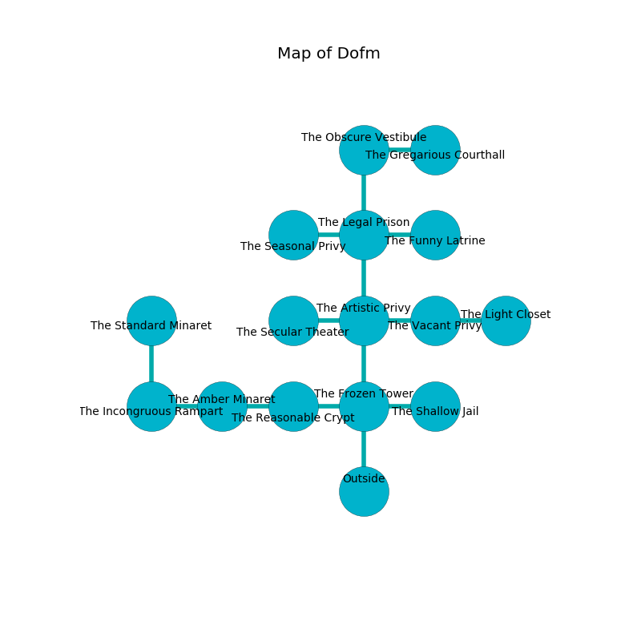

%Ruin Dogs

##Dofm
###Overview
Dofm is located on a poisoned plain. Some rooms of it are flooded. A blizzard is happening outside. It is occupied by Vampires. Alan Bradshaw The Cynical, a Frost Giant is here. The Vampires are ruled by Alan Bradshaw The Cynical. He  is founding a new religion. 

###Artifact
####The Past Tumour

The Past Tumour looks like an opaque rock. Power incinerates from it. It is a bright blue color. When gazed upon it grants power to its owner. 

###Locations

####the frozen tower
There are two Vampire Spawns here. The metallic walls are scratched. If the Vampires notice the Ruin Dogs, one of them will retreat and alert the others. 

* There is a bee here.
* To the west a twisted opening opens to [the reasonable crypt](#the-reasonable-crypt).
* To the east a hazy artery opens to [the shallow jail](#the-shallow-jail).
* To the north a hazy cave leads to [the artistic privy](#the-artistic-privy).
* To the south is the entrance.

####the artistic privy
There are a Blink Dog, a Swarm of Ravens, a Shadow, a Dretch, an Owl, a Bandit, a Bone Naga, and a Gibbering Mouther here. 

* To the west a twisted artery connects to [the secular theater](#the-secular-theater).
* To the east a flooded threshold leads to [the vacant privy](#the-vacant-privy).
* To the north a long path opens to [the legal prison](#the-legal-prison).
* To the south a hazy cave connects to [the frozen tower](#the-frozen-tower).

####the legal prison
The air tastes like metal here. Green mushrooms are sprouting from the ceiling. The floor is flooded with two inch deep lukewarm water. 

* To the west a small pathway opens to [the seasonal privy](#the-seasonal-privy).
* To the east a windy hallway opens to [the funny latrine](#the-funny-latrine).
* To the north a narrow walkway connects to [the obscure vestibule](#the-obscure-vestibule).
* To the south a long path opens to [the artistic privy](#the-artistic-privy).

####the obscure vestibule
The wooden walls are caving in. White moss is swaying from the ceiling. There are two Vampire Spawns here. If the Vampires notice the Ruin Dogs, one of them will retreat and alert [Alan Bradshaw](#Alan-Bradshaw). 

* There is a spoon here.
* To the east a narrow path opens to [the gregarious courthall](#the-gregarious-courthall).
* To the south a narrow walkway connects to [the legal prison](#the-legal-prison).

####the reasonable crypt
The brick walls are bloodstained. 

* To the west a dripping path leads to [the amber minaret](#the-amber-minaret).
* To the east a twisted opening leads to [the frozen tower](#the-frozen-tower).

####the amber minaret
There are an Incubus, a Flameskull, and a Brown Bear here. 

There is an engraving on the ceiling written in common. 

> Oh my! my fate is inhumane
>
> handy and vain
>
> but never cute
>
> life is acute
>

* [Alan Bradshaw The Cynical](#Alan-Bradshaw-The-Cynical) is here.
* To the west a long threshold connects to [the incongruous rampart](#the-incongruous-rampart).
* To the east a dripping path opens to [the reasonable crypt](#the-reasonable-crypt).

####the seasonal privy
The crystal walls are caving in. The air smells like davana here. There are an Ankheg, a Jackal, a Gas Spore, a Thri-Kreen, a Vine Blight, a Gelatinous Cube, a Mule, and a Green Dragon Wyrmling here. 

* To the east a small pathway connects to [the legal prison](#the-legal-prison).

####the funny latrine

* To the west a windy hallway connects to [the legal prison](#the-legal-prison).

####the gregarious courthall
White mushrooms are growing from the walls. The air tastes like yuzu here. 

* There is a cow here.
* To the west a narrow path leads to [the obscure vestibule](#the-obscure-vestibule).

####the vacant privy
There are a Gargoyle, a Spirit Naga, and a Giant Crab here. The wooden walls are pristine. 

* [The Past Tumour](#The-Past-Tumour) is here.
* To the west a flooded threshold connects to [the artistic privy](#the-artistic-privy).
* To the east a dark cave leads to [the light closet](#the-light-closet).

####the incongruous rampart
There are a Doppelganger, a Sahuagin, a Reef Shark, a Mule, a Green Dragon Wyrmling, and an Awakened Tree here. The air smells like jasmin here. 

There is an engraving on the ceiling written in common. 

> O! terrible fate
>
> supplementary, definite, late
>
> agile and express
>
> life is straight
>

* To the east a long threshold leads to [the amber minaret](#the-amber-minaret).
* To the north a narrow cavern leads to [the standard minaret](#the-standard-minaret).

####the shallow jail
There are two Vampire Spawns here. The air smells like peony here. One of the Vampires is on watch, the rest are fighting amongst themselves. 

There is an engraving on a monolith written in common. 

> All of us are sorrowful
>
> unexpected and multiple
>

* To the west a hazy artery connects to [the frozen tower](#the-frozen-tower).

####the standard minaret
The glass walls are ruined. The air tastes like agarwood here. White moss is decaying in cracks in the floor. 

There is an engraving on the wall written in common. 

> Oh meak we
>
> but free
>
> but ultimate
>
> nothing is free
>

* To the south a narrow cavern connects to [the incongruous rampart](#the-incongruous-rampart).

####the secular theater
There are two Vampire Spawns here. The wooden walls are ruined. The air tastes like fermentation here. The Vampires are willing to negotiate. 

* To the east a twisted artery leads to [the artistic privy](#the-artistic-privy).

####the light closet
The air smells like medicine here. The crystal walls are ruined. Blue moss is growing from the walls. The floor is smooth. 

There is an engraving on the wall written in Vampires Script. 

> I am hiding in Dofm.
>

* To the west a dark cave leads to [the vacant privy](#the-vacant-privy).

