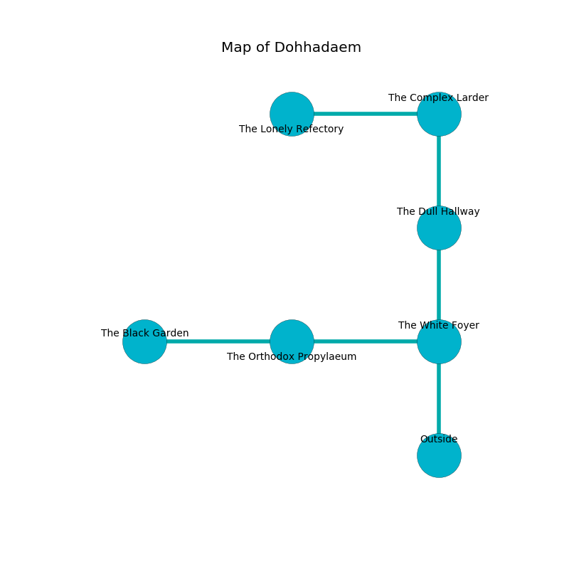

%Ruin Dogs

##Dohhadaem
###Overview
Dohhadaem is located in a haunted plain. Some areas of it are corrupted. The ruin is collapsing slowly. It is occupied by Duergars. Wilmer Lavigne The Obstinate, a Mind Flayer Arcanist is here. The Duergars are battling Wilmer Lavigne The Obstinate. He  is trying to research [The Jealous Solidarity](#The-Jealous-Solidarity). 

###Artifact
####The Jealous Solidarity

The Jealous Solidarity looks like a soft spear. It is a dark purple color. When rubbed it turns surrounding objects to ashes. 

###Locations

####the white foyer
The brick walls are caving in. 

There is an engraving on a monolith written in common. 

> Dear me! meak you
>
> it is never due
>
> yet bad
>
> death is sad
>

* [Wilmer Lavigne The Obstinate](#Wilmer-Lavigne-The-Obstinate) is here.
* To the west a flooded pathway opens to [the orthodox propylaeum](#the-orthodox-propylaeum).
* To the north a narrow pathway opens to [the dull hallway](#the-dull-hallway).
* To the south is the entrance.

####the dull hallway
The air smells like chive here. 

* There is a femur here.
* To the north a dark corridor connects to [the complex larder](#the-complex-larder).
* To the south a narrow pathway opens to [the white foyer](#the-white-foyer).

####the orthodox propylaeum
Yellow mushrooms are growing in cracks in the floor. The wooden walls are scratched. The floor is smooth. 

* There is a shoe here.
* There is a button here.
* To the west a small cavern leads to [the black garden](#the-black-garden).
* To the east a flooded pathway leads to [the white foyer](#the-white-foyer).

####the black garden
The air tastes like alcohol here. The obsidion walls are scratched. 

* To the east a small cavern connects to [the orthodox propylaeum](#the-orthodox-propylaeum).

####the complex larder

* [The Jealous Solidarity](#The-Jealous-Solidarity) is here.
* To the west a hazy artery connects to [the lonely refectory](#the-lonely-refectory).
* To the south a dark corridor connects to [the dull hallway](#the-dull-hallway).

####the lonely refectory
There are nine Duergars here. One of the Duergars is on watch, the rest are caring for babies. 

* To the east a hazy artery opens to [the complex larder](#the-complex-larder).

