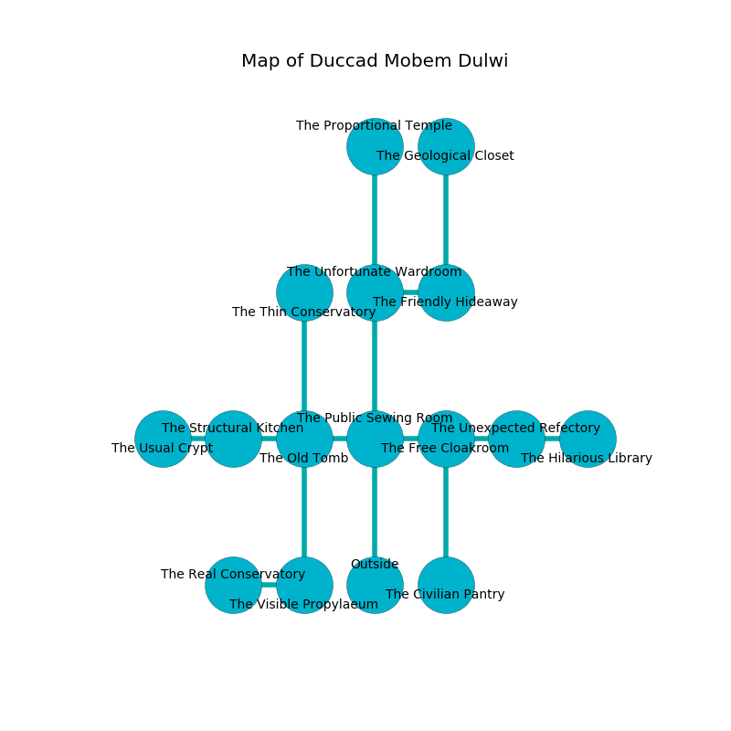

%Ruin Dogs

##Duccad Mobem Dulwi
###Overview
Duccad Mobem Dulwi is located on a giant city. Some areas of Duccad Mobem Dulwi are somewhat hot. A battle between raiders is happening outside. It is occupied by Pixies. Dorian Oakley The Interfering, a Frost Giant is here. The Pixies are battling Dorian Oakley The Interfering. She  is founding a new religion. 

###Artifact
####The Logical Battle

The Logical Battle looks like a sharp doll. Fire slips towards it. When eaten it sings the hymn of the damned. 

###Locations

####the public sewing room
The obsidion walls are bloodstained. The floor is flooded with two inch deep cool water. Yellow ferns are growing in broken urns. 

* To the west a windy cavern opens to [the old tomb](#the-old-tomb).
* To the east a hazy hall connects to [the free cloakroom](#the-free-cloakroom).
* To the north a dark hallway opens to [the unfortunate wardroom](#the-unfortunate-wardroom).
* To the south is the entrance.

####the old tomb
The air tastes like nut flesh here. Yellow mushrooms are sprouting in cracks in the floor. The stone walls are pristine. There is a trap here. When activated, a magical rune will make the ceiling slowly lower. 

* To the west a dripping corridor connects to [the structural kitchen](#the-structural-kitchen).
* To the east a windy cavern opens to [the public sewing room](#the-public-sewing-room).
* To the north a dark path leads to [the thin conservatory](#the-thin-conservatory).
* To the south a hazy passageway connects to [the visible propylaeum](#the-visible-propylaeum).

####the unfortunate wardroom
Red moss is sprouting in a patch on the floor. The floor is sticky. 

* [The Logical Battle](#The-Logical-Battle) is here.
* To the east a twisted cavern opens to [the friendly hideaway](#the-friendly-hideaway).
* To the north a small passageway opens to [the proportional temple](#the-proportional-temple).
* To the south a dark hallway opens to [the public sewing room](#the-public-sewing-room).

####the free cloakroom
The floor is glossy. The air smells like horhound here. There are a Barlgura and a Blue Slaad here. 

* There is a cart here.
* To the west a hazy hall leads to [the public sewing room](#the-public-sewing-room).
* To the east a small opening connects to [the unexpected refectory](#the-unexpected-refectory).
* To the south a narrow opening leads to [the civilian pantry](#the-civilian-pantry).

####the thin conservatory
There are a Badger, a Merrow, a Fire Snake, a Werewolf, and a Troll here. Yellow moss is decaying in a patch on the floor. 

* To the south a dark path opens to [the old tomb](#the-old-tomb).

####the friendly hideaway
The stone walls are caving in. 

* To the west a twisted cavern opens to [the unfortunate wardroom](#the-unfortunate-wardroom).
* To the north a dripping cavern opens to [the geological closet](#the-geological-closet).

####the unexpected refectory
The floor is cluttered with rocks. Green mushrooms are swaying from the ceiling. 

There is an engraving on a stone written in common. 

> I am worshipping this place.
>
> Try praying.
>

* To the west a small opening leads to [the free cloakroom](#the-free-cloakroom).
* To the east a small pathway connects to [the hilarious library](#the-hilarious-library).

####the hilarious library
The air smells like shellfish here. The floor is flooded with one inch deep scalding water. White lichens are growing from the walls. The concrete walls are scratched. 

* There is a treasure here.
* To the west a small pathway leads to [the unexpected refectory](#the-unexpected-refectory).

####the civilian pantry
The air smells like coconut here. The mirrored walls are pristine. There are a Magma Mephit, a Myconid Sprout, a Gnoll, a Kenku, a Giant Goat, a Quaggoth Spore Servant, a Warhorse, an Owl, and a Shadow Demon here. The floor is flooded with nine inch deep cool water. Blue ferns are decaying in cracks in the floor. 

* To the north a narrow opening leads to [the free cloakroom](#the-free-cloakroom).

####the visible propylaeum
There is a trap here. When activated, a magical proximity detector will flood the room with water. White razorgrass is decaying from the ceiling. The floor is sticky. 

* To the west a long corridor connects to [the real conservatory](#the-real-conservatory).
* To the north a hazy passageway connects to [the old tomb](#the-old-tomb).

####the real conservatory
There are thirty two Pixies here. The brick walls are scratched. One of the Pixies is working a mechanism that can lock the exits. 

* To the east a long corridor connects to [the visible propylaeum](#the-visible-propylaeum).

####the structural kitchen
The floor is flooded with one inch deep cool water. The air smells like acerola here. White moss is swaying in broken urns. 

* To the west a flooded gap opens to [the usual crypt](#the-usual-crypt).
* To the east a dripping corridor connects to [the old tomb](#the-old-tomb).

####the geological closet
There are a Kuo-Toa Monitor, a Zombie, a Hunter Shark, a Worg, a Scout, a Slaad Tadpole, and a Myconid Sovereign here. The air smells like bacon here. The floor is glossy. 

* [Dorian Oakley The Interfering](#Dorian-Oakley-The-Interfering) is here.
* To the south a dripping cavern leads to [the friendly hideaway](#the-friendly-hideaway).

####the usual crypt
The floor is glossy. White mushrooms are decaying in a patch on the floor. There are thirty two Pixies here. One of the Pixies is pointing a ballista at the entrance. 

There is an engraving on the floor written in common. 

> Leave at once.
>

* To the east a flooded gap connects to [the structural kitchen](#the-structural-kitchen).

####the proportional temple
The air smells like cooked onion here. The floor is smooth. 

* To the south a small passageway connects to [the unfortunate wardroom](#the-unfortunate-wardroom).

