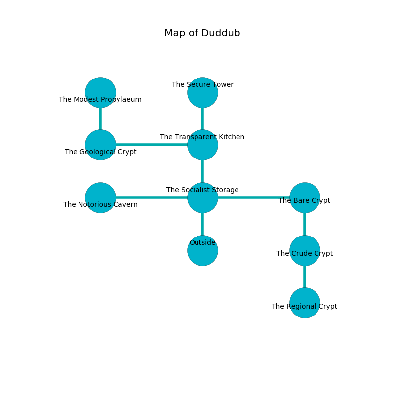

%Ruin Dogs

##Duddub
###Overview
Duddub is located under a spikey mountain. Some rooms of Duddub are flooded. A windstorm is happening outside. It is occupied by Myconids. Jarvis Orellana The Flirtatious, a Stone Giant is here. The Myconids have been charmed by Jarvis Orellana The Flirtatious. He  is trying to exploit [Hagd](#Hagd). 

###Artifact
####Hagd

Hagd has the form of a smooth gem. It is a medium white color. When worn it tunnels into the earth. 

###Locations

####the socialist storage
There are three Myconid Sovereigns and four Myconid Adults here. Green mushrooms are decaying from the ceiling. The Myconids are defending this room from intruders. 

* To the west a small pathway leads to [the notorious cavern](#the-notorious-cavern).
* To the east a dark artery leads to [the bare crypt](#the-bare-crypt).
* To the north a long cavern opens to [the transparent kitchen](#the-transparent-kitchen).
* To the south is the entrance.

####the transparent kitchen
There are three Myconid Sovereigns and four Myconid Adults here. There is a trap here. When activated, a tripwire will blast flames. The Myconids are willing to fight to the death. 

There is an engraving on the ceiling written in Myconids Script. 

> I am lost in Duddub.
>

* To the west a torchlit threshold leads to [the geological crypt](#the-geological-crypt).
* To the north a twisted corridor opens to [the secure tower](#the-secure-tower).
* To the south a long cavern opens to [the socialist storage](#the-socialist-storage).

####the notorious cavern
The air smells like lilac here. Blue lichens are sprouting from the ceiling. There is a trap here. When activated, a magical proximity detector will launch a hail of needles. 

* To the east a small pathway leads to [the socialist storage](#the-socialist-storage).

####the geological crypt
The floor is cluttered with ashes. Green ferns are sprouting in broken urns. There are a Winter Wolf, a Medusa, a Banshee, and a Duodrone here. 

* To the east a torchlit threshold opens to [the transparent kitchen](#the-transparent-kitchen).
* To the north a narrow opening leads to [the modest propylaeum](#the-modest-propylaeum).

####the bare crypt
The stone walls are unsettled. The air tastes like carrot seed here. The floor is cluttered with bones. 

* To the west a dark artery opens to [the socialist storage](#the-socialist-storage).
* To the south a narrow passageway opens to [the crude crypt](#the-crude-crypt).

####the modest propylaeum
The air smells like lilac here. Red razorgrass is growing from the walls. 

* To the south a narrow opening leads to [the geological crypt](#the-geological-crypt).

####the secure tower
There are a Badger, a Goblin Boss, a Hydra, a Swarm of Ravens, and a Deer here. The air smells like white rose here. 

* To the south a twisted corridor leads to [the transparent kitchen](#the-transparent-kitchen).

####the crude crypt
The metallic walls are bloodstained. The floor is glossy. There is a trap here. When activated, a pressure plate will open a trapdoor in the floor. The air smells like roasted meaty here. Blue razorgrass is sprouting in a patch on the floor. 

There is an engraving on the floor written in Myconids Script. 

> Maybe try leaving.
>

* There is a wand here.
* [Hagd](#Hagd) is here.
* To the north a narrow passageway opens to [the bare crypt](#the-bare-crypt).
* To the south a narrow threshold connects to [the regional crypt](#the-regional-crypt).

####the regional crypt

* [Jarvis Orellana The Flirtatious](#Jarvis-Orellana-The-Flirtatious) is here.
* To the north a narrow threshold connects to [the crude crypt](#the-crude-crypt).

