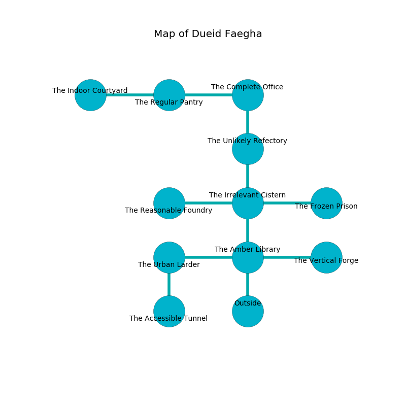

%Ruin Dogs

##Dueid Faegha
###Overview
Dueid Faegha is constructed on a giant city. Some rooms of Dueid Faegha are cursed. A windstorm is happening outside. It is occupied by Kuo-Toa. Kip Reese The Quick-Tempered, a Yuan-Ti Malison is here. The Kuo-Toa worship Kip Reese The Quick-Tempered. He  is founding a new religion. 

###Artifact
####The Physical Hip

The Physical Hip is a powerful artifact in the shape of a hard figurine. It smells like bell pepper. It is a dark white color. When gazed upon it grants power to its owner. 

###Locations

####the amber library
The brick walls are ruined. The air smells like carrot seed here. The floor is sticky. 

* There is a goat here.
* To the west a long gap connects to [the urban larder](#the-urban-larder).
* To the east a windy opening connects to [the vertical forge](#the-vertical-forge).
* To the north a small pathway leads to [the irrelevant cistern](#the-irrelevant-cistern).
* To the south is the entrance.

####the irrelevant cistern
The floor is bloodstained. Yellow ferns are decaying in cracks in the floor. 

* To the west a small threshold leads to [the reasonable foundry](#the-reasonable-foundry).
* To the east a long threshold opens to [the frozen prison](#the-frozen-prison).
* To the north a hazy hall leads to [the unlikely refectory](#the-unlikely-refectory).
* To the south a small pathway connects to [the amber library](#the-amber-library).

####the vertical forge
Green mushrooms are decaying in a patch on the floor. 

There is an engraving on a monolith written in common. 

> I am cruel.
>
> I thought about cowering.
>

* [Kip Reese The Quick-Tempered](#Kip-Reese-The-Quick-Tempered) is here.
* To the west a windy opening leads to [the amber library](#the-amber-library).

####the frozen prison
The floor is bloodstained. The air smells like narcissus here. 

* To the west a long threshold opens to [the irrelevant cistern](#the-irrelevant-cistern).

####the unlikely refectory
The floor is smooth. There is a trap here. When activated, a magical sound detector will launch a ceiling pendulum. Blue ferns are swaying in broken urns. The brick walls are scratched. There are two Kuo-Toa Whips, a Kuo-Toa Monitor, four Kuo-Toa,  here. The Kuo-Toa are performing a ritual. If not interrupted, the ruin dogs will be weakened. 

* To the north a narrow corridor connects to [the complete office](#the-complete-office).
* To the south a hazy hall opens to [the irrelevant cistern](#the-irrelevant-cistern).

####the urban larder
The mirrored walls are scratched. The floor is bloodstained. White razorgrass is swaying in cracks in the floor. 

There is an engraving on a stone written in common. 

> I am lost in Dueid Faegha.
>

* [The Physical Hip](#The-Physical-Hip) is here.
* To the east a long gap opens to [the amber library](#the-amber-library).
* To the south a hazy hallway leads to [the accessible tunnel](#the-accessible-tunnel).

####the reasonable foundry
The floor is smooth. 

* To the east a small threshold opens to [the irrelevant cistern](#the-irrelevant-cistern).

####the complete office
There are a Giant Octopus, a Lamia, and an Awakened Tree here. The floor is glossy. 

There is an engraving on a stone written in common. 

> I am afraid.
>
> Run away.
>

* There is a cow here.
* To the west a torchlit cave leads to [the regular pantry](#the-regular-pantry).
* To the south a narrow corridor opens to [the unlikely refectory](#the-unlikely-refectory).

####the regular pantry

There is an engraving on a tablet written in Kuo-Toa Script. 

> I am hiding in this place.
>

* There is a mug here.
* There is a rat here.
* There is a baby here.
* To the west a dark walkway leads to [the indoor courtyard](#the-indoor-courtyard).
* To the east a torchlit cave leads to [the complete office](#the-complete-office).

####the indoor courtyard
The floor is sticky. Gray mushrooms are swaying from the ceiling. There are a Hook Horror, a Reef Shark, a Hobgoblin Captain, a Giant Crab, and a Baboon here. The air smells like logenberry here. 

* There is a sheep here.
* There is an eye here.
* To the east a dark walkway leads to [the regular pantry](#the-regular-pantry).

####the accessible tunnel
The wooden walls are pristine. The air tastes like citrus peel here. There are a Kuo-Toa Whip and a Kuo-Toa Monitor here. The Kuo-Toa are willing to negotiate. 

* To the north a hazy hallway opens to [the urban larder](#the-urban-larder).

