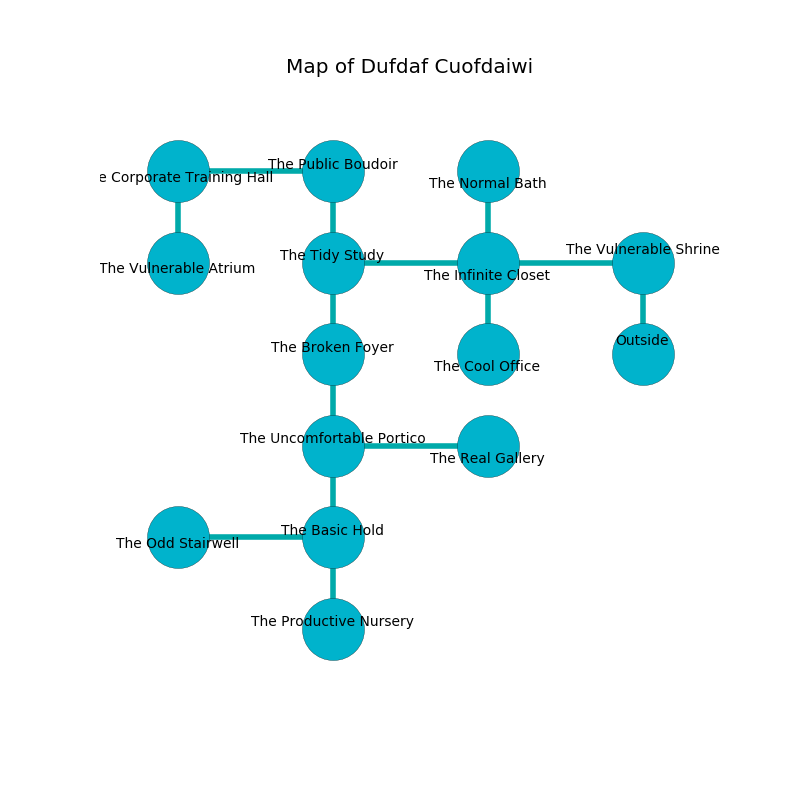

%Ruin Dogs

##Dufdaf Cuofdaiwi
###Overview
Dufdaf Cuofdaiwi is located under an alien mountain. Parts of Dufdaf Cuofdaiwi are cursed. The ruin is burning. It is occupied by Drows. Lori Spence The Self-Indulgent, an Orc War Chief is here. The Drows are the soldiers of Lori Spence The Self-Indulgent. She  is founding a new religion. 

###Artifact
####The Enjoyable Girl

The Enjoyable Girl is a powerful artifact in the shape of a transparent meteorite. It is a pale orange color. It smells like anise. When rubbed it curses all nearby. 

###Locations

####the vulnerable shrine
There is a trap here. When activated, a magical sound detector will launch an arrow. There are twenty Drows here. The Drows are performing a ritual. If not interrupted, the ruin dogs will be weakened. 

* To the west a long passageway leads to [the infinite closet](#the-infinite-closet).
* To the south is the entrance.

####the infinite closet
White moss is decaying in broken urns. The metallic walls are bloodstained. The air tastes like horhound here. 

* To the west a long threshold leads to [the tidy study](#the-tidy-study).
* To the east a long passageway opens to [the vulnerable shrine](#the-vulnerable-shrine).
* To the north a dark artery opens to [the normal bath](#the-normal-bath).
* To the south a narrow threshold opens to [the cool office](#the-cool-office).

####the cool office
The floor is bloodstained. The stone walls are pristine. There are an Owlbear, a Yuan-Ti Pureblood, a Quipper, a Copper Dragon Wyrmling, a Steam Mephit, and a Vulture here. Gray mushrooms are sprouting in broken urns. 

There is an engraving on a tablet written in Drows Script. 

> I found Dufdaf Cuofdaiwi.
>
> Leave at once.
>

* To the north a narrow threshold connects to [the infinite closet](#the-infinite-closet).

####the tidy study
Green mushrooms are sprouting from the ceiling. The air smells like taco here. 

* To the east a long threshold leads to [the infinite closet](#the-infinite-closet).
* To the north a long hallway connects to [the public boudoir](#the-public-boudoir).
* To the south a twisted cavern leads to [the broken foyer](#the-broken-foyer).

####the normal bath
Yellow ferns are swaying from the walls. The floor is bloodstained. The obsidion walls are ruined. There are a Blink Dog, a Hawk, a Warhorse Skeleton, an Elk, and a Beholder Zombie here. 

There is an engraving on the ceiling written in common. 

> I am young.
>

* To the south a dark artery connects to [the infinite closet](#the-infinite-closet).

####the broken foyer
The air smells like cooked apple here. The floor is bloodstained. There are twenty Drows here. The concrete walls are caving in. The Drows are willing to fight to the death. 

* To the north a twisted cavern connects to [the tidy study](#the-tidy-study).
* To the south a dark hall opens to [the uncomfortable portico](#the-uncomfortable-portico).

####the public boudoir
There are a Lamia, a Poltergeist, and a Reef Shark here. The air smells like hay here. The floor is smooth. There is a trap here. When activated, a magical rune will fire a scything blade. 

* To the west a dripping pathway connects to [the corporate training hall](#the-corporate-training-hall).
* To the south a long hallway leads to [the tidy study](#the-tidy-study).

####the uncomfortable portico
The crystal walls are caving in. The floor is bloodstained. 

* There is a treasure here.
* [Lori Spence The Self-Indulgent](#Lori-Spence-The-Self-Indulgent) is here.
* To the east a dark pathway connects to [the real gallery](#the-real-gallery).
* To the north a dark hall leads to [the broken foyer](#the-broken-foyer).
* To the south a windy passageway connects to [the basic hold](#the-basic-hold).

####the corporate training hall
There are a Wight, a Scarecrow, and a Dire Wolf here. The floor is glossy. The air smells like sulfur here. Yellow razorgrass is growing in a patch on the floor. 

There is an engraving on the ceiling written in common. 

> I tried hiding.
>

* There is a hoard here.
* To the east a dripping pathway leads to [the public boudoir](#the-public-boudoir).
* To the south a hazy threshold connects to [the vulnerable atrium](#the-vulnerable-atrium).

####the vulnerable atrium
White moss is swaying in broken urns. The air tastes like oak wood here. 

There is an engraving on the wall written in Drows Script. 

> They are damned
>
> feminine, important, proud
>
> They are envious
>
> discreet and ethnic
>
> but representative
>
> but never specified
>
> yet flat
>
> comfortable and unexpected
>
> delicate, effective, political
>
> accurate and invisible
>

* There is a seed here.
* To the north a hazy threshold leads to [the corporate training hall](#the-corporate-training-hall).

####the basic hold
The air smells like humus here. The floor is sticky. 

* [The Enjoyable Girl](#The-Enjoyable-Girl) is here.
* To the west a dark hallway leads to [the odd stairwell](#the-odd-stairwell).
* To the north a windy passageway opens to [the uncomfortable portico](#the-uncomfortable-portico).
* To the south a long walkway connects to [the productive nursery](#the-productive-nursery).

####the real gallery
Green razorgrass is sprouting from the ceiling. There is a Wraith here. The concrete walls are pristine. 

There is an engraving on the floor written in common. 

> O! weak we
>
> it is always free
>
> balanced, ugly, rough
>
> everything is tough
>

* To the west a dark pathway opens to [the uncomfortable portico](#the-uncomfortable-portico).

####the odd stairwell
White razorgrass is sprouting in broken urns. There are twenty Drows here. The Drows are performing a ritual. If not interrupted, a powerful monster will be summoned. 

* To the east a dark hallway leads to [the basic hold](#the-basic-hold).

####the productive nursery
There are twenty Drows here. The air smells like hay here. The mirrored walls are scratched. The Drows are drunk. 

There is an engraving on a tablet written in Drows Script. 

> Poor me! death is sadistic
>
> direct and automatic
>
> always characteristic
>
> sadness is charismatic
>

* To the north a long walkway connects to [the basic hold](#the-basic-hold).

