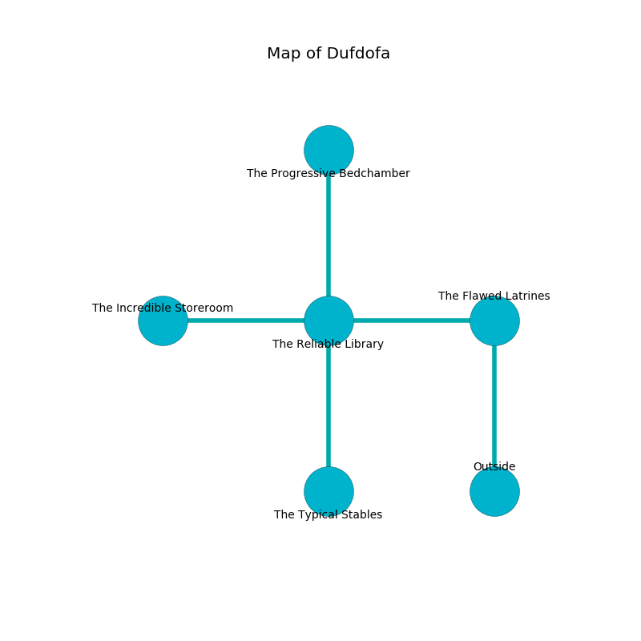

%Ruin Dogs

##Dufdofa
###Overview
Dufdofa is located in a giant rift. Regions of Dufdofa are flooded. A solar eclipse is happening outside. It is occupied by Lizardfolk. Honey Herman The Finicky, a Bulette is here. The Lizardfolk are battling Honey Herman The Finicky. She  is founding a new religion. 

###Artifact
####Laefacdaeum

Laefacdaeum looks like a transparent crystal. When cradled it become energized with a powerful vibration. 

###Locations

####the flawed latrines
The air tastes like egg yolk here. The concrete walls are covered in mold. There are a Lizardfolk Shaman and four Lizardfolk here. One of the Lizardfolk is pointing a ballista at the entrance. 

There is an engraving on the floor written in Lizardfolk Script. 

> Dig here.
>

* To the west a narrow hallway connects to [the reliable library](#the-reliable-library).
* To the south is the entrance.

####the reliable library
There are a Thug, a Ghast, a Drow, a Lizard King, and a Shrieker here. 

There is an engraving on the floor written in Lizardfolk Script. 

> Oh life is sadistic
>
> first, environmental, just
>
> but never artistic
>
> the world is socialist
>

* [Laefacdaeum](#Laefacdaeum) is here.
* To the west a long hall leads to [the incredible storeroom](#the-incredible-storeroom).
* To the east a narrow hallway connects to [the flawed latrines](#the-flawed-latrines).
* To the north a windy opening leads to [the progressive bedchamber](#the-progressive-bedchamber).
* To the south a windy artery connects to [the typical stables](#the-typical-stables).

####the progressive bedchamber
The stone walls are pristine. The air tastes like cauliflower here. Blue moss is swaying in broken urns. There is a trap here. When activated, a magical sound detector will swing a tripping chain. The floor is flooded with eight inch deep cool water. 

* To the south a windy opening leads to [the reliable library](#the-reliable-library).

####the incredible storeroom
The floor is bloodstained. There are two Lizardfolk Shamans and a Lizardfolk here. The air tastes like coriander here. The Lizardfolk are defending this room from intruders. 

* There is a spirit here.
* To the east a long hall connects to [the reliable library](#the-reliable-library).

####the typical stables
The air tastes like mastic here. The floor is bloodstained. There are two Lizardfolk Shamans and three Lizardfolk here. The Lizardfolk are berserk with rage. 

* [Honey Herman The Finicky](#Honey-Herman-The-Finicky) is here.
* To the north a windy artery connects to [the reliable library](#the-reliable-library).

