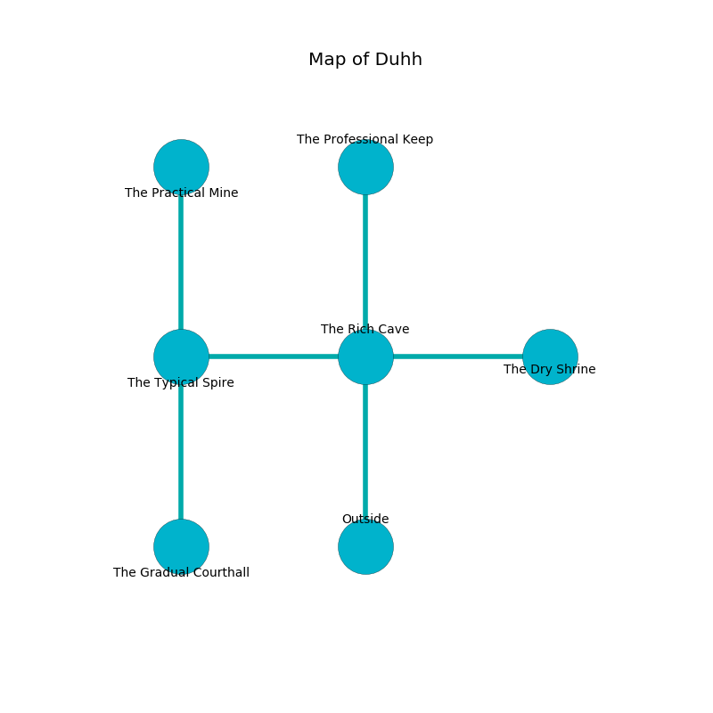

%Ruin Dogs

##Duhh
###Overview
Duhh is located under an alien mountain. Regions of Duhh are flooded. The ruin is collapsing slowly. It is occupied by Drows. Joetta Salinas The Stingy, a Cloud Giant is here. The Drows are the soldiers of Joetta Salinas The Stingy. She  is founding a new religion. 

###Artifact
####Defdmaf

Defdmaf is a powerful artifact in the shape of a warm amulet. It smells like salmon. When smelled it become energized with a powerful vibration. 

###Locations

####the rich cave
White mushrooms are growing in a patch on the floor. The air tastes like molasses here. 

* [Defdmaf](#Defdmaf) is here.
* To the west a long hall connects to [the typical spire](#the-typical-spire).
* To the east a small walkway leads to [the dry shrine](#the-dry-shrine).
* To the north a torchlit threshold opens to [the professional keep](#the-professional-keep).
* To the south is the entrance.

####the typical spire
The air smells like laundered cloth here. Blue lichens are sprouting in broken urns. The crystal walls are unsettled. 

There is an engraving on the ceiling written in Drows Script. 

> [Defdmaf](#Defdmaf)
>
> noisy, satisfactory, aloof
>
> expected, dark, functional
>
> brown and deep
>
> amber and provincial
>
> illegal, chronic, regional
>
> you shall be destroyed
>

* There is a picture here.
* [Joetta Salinas The Stingy](#Joetta-Salinas-The-Stingy) is here.
* To the east a long hall leads to [the rich cave](#the-rich-cave).
* To the north a small corridor opens to [the practical mine](#the-practical-mine).
* To the south a narrow hall connects to [the gradual courthall](#the-gradual-courthall).

####the gradual courthall
Yellow razorgrass is swaying in a patch on the floor. The obsidion walls are pristine. The air smells like graham cracker here. The floor is smooth. 

There is an engraving on a monolith written in Drows Script. 

> [Defdmaf](#Defdmaf)
>
> yet never kind
>
> central and systematic
>
> yet rural
>
> but never premature
>
> yet never present
>
> neutral, elegant, absolute
>

* To the north a narrow hall leads to [the typical spire](#the-typical-spire).

####the professional keep
The air tastes like coconut here. 

* To the south a torchlit threshold leads to [the rich cave](#the-rich-cave).

####the practical mine
The floor is flooded with two inch deep scalding water. The air smells like elderflower here. White razorgrass is swaying from the ceiling. 

There is an engraving on the wall written in Drows Script. 

> [Defdmaf](#Defdmaf)
>
> middle-class and tolerant
>

* There is an eye here.
* There is a brick here.
* To the south a small corridor opens to [the typical spire](#the-typical-spire).

####the dry shrine
The stone walls are covered in mold. There are a Death Slaad, a Giant Hyena, and a Chimera here. The air smells like acai here. White moss is growing from the walls. 

* To the west a small walkway opens to [the rich cave](#the-rich-cave).

