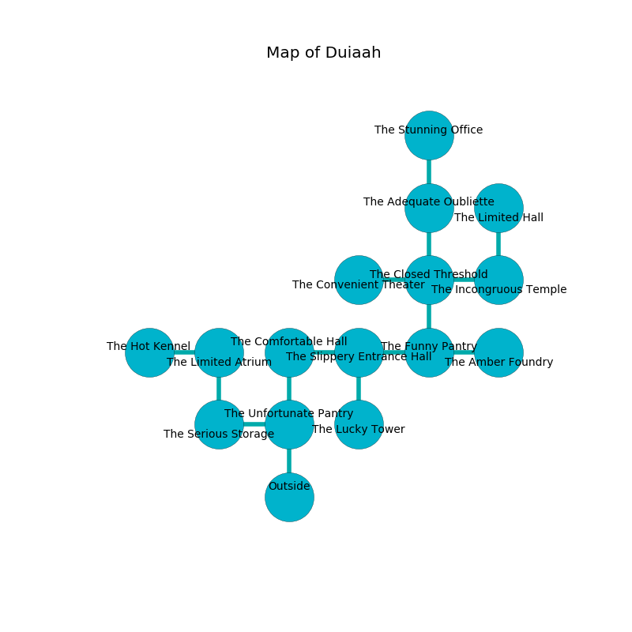

%Ruin Dogs

##Duiaah
###Overview
Duiaah is located under a spikey mountain. Some rooms of it are flooded. The ruin is flooding. It is occupied by Giants. Jackson Willis The Grumpy, a Mind Flayer Arcanist is here. The Giants are the slaves of Jackson Willis The Grumpy. He  is founding a new religion. 

###Artifact
####Cubbamd Uggaecaeeh

Cubbamd Uggaecaeeh has the form of a warm sphere. It is a bright green color. It smells like tansy. When held it curses all nearby. 

###Locations

####the unfortunate pantry
Green mushrooms are growing from the walls. There is a Fire Giant here. The stone walls are scratched. The floor is cluttered with rocks. If the Fire Giant notice the Ruin Dogs, one of them will retreat and alert the others. 

* To the west a flooded artery connects to [the serious storage](#the-serious-storage).
* To the north a dark opening opens to [the comfortable hall](#the-comfortable-hall).
* To the south is the entrance.

####the serious storage
Green mushrooms are swaying in a patch on the floor. The floor is glossy. 

* To the east a flooded artery leads to [the unfortunate pantry](#the-unfortunate-pantry).
* To the north a long artery opens to [the limited atrium](#the-limited-atrium).

####the comfortable hall
The air tastes like fudge here. The floor is flooded with seven inch deep hot water. The wooden walls are unsettled. 

* To the east a torchlit walkway opens to [the slippery entrance hall](#the-slippery-entrance-hall).
* To the south a dark opening opens to [the unfortunate pantry](#the-unfortunate-pantry).

####the slippery entrance hall
There are a Hill Giant and a Stone Giant here. Gray ferns are sprouting in a patch on the floor. The floor is smooth. One of the Giants is on watch, the rest are feasting. 

There is an engraving on the wall written in Giants Script. 

> I lost [Cubbamd Uggaecaeeh](#Cubbamd-Uggaecaeeh).
>
> Leave now.
>

* [Cubbamd Uggaecaeeh](#Cubbamd-Uggaecaeeh) is here.
* To the west a torchlit walkway opens to [the comfortable hall](#the-comfortable-hall).
* To the east a small artery opens to [the funny pantry](#the-funny-pantry).
* To the south a dripping cavern connects to [the lucky tower](#the-lucky-tower).

####the limited atrium
The brick walls are covered in mold. Yellow mushrooms are growing in a patch on the floor. 

* [Jackson Willis The Grumpy](#Jackson-Willis-The-Grumpy) is here.
* To the west a narrow hall opens to [the hot kennel](#the-hot-kennel).
* To the south a long artery leads to [the serious storage](#the-serious-storage).

####the funny pantry
There are a Will-O’-Wisp, a Black Dragon Wyrmling, a Knight, and a Yuan-Ti Malison here. The glass walls are ruined. The floor is bloodstained. 

* To the west a small artery leads to [the slippery entrance hall](#the-slippery-entrance-hall).
* To the east a small opening leads to [the amber foundry](#the-amber-foundry).
* To the north a dripping path opens to [the closed threshold](#the-closed-threshold).

####the closed threshold
The glass walls are caving in. White lichens are growing from the walls. There are a Stone Giant and a Cloud Giant here. One of the Giants is working a mechanism that can engulf the room in a fiery blaze. 

* There is a cart here.
* To the west a torchlit hall leads to [the convenient theater](#the-convenient-theater).
* To the east a hazy threshold connects to [the incongruous temple](#the-incongruous-temple).
* To the north a dripping walkway connects to [the adequate oubliette](#the-adequate-oubliette).
* To the south a dripping path leads to [the funny pantry](#the-funny-pantry).

####the incongruous temple
Blue mushrooms are sprouting in a patch on the floor. The air smells like autumn here. The metallic walls are pristine. There is a trap here. When activated, a tripwire will launch an arrow. 

There is an engraving on a tablet written in Giants Script. 

> O! pitiful god
>
> ever odd
>
> yet kind
>
> the world is blind
>

* To the west a hazy threshold opens to [the closed threshold](#the-closed-threshold).
* To the north a flooded walkway connects to [the limited hall](#the-limited-hall).

####the adequate oubliette
Blue razorgrass is swaying from the ceiling. 

There is an engraving on the ceiling written in common. 

> O cruel we
>
> but never internal
>
> yet never free
>
> all is eternal
>

* There is a brake here.
* To the north a windy threshold leads to [the stunning office](#the-stunning-office).
* To the south a dripping walkway leads to [the closed threshold](#the-closed-threshold).

####the hot kennel
The obsidion walls are unsettled. There is a Fire Giant here. Red ferns are sprouting in a patch on the floor. The floor is sticky. The Fire Giant is drunk. 

There is an engraving on the wall written in Giants Script. 

> Dig here.
>

* To the east a narrow hall leads to [the limited atrium](#the-limited-atrium).

####the limited hall
Green moss is sprouting in broken urns. The glass walls are pristine. There is a Fire Giant here. The Fire Giant is performing a ritual. If not interrupted, the Fire Giant will become more powerful. 

* To the south a flooded walkway connects to [the incongruous temple](#the-incongruous-temple).

####the amber foundry
There is a trap here. When activated, a magical sound detector will shoot a lightning bolt. 

* There is a bag here.
* To the west a small opening leads to [the funny pantry](#the-funny-pantry).

####the stunning office
The stone walls are covered in mold. There is a Cloud Giant here. If the Cloud Giant notice the Ruin Dogs, one of them will retreat and alert the others. 

* There is a sheep here.
* To the south a windy threshold connects to [the adequate oubliette](#the-adequate-oubliette).

####the convenient theater
The floor is bloodstained. There is a trap here. When activated, a magical proximity detector will swing a tripping chain. The air tastes like cocoa here. 

* To the east a torchlit hall leads to [the closed threshold](#the-closed-threshold).

####the lucky tower
The mirrored walls are pristine. The floor is flooded with five inch deep cold water. The air smells like pineapple here. There are a Hill Giant and a Fire Giant here. The Giants are performing a ritual. If not interrupted, [Jackson Willis](#Jackson-Willis) will be magically alarmed. 

There is an engraving on a tablet written in Giants Script. 

> Leave now.
>

* To the north a dripping cavern opens to [the slippery entrance hall](#the-slippery-entrance-hall).

