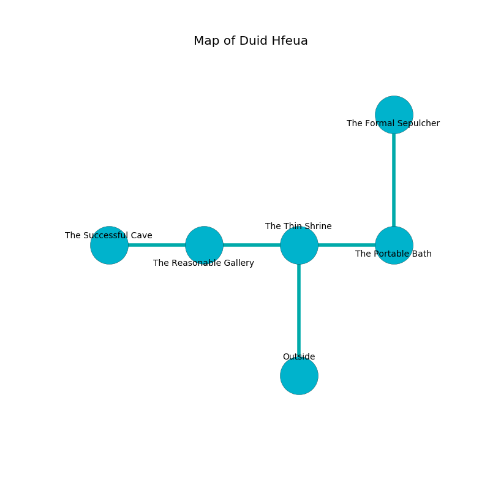

%Ruin Dogs

##Duid Hfeua
###Overview
Duid Hfeua is located on a spikey rift. Some rooms of it are flooded. A massive flood is happening outside. It is occupied by Yuan-Ti. Latarsha Narvaez The Narrow-Minded, a Stone Giant is here. The Yuan-Ti worship Latarsha Narvaez The Narrow-Minded. She  is founding a new religion. 

###Artifact
####The Exotic Lane

The Exotic Lane has the form of a cold figurine. Psychic energy flows near it. It smells like root. When eaten it sings the hymn of the damned. 

###Locations

####the thin shrine
Yellow razorgrass is decaying in a patch on the floor. The obsidion walls are unsettled. The floor is smooth. 

* There is a chest here.
* [Latarsha Narvaez The Narrow-Minded](#Latarsha-Narvaez-The-Narrow-Minded) is here.
* To the west a twisted hallway connects to [the reasonable gallery](#the-reasonable-gallery).
* To the east a windy path opens to [the portable bath](#the-portable-bath).
* To the south is the entrance.

####the reasonable gallery
The metallic walls are scratched. There are a Ghast, a Merrow, a Black Bear, a Commoner, a Poisonous Snake, a Rug of Smothering, and a Priest here. The floor is smooth. The air tastes like quince here. 

* [The Exotic Lane](#The-Exotic-Lane) is here.
* To the west a flooded cavern opens to [the successful cave](#the-successful-cave).
* To the east a twisted hallway opens to [the thin shrine](#the-thin-shrine).

####the portable bath
The floor is flooded with three inch deep lukewarm water. The obsidion walls are bloodstained. The air tastes like mulberry here. 

* There is a bucket here.
* To the west a windy path leads to [the thin shrine](#the-thin-shrine).
* To the north a small path opens to [the formal sepulcher](#the-formal-sepulcher).

####the formal sepulcher
The air tastes like carnation here. There are a Young Copper Dragon, a Bugbear Chief, a Blood Hawk, and a Bandit Captain here. 

* To the south a small path leads to [the portable bath](#the-portable-bath).

####the successful cave
The floor is flooded with two inch deep scalding water. Blue mushrooms are swaying from the ceiling. 

There is an engraving on a monolith written in Yuan-Ti Script. 

> Do not try running.
>

* To the east a flooded cavern connects to [the reasonable gallery](#the-reasonable-gallery).

