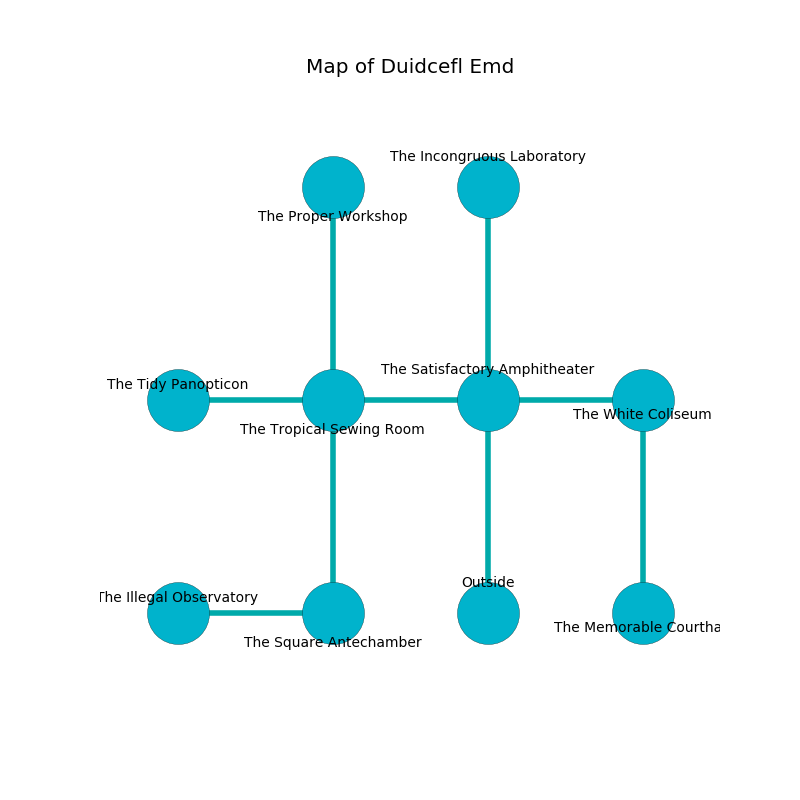

%Ruin Dogs

##Duidcefl Emd
###Overview
Duidcefl Emd is located under a giant mountain. Regions of Duidcefl Emd are foggy. The ruin is collapsing slowly. It is occupied by Yuan-Ti. Ardell Boudreau The Obstinate, a Drow Mage is here. The Yuan-Ti are the minions of Ardell Boudreau The Obstinate. She  is founding a new religion. 

###Artifact
####Mahh Dahh

Mahh Dahh is a powerful artifact in the shape of a broken doll. It smells like macadamia. It is a sickly black color. When touched it emits dust. 

###Locations

####the satisfactory amphitheater
The wooden walls are covered in mold. The floor is glossy. There are a Goblin, a Grick, and a Bulette here. 

* There is a trophy here.
* There is a bridge here.
* To the west a small cave connects to [the tropical sewing room](#the-tropical-sewing-room).
* To the east a long pathway connects to [the white coliseum](#the-white-coliseum).
* To the north a narrow opening opens to [the incongruous laboratory](#the-incongruous-laboratory).
* To the south is the entrance.

####the incongruous laboratory
The wooden walls are caving in. There are a Gargoyle and a Werebear here. Green lichens are swaying in a patch on the floor. 

* To the south a narrow opening leads to [the satisfactory amphitheater](#the-satisfactory-amphitheater).

####the tropical sewing room
The wooden walls are pristine. There are two Yuan-Ti Malisons and a Yuan-Ti Pureblood here. The air tastes like toasted grain here. The floor is smooth. If the Yuan-Ti notice the Ruin Dogs, one of them will retreat and alert [Ardell Boudreau](#Ardell-Boudreau). 

* To the west a narrow passageway connects to [the tidy panopticon](#the-tidy-panopticon).
* To the east a small cave opens to [the satisfactory amphitheater](#the-satisfactory-amphitheater).
* To the north a windy cavern leads to [the proper workshop](#the-proper-workshop).
* To the south a small path connects to [the square antechamber](#the-square-antechamber).

####the white coliseum
There are a Swarm of Ravens, a Lizard King, and a Berserker here. The air smells like spearmint here. 

* [Ardell Boudreau The Obstinate](#Ardell-Boudreau-The-Obstinate) is here.
* To the west a long pathway leads to [the satisfactory amphitheater](#the-satisfactory-amphitheater).
* To the south a flooded pathway opens to [the memorable courthall](#the-memorable-courthall).

####the proper workshop
There are three Yuan-Ti Purebloods and a Yuan-Ti Malison here. The obsidion walls are scratched. The floor is glossy. Blue ferns are decaying in a patch on the floor. The Yuan-Ti are willing to fight to the death. 

* To the south a windy cavern connects to [the tropical sewing room](#the-tropical-sewing-room).

####the memorable courthall
There are a Pony, a Black Pudding, a Yeti, a White Dragon Wyrmling, and a Scout here. Red mushrooms are sprouting in a patch on the floor. The floor is glossy. The air smells like mushroom here. 

There is an engraving on a stone written in Yuan-Ti Script. 

> [Mahh Dahh](#Mahh-Dahh)
>
> content and tall
>
> verbal, vertical, separate
>

* To the north a flooded pathway leads to [the white coliseum](#the-white-coliseum).

####the tidy panopticon
The floor is smooth. Gray moss is growing from the ceiling. 

* To the east a narrow passageway connects to [the tropical sewing room](#the-tropical-sewing-room).

####the square antechamber
The obsidion walls are caving in. The air smells like caraway here. 

* There is a bee here.
* [Mahh Dahh](#Mahh-Dahh) is here.
* To the west a dripping gap opens to [the illegal observatory](#the-illegal-observatory).
* To the north a small path opens to [the tropical sewing room](#the-tropical-sewing-room).

####the illegal observatory
There is a trap here. When activated, a magical proximity detector will launch an arrow. The floor is smooth. There are a Sea Horse, a Myconid Sovereign, a Knight, and a Priest here. 

* There is a flag here.
* To the east a dripping gap connects to [the square antechamber](#the-square-antechamber).

