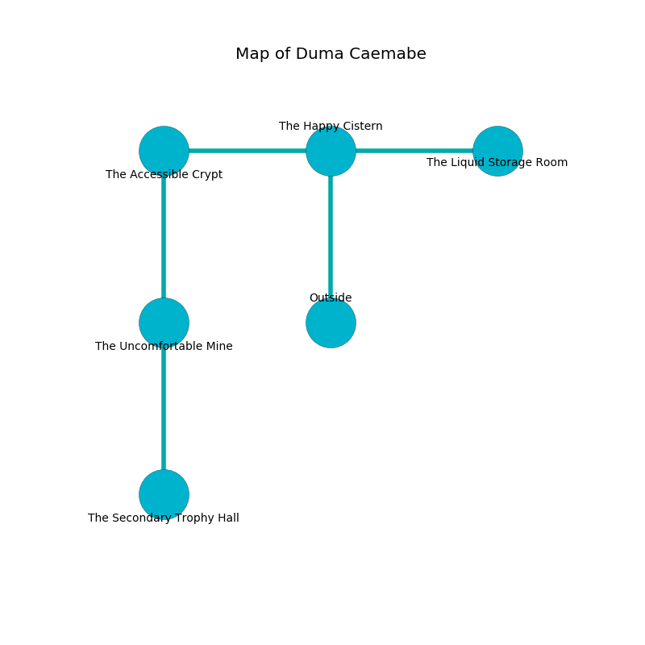

%Ruin Dogs

##Duma Caemabe
###Overview
Duma Caemabe is located under a flooded city. Some areas of Duma Caemabe are inaccessible. The ruin is larger on the inside than the outside. It is occupied by Yuan-Ti. Dante Galvez The Aggressive, a Mind Flayer Arcanist is here. The Yuan-Ti are battling Dante Galvez The Aggressive. He  is founding a new religion. 

###Artifact
####Cmuaeca

Cmuaeca is a powerful artifact in the shape of a glassy crystal. It smells like orange. It is a light purple color. When held it changes probabilities. 

###Locations

####the happy cistern
The floor is smooth. Red ferns are decaying from the walls. 

There is an engraving on the wall written in common. 

> Maybe try fighting.
>

* To the west a twisted gap connects to [the accessible crypt](#the-accessible-crypt).
* To the east a windy corridor connects to [the liquid storage room](#the-liquid-storage-room).
* To the south is the entrance.

####the accessible crypt
The mirrored walls are unsettled. There are a Doppelganger, an Aarakocra, and an Umber Hulk here. The air smells like freshly cut hay here. Yellow moss is decaying from the ceiling. 

* There is a glove here.
* To the east a twisted gap opens to [the happy cistern](#the-happy-cistern).
* To the south a small cavern connects to [the uncomfortable mine](#the-uncomfortable-mine).

####the uncomfortable mine
The concrete walls are bloodstained. Green razorgrass is growing from the walls. 

* There is a horn here.
* [Cmuaeca](#Cmuaeca) is here.
* [Dante Galvez The Aggressive](#Dante-Galvez-The-Aggressive) is here.
* To the north a small cavern connects to [the accessible crypt](#the-accessible-crypt).
* To the south a small path opens to [the secondary trophy hall](#the-secondary-trophy-hall).

####the liquid storage room
The air tastes like lettuce here. 

There is an engraving on the wall written in Yuan-Ti Script. 

> I discovered this place.
>
> A trap ahead.
>

* To the west a windy corridor leads to [the happy cistern](#the-happy-cistern).

####the secondary trophy hall
There are a Young Brass Dragon, a Crawling Claw, and a Bone Naga here. Green moss is decaying from the walls. The metallic walls are caving in. 

There is an engraving on the ceiling written in common. 

> A box is a culture
>
> artificial, private, constructive
>
> A box is a culture
>

* To the north a small path connects to [the uncomfortable mine](#the-uncomfortable-mine).

