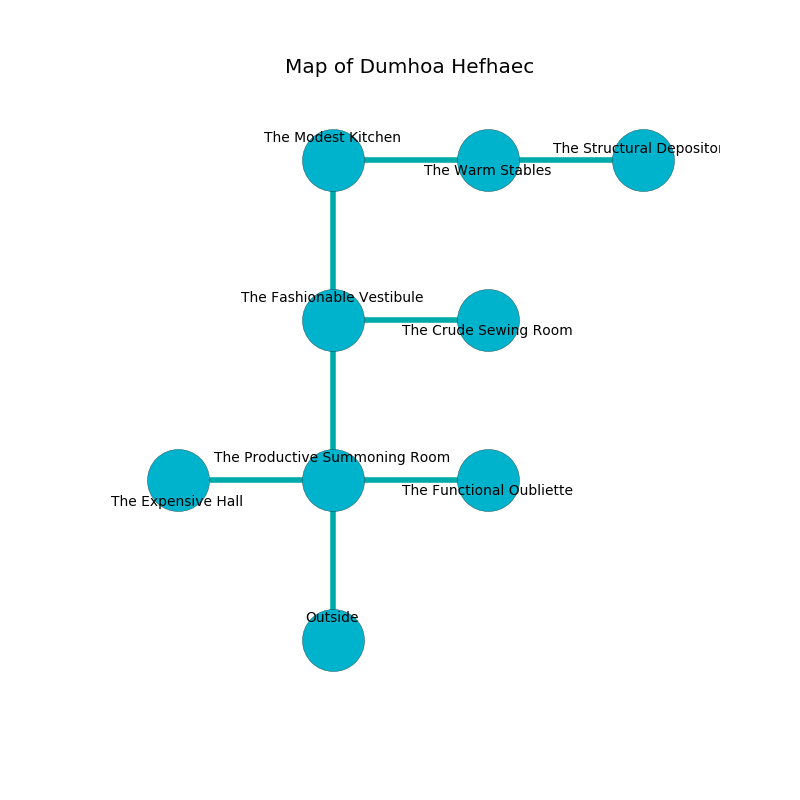

%Ruin Dogs

##Dumhoa Hefhaec
###Overview
Dumhoa Hefhaec is located under an alien tree. Some areas of it are unbearably hot. The ruin is flooding. It is occupied by Sahuagins. Amberly Tavares The Harsh, a Fire Giant is here. The Sahuagins are the slaves of Amberly Tavares The Harsh. She  is trying to discover [Cemuei Lfaeuaf](#Cemuei-Lfaeuaf). 

###Artifact
####Cemuei Lfaeuaf

Cemuei Lfaeuaf has the form of a broken crystal. It is a medium brown color. It smells like rose. When worshipped it levitates those nearby. 

###Locations

####the productive summoning room
The metallic walls are unsettled. 

There is an engraving on a stone written in common. 

> I found [Cemuei Lfaeuaf](#Cemuei-Lfaeuaf).
>
> Treasure here.
>

* There is a spring here.
* To the west a dripping hallway leads to [the expensive hall](#the-expensive-hall).
* To the east a torchlit hallway opens to [the functional oubliette](#the-functional-oubliette).
* To the north a torchlit threshold opens to [the fashionable vestibule](#the-fashionable-vestibule).
* To the south is the entrance.

####the fashionable vestibule
There are a Gray Slaad, an Animated Armor, and a Young Remorhaz here. The air tastes like deertongue here. White razorgrass is swaying in cracks in the floor. 

There is an engraving on the wall written in Sahuagins Script. 

> O! terrible god
>
> sophisticated, late, odd
>
> brave and alert
>
> the world is odd
>

* There is a basket here.
* [Cemuei Lfaeuaf](#Cemuei-Lfaeuaf) is here.
* To the east a windy cave leads to [the crude sewing room](#the-crude-sewing-room).
* To the north a torchlit path connects to [the modest kitchen](#the-modest-kitchen).
* To the south a torchlit threshold connects to [the productive summoning room](#the-productive-summoning-room).

####the modest kitchen
There are a Yeti, a Hydra, and a Flying Snake here. The crystal walls are ruined. 

* To the east a windy corridor leads to [the warm stables](#the-warm-stables).
* To the south a torchlit path leads to [the fashionable vestibule](#the-fashionable-vestibule).

####the functional oubliette
There are a Nothic, a Giant Scorpion, a Nycaloth, a Giant Sea Horse, and a Green Hag here. The floor is cluttered with ashes. Blue ferns are sprouting in cracks in the floor. The air tastes like osmanthus here. 

* There is a leaf here.
* To the west a torchlit hallway connects to [the productive summoning room](#the-productive-summoning-room).

####the expensive hall
The floor is sticky. 

* [Amberly Tavares The Harsh](#Amberly-Tavares-The-Harsh) is here.
* To the east a dripping hallway connects to [the productive summoning room](#the-productive-summoning-room).

####the warm stables
Red ferns are growing from the walls. The floor is sticky. 

* To the west a windy corridor leads to [the modest kitchen](#the-modest-kitchen).
* To the east a narrow opening opens to [the structural depository](#the-structural-depository).

####the structural depository
There are a Giant Rat, a Swarm of Rats, a Raven, a Rust Monster, a Shambling Mound, a Riding Horse, a Swarm of Bats, a Merrow, an Acolyte, a Reef Shark, a Bat, and a Yuan-Ti Malison here. The air tastes like hay here. 

* To the west a narrow opening leads to [the warm stables](#the-warm-stables).

####the crude sewing room
The floor is glossy. Gray lichens are swaying in cracks in the floor. There are an Ankheg, a Tridrone, a Slaad Tadpole, a Giant fire beetle, a Gnoll, a Barlgura, and a Grick here. 

* To the west a windy cave leads to [the fashionable vestibule](#the-fashionable-vestibule).

