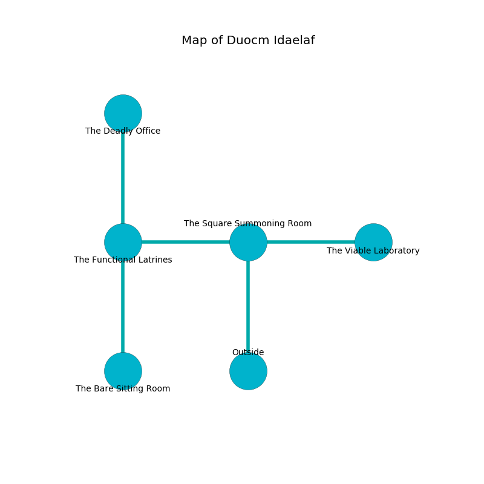

%Ruin Dogs

##Duocm Idaelaf
###Overview
Duocm Idaelaf is located under an obsidion rift. Parts of Duocm Idaelaf are unbearably cold. The ruin is flooding. It is occupied by Quaggoths. Reed Harrison The Bitchy, a Cloud Giant is here. The Quaggoths are the minions of Reed Harrison The Bitchy. He  is trying to discover [The Fresh Image](#The-Fresh-Image). 

###Artifact
####The Fresh Image

The Fresh Image is a powerful artifact in the shape of an opaque gem. It smells like fruit. When cradled it changes probabilities. 

###Locations

####the square summoning room
There are three Quaggoth Thonots and a Quaggoth here. Blue mushrooms are decaying from the ceiling. One of the Quaggoths is on watch, the rest are meditating. 

There is an engraving on a stone written in common. 

> I found this place.
>

* To the west a flooded pathway leads to [the functional latrines](#the-functional-latrines).
* To the east a dripping cave opens to [the viable laboratory](#the-viable-laboratory).
* To the south is the entrance.

####the viable laboratory
There is a trap here. When activated, a tripwire will launch a poison dart. The floor is flooded with seven inch deep hot water. The air smells like hawthorn here. The obsidion walls are bloodstained. 

* To the west a dripping cave leads to [the square summoning room](#the-square-summoning-room).

####the functional latrines
The air smells like cotton candy here. 

* [The Fresh Image](#The-Fresh-Image) is here.
* To the east a flooded pathway connects to [the square summoning room](#the-square-summoning-room).
* To the north a long cavern leads to [the deadly office](#the-deadly-office).
* To the south a long cave leads to [the bare sitting Room](#the-bare-sitting-Room).

####the deadly office
The floor is flooded with nine inch deep scalding water. Red moss is swaying in a patch on the floor. The glass walls are caving in. 

There is an engraving on a monolith written in common. 

> Oh my! dire we
>
> it is always free
>
> exotic and direct
>
> death is perfect
>

* There is a crystal here.
* There is a dragon here.
* [Reed Harrison The Bitchy](#Reed-Harrison-The-Bitchy) is here.
* To the south a long cavern leads to [the functional latrines](#the-functional-latrines).

####the bare sitting Room
The air smells like moss here. There are two Quaggoth Thonots and two Quaggoths here. The metallic walls are unsettled. The floor is bloodstained. One of the Quaggoths is working a mechanism that can engulf the room in a fiery blaze. 

* To the north a long cave connects to [the functional latrines](#the-functional-latrines).

