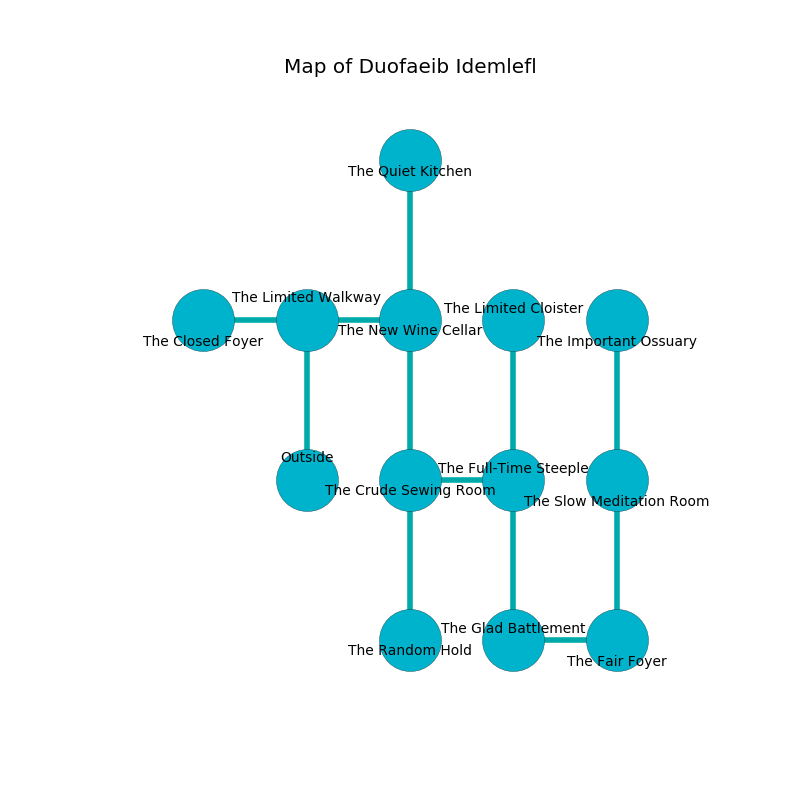

%Ruin Dogs

##Duofaeib Idemlefl
###Overview
Duofaeib Idemlefl is located under a poisoned mountain. Parts of it are foggy. The ruin is burning. It is occupied by Deep Gnomes. Dale Trent The Fussy, a Cyclops is here. The Deep Gnomes have been charmed by Dale Trent The Fussy. He  is founding a new religion. 

###Artifact
####Iehum Iaaeluia

Iehum Iaaeluia looks like an opaque rock. It is a pale pink color. When held it become energized with a powerful vibration. 

###Locations

####the limited walkway
The floor is bloodstained. The air tastes like root beer here. Yellow ferns are swaying in a patch on the floor. 

* To the west a hazy threshold connects to [the closed foyer](#the-closed-foyer).
* To the east a long hall leads to [the new wine cellar](#the-new-wine-cellar).
* To the south is the entrance.

####the new wine cellar
The crystal walls are ruined. The air smells like feces here. There is a trap here. When activated, a magical rune will make the walls close in. 

* To the west a long hall leads to [the limited walkway](#the-limited-walkway).
* To the north a hazy path connects to [the quiet kitchen](#the-quiet-kitchen).
* To the south a long opening connects to [the crude sewing room](#the-crude-sewing-room).

####the quiet kitchen
Blue lichens are growing in cracks in the floor. The floor is sticky. The air tastes like blackberry here. 

* [Dale Trent The Fussy](#Dale-Trent-The-Fussy) is here.
* To the south a hazy path leads to [the new wine cellar](#the-new-wine-cellar).

####the crude sewing room
There is a trap here. When activated, a magical proximity detector will fire a scything blade. 

* There is a trousers here.
* To the east a torchlit hall opens to [the full-time steeple](#the-full-time-steeple).
* To the north a long opening leads to [the new wine cellar](#the-new-wine-cellar).
* To the south a dark hallway connects to [the random hold](#the-random-hold).

####the random hold
There is a trap here. When activated, a magical sound detector will launch a fireball. Gray lichens are swaying in broken urns. The floor is bloodstained. 

* To the north a dark hallway connects to [the crude sewing room](#the-crude-sewing-room).

####the full-time steeple
Blue moss is decaying in a patch on the floor. The brick walls are pristine. There are a Giant Constrictor Snake and a Revenant here. The floor is smooth. 

* To the west a torchlit hall leads to [the crude sewing room](#the-crude-sewing-room).
* To the north a torchlit walkway connects to [the limited cloister](#the-limited-cloister).
* To the south a dripping artery connects to [the glad battlement](#the-glad-battlement).

####the closed foyer
The concrete walls are caving in. There is a trap here. When activated, a pressure plate will collapse a column. Red razorgrass is swaying from the walls. The air tastes like yuzu here. 

* There is a collar here.
* There is a finger here.
* There is a mug here.
* To the east a hazy threshold connects to [the limited walkway](#the-limited-walkway).

####the glad battlement
There are an Ape, a Shadow, a Magmin, a Reef Shark, a Pixie, a Ghost, and an Elephant here. White razorgrass is sprouting from the ceiling. The air smells like rye bread here. 

* To the east a dripping gap connects to [the fair foyer](#the-fair-foyer).
* To the north a dripping artery connects to [the full-time steeple](#the-full-time-steeple).

####the fair foyer
The obsidion walls are caving in. There are a Spined Devil and a Vampire Spawn here. 

* There is an arch here.
* To the west a dripping gap opens to [the glad battlement](#the-glad-battlement).
* To the north a torchlit pathway leads to [the slow meditation room](#the-slow-meditation-room).

####the slow meditation room
The obsidion walls are covered in mold. Yellow mushrooms are sprouting in a patch on the floor. The floor is cluttered with rocks. The air smells like clove here. 

* [Iehum Iaaeluia](#Iehum-Iaaeluia) is here.
* To the north a small cavern opens to [the important ossuary](#the-important-ossuary).
* To the south a torchlit pathway leads to [the fair foyer](#the-fair-foyer).

####the limited cloister
There is a trap here. When activated, a pressure plate will cast a curse. Blue razorgrass is sprouting from the ceiling. The air tastes like blueberry here. There are a Hook Horror and a Kuo-Toa Archpriest here. 

* There is a sword here.
* To the south a torchlit walkway opens to [the full-time steeple](#the-full-time-steeple).

####the important ossuary
There are a Badger, a Noble, a Sea Hag, a Scout, a Will-O’-Wisp, a Sahuagin Baron, and a Bat here. The concrete walls are unsettled. The air smells like ocean here. 

* To the south a small cavern opens to [the slow meditation room](#the-slow-meditation-room).

