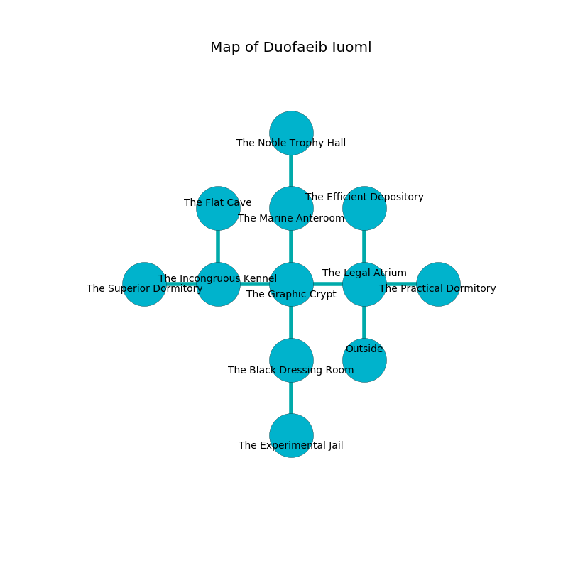

%Ruin Dogs

##Duofaeib Iuoml
###Overview
Duofaeib Iuoml is located under a giant plain. Regions of it are cursed. A windstorm is happening outside. It is occupied by Centaurs. Sterling Casper The Cowardly, an Assassin is here. The Centaurs are battling Sterling Casper The Cowardly. He  is founding a new religion. 

###Artifact
####The Normal Shot

The Normal Shot looks like a glassy spear. When picked up it aids memory. 

###Locations

####the legal atrium
The air smells like anise here. There are four Centaurs here. If the Centaurs notice the Ruin Dogs, one of them will retreat and alert [Sterling Casper](#Sterling-Casper). 

* There is a lock here.
* To the west a torchlit cavern opens to [the graphic crypt](#the-graphic-crypt).
* To the east a dark pathway connects to [the practical dormitory](#the-practical-dormitory).
* To the north a flooded path leads to [the efficient depository](#the-efficient-depository).
* To the south is the entrance.

####the graphic crypt
The air smells like banana peel here. The floor is flooded with two inch deep lukewarm water. Red razorgrass is growing from the ceiling. 

* There is a portrait here.
* To the west a long pathway leads to [the incongruous kennel](#the-incongruous-kennel).
* To the east a torchlit cavern connects to [the legal atrium](#the-legal-atrium).
* To the north a torchlit corridor connects to [the marine anteroom](#the-marine-anteroom).
* To the south a hazy cave leads to [the black dressing room](#the-black-dressing-room).

####the efficient depository
The floor is flooded with three inch deep cool water. 

* To the south a flooded path opens to [the legal atrium](#the-legal-atrium).

####the marine anteroom
The air smells like chive here. There are four Centaurs here. Gray moss is sprouting in cracks in the floor. The Centaurs are performing a ritual. If not interrupted, the ruin dogs will be weakened. 

There is an engraving on a tablet written in Centaurs Script. 

> You are corrupted
>
> proper and annual
>
> lazy and content
>
> native, passionate, economic
>
> [The Normal Shot](#The-Normal-Shot)
>
> standard and sufficient
>
> colourful and unexpected
>
> You are corrupted
>

* [The Normal Shot](#The-Normal-Shot) is here.
* [Sterling Casper The Cowardly](#Sterling-Casper-The-Cowardly) is here.
* To the north a dripping cavern opens to [the noble trophy hall](#the-noble-trophy-hall).
* To the south a torchlit corridor leads to [the graphic crypt](#the-graphic-crypt).

####the incongruous kennel
The air smells like vegetables here. There are a Giant Vulture and a Blue Slaad here. The crystal walls are scratched. White lichens are growing from the ceiling. 

There is an engraving on the ceiling written in common. 

> You are sorrowful
>
> foolish and incredible
>
> beautiful and due
>

* There is a boot here.
* To the west a hazy threshold connects to [the superior dormitory](#the-superior-dormitory).
* To the east a long pathway connects to [the graphic crypt](#the-graphic-crypt).
* To the north a twisted hall connects to [the flat cave](#the-flat-cave).

####the practical dormitory
There are four Centaurs here. The air tastes like old wood here. Yellow ferns are sprouting from the ceiling. One of the Centaurs is working a mechanism that can engulf the room in a fiery blaze. 

* There is a bee here.
* To the west a dark pathway opens to [the legal atrium](#the-legal-atrium).

####the superior dormitory
The floor is cluttered with shells. There are four Centaurs here. The Centaurs are willing to negotiate. 

* To the east a hazy threshold opens to [the incongruous kennel](#the-incongruous-kennel).

####the flat cave
The floor is smooth. There are a Cult Fanatic and a Vrock here. The air tastes like taco here. White moss is sprouting in a patch on the floor. The glass walls are unsettled. There is a trap here. When activated, a magical proximity detector will launch stone blocks from the ceiling. 

There is an engraving on a monolith written in Centaurs Script. 

> O! meak fate
>
> yet never late
>
> it is never straight
>
> sadness is straight
>

* There is a frame here.
* To the south a twisted hall connects to [the incongruous kennel](#the-incongruous-kennel).

####the black dressing room
Gray lichens are sprouting in broken urns. The air tastes like spearmint here. 

There is an engraving on the floor written in Centaurs Script. 

> Try swimming.
>

* To the north a hazy cave connects to [the graphic crypt](#the-graphic-crypt).
* To the south a small hall leads to [the experimental jail](#the-experimental-jail).

####the experimental jail
Gray mushrooms are growing in cracks in the floor. The wooden walls are ruined. The floor is sticky. 

There is an engraving on a tablet written in Centaurs Script. 

> O meak fate
>
> but late
>
> busy, passive, last
>
> life is lost
>

* To the north a small hall connects to [the black dressing room](#the-black-dressing-room).

####the noble trophy hall
There are four Centaurs here. The air tastes like beef here. The floor is glossy. The Centaurs are willing to negotiate. 

* There is a key here.
* There is a shield here.
* To the south a dripping cavern connects to [the marine anteroom](#the-marine-anteroom).

