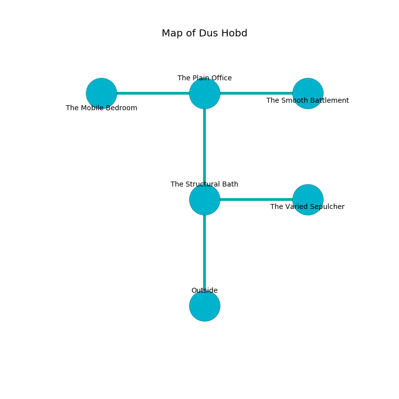

%Ruin Dogs

##Dus Hobd
###Overview
Dus Hobd is located on a spikey city. Some areas of it are somewhat cold. The ruin is flooding. It is occupied by Deep Gnomes. Setsuko Stubbs The Fussy, a Mind Flayer is here. The Deep Gnomes are battling Setsuko Stubbs The Fussy. She  is trying to recover [Cehufaea Cfuiiaemh](#Cehufaea-Cfuiiaemh). 

###Artifact
####Cehufaea Cfuiiaemh

Cehufaea Cfuiiaemh is a powerful artifact in the shape of a soft sphere. It is a pale pink color. It smells like balsamic. When carried it changes probabilities. 

###Locations

####the structural bath
Yellow mushrooms are decaying in cracks in the floor. The floor is smooth. The air smells like tansy here. 

* To the east a twisted hall connects to [the varied sepulcher](#the-varied-sepulcher).
* To the north a windy pathway leads to [the plain office](#the-plain-office).
* To the south is the entrance.

####the plain office
The floor is glossy. The concrete walls are covered in mold. There are sixteen Deep Gnomes here. The Deep Gnomes are performing a ritual. If not interrupted, the ruin dogs will be weakened. 

* [Cehufaea Cfuiiaemh](#Cehufaea-Cfuiiaemh) is here.
* To the west a flooded threshold connects to [the mobile bedroom](#the-mobile-bedroom).
* To the east a long hall connects to [the smooth battlement](#the-smooth-battlement).
* To the south a windy pathway opens to [the structural bath](#the-structural-bath).

####the mobile bedroom
Gray lichens are swaying from the walls. The floor is sticky. 

* [Setsuko Stubbs The Fussy](#Setsuko-Stubbs-The-Fussy) is here.
* To the east a flooded threshold connects to [the plain office](#the-plain-office).

####the varied sepulcher
The glass walls are unsettled. The air tastes like roasted almond here. 

There is an engraving on a monolith written in Deep Gnomes Script. 

> I hid something in Dus Hobd.
>

* To the west a twisted hall connects to [the structural bath](#the-structural-bath).

####the smooth battlement
There are a Drider, a Crocodile, and a Hell Hound here. The floor is smooth. 

* To the west a long hall leads to [the plain office](#the-plain-office).

