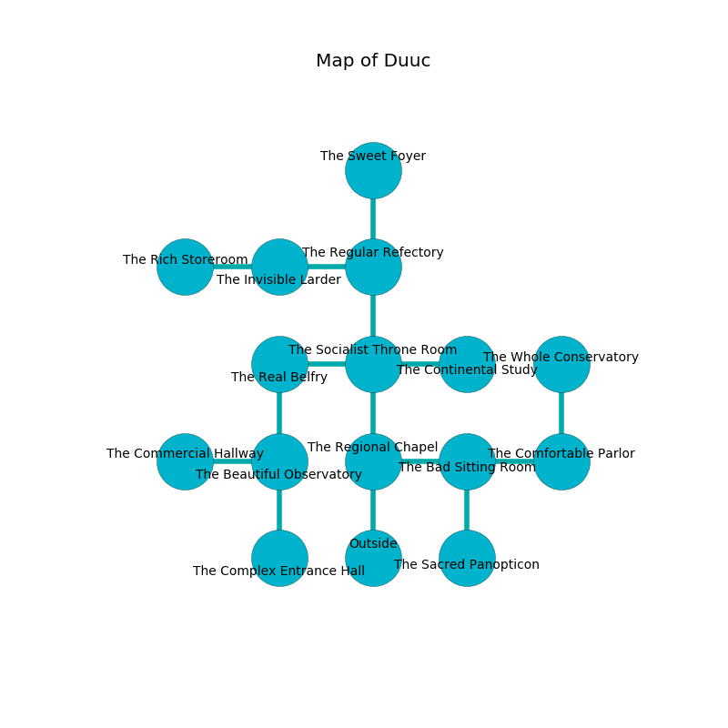

%Ruin Dogs

##Duuc
###Overview
Duuc is constructed on an obsidion plain. Some rooms of Duuc are inaccessible. The ruin is sinking into the earth. It is occupied by Vampires. Bette Meador The Cynical, an Assassin is here. The Vampires are the slaves of Bette Meador The Cynical. She  is founding a new religion. 

###Artifact
####Laehabbe

Laehabbe looks like a broken crystal. It is a bright blue color. It smells like coriander. When cradled it flies into the air. 

###Locations

####the regional chapel
Blue lichens are sprouting in a patch on the floor. The mirrored walls are ruined. The floor is cluttered with broken glass. There are two Vampire Spawns here. One of the Vampires is working a mechanism that can open a trapodoor in the floor. 

* To the east a hazy corridor opens to [the bad sitting Room](#the-bad-sitting-Room).
* To the north a flooded hall leads to [the socialist throne room](#the-socialist-throne-room).
* To the south is the entrance.

####the socialist throne room
The floor is cluttered with shells. There are two Vampire Spawns here. The brick walls are bloodstained. The air smells like fish here. The Vampires are willing to negotiate. 

There is an engraving on the ceiling written in Vampires Script. 

> I am lost in Duuc.
>
> Dig here.
>

* To the west a small gap opens to [the real belfry](#the-real-belfry).
* To the east a long pathway opens to [the continental study](#the-continental-study).
* To the north a hazy gap connects to [the regular refectory](#the-regular-refectory).
* To the south a flooded hall opens to [the regional chapel](#the-regional-chapel).

####the real belfry
The floor is bloodstained. The air smells like raw	reseda here. White ferns are growing in broken urns. 

* There is a card here.
* To the east a small gap opens to [the socialist throne room](#the-socialist-throne-room).
* To the south a torchlit artery leads to [the beautiful observatory](#the-beautiful-observatory).

####the regular refectory
The concrete walls are scratched. There are a Shield Guardian, a Bandit, a Swarm of Bats, a Brass Dragon Wyrmling, and a Commoner here. Yellow lichens are growing in cracks in the floor. 

* To the west a dripping hall opens to [the invisible larder](#the-invisible-larder).
* To the north a flooded walkway opens to [the sweet foyer](#the-sweet-foyer).
* To the south a hazy gap connects to [the socialist throne room](#the-socialist-throne-room).

####the beautiful observatory
There are a Rug of Smothering and a Githyanki Knight here. The air smells like boysenberry here. The floor is sticky. 

* To the west a windy walkway leads to [the commercial hallway](#the-commercial-hallway).
* To the north a torchlit artery opens to [the real belfry](#the-real-belfry).
* To the south a small path connects to [the complex entrance hall](#the-complex-entrance-hall).

####the invisible larder
The mirrored walls are unsettled. 

* There is a brake here.
* To the west a twisted threshold connects to [the rich storeroom](#the-rich-storeroom).
* To the east a dripping hall leads to [the regular refectory](#the-regular-refectory).

####the continental study
Yellow ferns are decaying from the ceiling. 

* [Bette Meador The Cynical](#Bette-Meador-The-Cynical) is here.
* To the west a long pathway connects to [the socialist throne room](#the-socialist-throne-room).

####the bad sitting Room
The concrete walls are bloodstained. The air tastes like hay here. 

* To the west a hazy corridor connects to [the regional chapel](#the-regional-chapel).
* To the east a dark corridor connects to [the comfortable parlor](#the-comfortable-parlor).
* To the south a dripping hall connects to [the sacred panopticon](#the-sacred-panopticon).

####the commercial hallway
Red razorgrass is decaying in cracks in the floor. The crystal walls are scratched. 

There is an engraving on a stone written in common. 

> A thread is a photographer
>
> always homosexual
>
> independent and rich
>
> [Laehabbe](#Laehabbe)
>
> ever impossible
>
> An island is a choice
>
> always awake
>
> [Laehabbe](#Laehabbe)
>
> practical, revolutionary, huge
>
> yet never limited
>
> but never vacant
>
> true and inadequate
>
> An apple is a foot
>
> sexual, cheerful, geological
>

* To the east a windy walkway connects to [the beautiful observatory](#the-beautiful-observatory).

####the comfortable parlor
White razorgrass is growing in broken urns. There are two Vampire Spawns here. One of the Vampires is on watch, the rest are caring for babies. 

* There is a horn here.
* [Laehabbe](#Laehabbe) is here.
* To the west a dark corridor connects to [the bad sitting Room](#the-bad-sitting-Room).
* To the north a dripping walkway connects to [the whole conservatory](#the-whole-conservatory).

####the sacred panopticon
There are two Vampire Spawns here. The floor is glossy. There is a trap here. When activated, a magical sound detector will open a trapdoor in the floor. The air tastes like acorn here. The Vampires are willing to negotiate. 

* There is a spring here.
* There is a trousers here.
* To the north a dripping hall connects to [the bad sitting Room](#the-bad-sitting-Room).

####the rich storeroom
The air tastes like root beer here. Yellow ferns are swaying in a patch on the floor. 

* To the east a twisted threshold opens to [the invisible larder](#the-invisible-larder).

####the complex entrance hall
Red lichens are decaying from the ceiling. 

There is an engraving on a monolith written in common. 

> Poor me! meak god
>
> square and odd
>
> always addicted
>
> death is restricted
>

* There is a shield here.
* There is a rail here.
* To the north a small path leads to [the beautiful observatory](#the-beautiful-observatory).

####the sweet foyer
There are a Yeti, a Swarm of Poisonous Snakes, a Killer Whale, and a Githyanki Knight here. The wooden walls are scratched. 

* There is a net here.
* To the south a flooded walkway connects to [the regular refectory](#the-regular-refectory).

####the whole conservatory
There are two Vampire Spawns here. The wooden walls are pristine. Yellow lichens are growing in a patch on the floor. The Vampires are performing a ritual. If not interrupted, the Vampires will become more powerful. 

* There is a lock here.
* To the south a dripping walkway connects to [the comfortable parlor](#the-comfortable-parlor).

