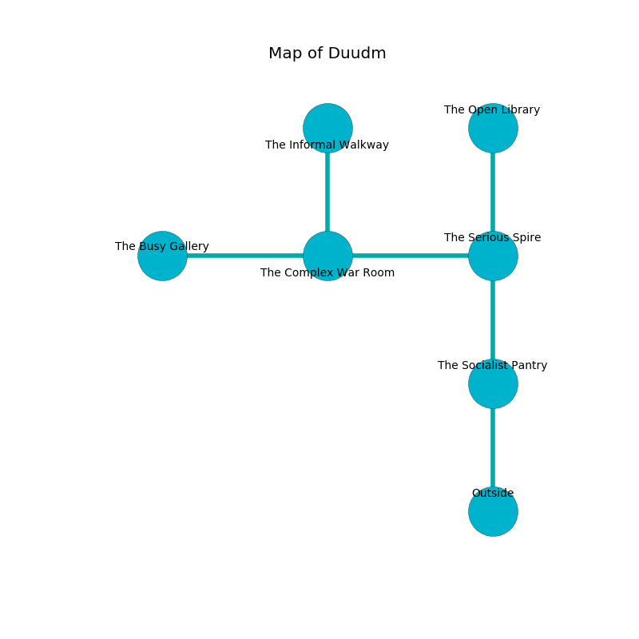

%Ruin Dogs

##Duudm
###Overview
Duudm is constructed on a giant rift. Some areas of Duudm are foggy. The ruin is burning. It is occupied by Orc. Altha Wilbur The Pompous, a Cloud Giant is here. The Orc have been charmed by Altha Wilbur The Pompous. She  is founding a new religion. 

###Artifact
####Fadodedaeum Coidaegaecedaeum

Fadodedaeum Coidaegaecedaeum is a powerful artifact in the shape of a soft spear. It is a dark orange color. When gazed upon it shows an image of the future. 

###Locations

####the socialist pantry
The air tastes like brandy here. There are twenty Orcs here. Red moss is growing in broken urns. The Orc are drunk. 

There is an engraving on a monolith written in common. 

> Leave now.
>

* There is a diamond here.
* [Altha Wilbur The Pompous](#Altha-Wilbur-The-Pompous) is here.
* To the north a dripping path connects to [the serious spire](#the-serious-spire).
* To the south is the entrance.

####the serious spire
The stone walls are bloodstained. The floor is glossy. There are twenty Orcs here. The air tastes like sage here. The Orc are crazy with bloodlust. 

There is an engraving on the floor written in Orc Script. 

> I am powerful.
>
> Maybe try hiding.
>

* To the west a long path leads to [the complex war Room](#the-complex-war-Room).
* To the north a dripping threshold connects to [the open library](#the-open-library).
* To the south a dripping path leads to [the socialist pantry](#the-socialist-pantry).

####the open library
There are twenty Orcs here. The brick walls are ruined. The floor is glossy. The Orc are berserk with rage. 

* To the south a dripping threshold opens to [the serious spire](#the-serious-spire).

####the complex war Room
The air smells like deertongue here. There are a Brown Bear, two Will-O’-Wisps, a Scout, a Weretiger, a Piercer, and  here. 

There is an engraving on a stone written in common. 

> A camera is an energy
>
> but never proportional
>
> A camera is an energy
>

* [Fadodedaeum Coidaegaecedaeum](#Fadodedaeum-Coidaegaecedaeum) is here.
* To the west a dripping gap opens to [the busy gallery](#the-busy-gallery).
* To the east a long path connects to [the serious spire](#the-serious-spire).
* To the north a small passageway connects to [the informal walkway](#the-informal-walkway).

####the informal walkway
The stone walls are bloodstained. The floor is sticky. 

* To the south a small passageway leads to [the complex war Room](#the-complex-war-Room).

####the busy gallery
There are a Young Green Dragon and a Sahuagin Baron here. The air smells like horhound here. Blue moss is sprouting in a patch on the floor. The floor is glossy. The brick walls are covered in mold. 

There is an engraving on the ceiling written in common. 

> [Fadodedaeum Coidaegaecedaeum](#Fadodedaeum-Coidaegaecedaeum)
>
> content, independent, commercial
>
> ethnic and experienced
>
> favorable, monstrous, outer
>
> bald and unaware
>
> but unfair
>
> established and temporary
>
> you shall be captured
>

* To the east a dripping gap leads to [the complex war Room](#the-complex-war-Room).

