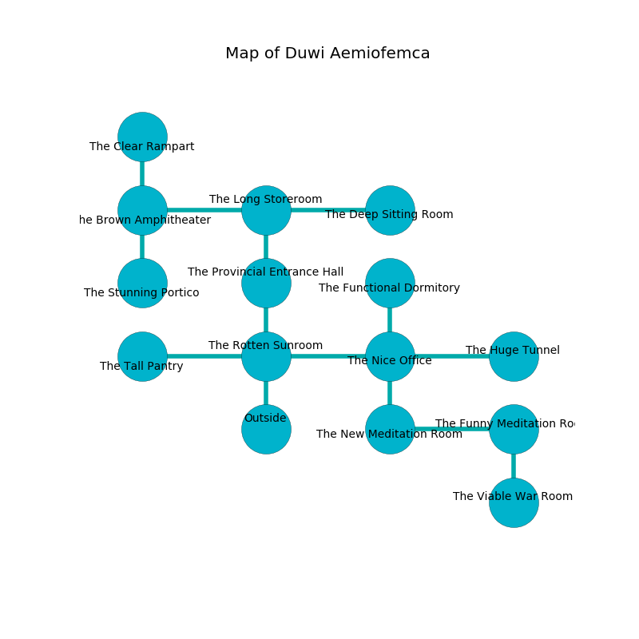

%Ruin Dogs

##Duwi Aemiofemca
###Overview
Duwi Aemiofemca is constructed on a broken tree. Some rooms of it are incredibly cold. The ruin is flooding. It is occupied by Sahuagin. Isabelle Robert The Interfering, a Cloud Giant is here. The Sahuagin are the slaves of Isabelle Robert The Interfering. She  is trying to use [The Green Toast](#The-Green-Toast). 

###Artifact
####The Green Toast

The Green Toast looks like a sharp figurine. When cradled it floats above the ground. 

###Locations

####the rotten sunroom
The floor is smooth. The air tastes like elderflower here. There are a Cyclops and an Unicorn here. 

* To the west a flooded passageway opens to [the tall pantry](#the-tall-pantry).
* To the east a small cave leads to [the nice office](#the-nice-office).
* To the north a long cave opens to [the provincial entrance hall](#the-provincial-entrance-hall).
* To the south is the entrance.

####the nice office
The stone walls are ruined. Green moss is sprouting in a patch on the floor. The air tastes like baked potato here. There are two Sahuagin Barons here. One of the Sahuagin is on watch, the rest are drunk. 

* [The Green Toast](#The-Green-Toast) is here.
* To the west a small cave connects to [the rotten sunroom](#the-rotten-sunroom).
* To the east a dark hallway opens to [the huge tunnel](#the-huge-tunnel).
* To the north a windy corridor opens to [the functional dormitory](#the-functional-dormitory).
* To the south a hazy corridor leads to [the new meditation room](#the-new-meditation-room).

####the provincial entrance hall
The wooden walls are pristine. Gray mushrooms are growing in broken urns. 

* [Isabelle Robert The Interfering](#Isabelle-Robert-The-Interfering) is here.
* To the north a torchlit threshold leads to [the long storeroom](#the-long-storeroom).
* To the south a long cave opens to [the rotten sunroom](#the-rotten-sunroom).

####the long storeroom
There are two Sahuagin Barons here. The metallic walls are scratched. The air tastes like marigold here. Blue mushrooms are sprouting from the ceiling. The Sahuagin are celebrating. 

There is an engraving on a monolith written in Sahuagin Script. 

> All of us are corrupted
>
> smooth and smooth
>
> useful, current, rare
>
> A comb is a trade
>
> moral and neutral
>
> They are joyful
>
> generous and private
>
> you are returned
>

* There is a roof here.
* To the west a narrow corridor leads to [the brown amphitheater](#the-brown-amphitheater).
* To the east a hazy corridor connects to [the deep sitting Room](#the-deep-sitting-Room).
* To the south a torchlit threshold opens to [the provincial entrance hall](#the-provincial-entrance-hall).

####the brown amphitheater
The metallic walls are pristine. The air smells like pimenta here. 

* There is a chest here.
* To the east a narrow corridor opens to [the long storeroom](#the-long-storeroom).
* To the north a windy threshold opens to [the clear rampart](#the-clear-rampart).
* To the south a windy path leads to [the stunning portico](#the-stunning-portico).

####the tall pantry
Yellow mushrooms are sprouting from the walls. The air smells like stringent here. 

* To the east a flooded passageway connects to [the rotten sunroom](#the-rotten-sunroom).

####the new meditation room
The floor is cluttered with debris. There are a Mummy, an Orog, a Cultist, a Cyclops, an Axe Beak, a Specter, and a Steam Mephit here. 

* To the east a dripping hallway connects to [the funny meditation room](#the-funny-meditation-room).
* To the north a hazy corridor leads to [the nice office](#the-nice-office).

####the stunning portico
The stone walls are pristine. There are a Blink Dog, a Giant Crab, a Giant Toad, a Hobgoblin Warlord, an Elk, a Bat, and a Priest here. The floor is flooded with two inch deep lukewarm water. 

* To the north a windy path connects to [the brown amphitheater](#the-brown-amphitheater).

####the functional dormitory
There are a Quaggoth Thonot, a Merrow, a Minotaur Skeleton, a Rat, a Poisonous Snake, and a Berserker here. 

* To the south a windy corridor opens to [the nice office](#the-nice-office).

####the funny meditation room
The brick walls are unsettled. There is a trap here. When activated, a magical proximity detector will launch a ceiling pendulum. White lichens are swaying in broken urns. The air smells like red rose here. 

There is an engraving on the ceiling written in Sahuagin Script. 

> I am defending this place.
>
> Do not try fighting.
>

* To the west a dripping hallway connects to [the new meditation room](#the-new-meditation-room).
* To the south a flooded hallway leads to [the viable war Room](#the-viable-war-Room).

####the clear rampart
Red mushrooms are decaying in a patch on the floor. There are a Red Slaad and a Minotaur here. The crystal walls are pristine. 

* There is a head here.
* To the south a windy threshold leads to [the brown amphitheater](#the-brown-amphitheater).

####the viable war Room
The crystal walls are scratched. The air tastes like kiwi here. The floor is cluttered with ashes. 

There is an engraving on the wall written in common. 

> [The Green Toast](#The-Green-Toast)
>
> perfect, sharp, long
>
> privileged and resident
>
> [The Green Toast](#The-Green-Toast)
>

* There is a card here.
* There is a table here.
* To the north a flooded hallway leads to [the funny meditation room](#the-funny-meditation-room).

####the deep sitting Room
The air tastes like currant here. 

* To the west a hazy corridor connects to [the long storeroom](#the-long-storeroom).

####the huge tunnel
The air tastes like must here. Yellow ferns are swaying from the walls. 

* To the west a dark hallway leads to [the nice office](#the-nice-office).

