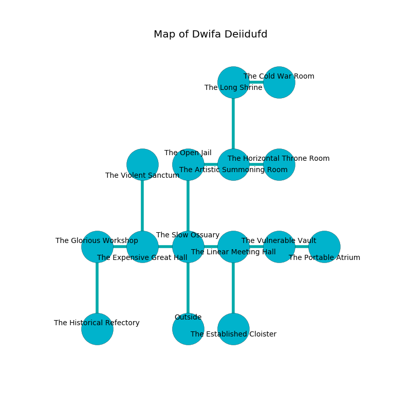

%Ruin Dogs

##Dwifa Deiidufd
###Overview
Dwifa Deiidufd is located in a giant plain. Regions of it are flooded. A windstorm is happening outside. It is occupied by Sprites. Dominic Kearney The Unpredictable, a Mind Flayer Arcanist is here. The Sprites worship Dominic Kearney The Unpredictable. He  is trying to use [The Characteristic Abuse](#The-Characteristic-Abuse). 

###Artifact
####The Characteristic Abuse

The Characteristic Abuse looks like a transparent orb. It smells like metal. It is a dark orange color. When held it floats above the ground. 

###Locations

####the slow ossuary
There are a Salamander and a Water Elemental here. 

* To the west a dripping cave connects to [the expensive great hall](#the-expensive-great-hall).
* To the east a dripping artery connects to [the linear meeting hall](#the-linear-meeting-hall).
* To the north a dark opening opens to [the open jail](#the-open-jail).
* To the south is the entrance.

####the expensive great hall
There are a Salamander, two Deep Gnomes, a Mind Flayer, and  here. The floor is cluttered with broken glass. The air tastes like linden flower here. 

* There is a rat here.
* To the west a narrow corridor leads to [the glorious workshop](#the-glorious-workshop).
* To the east a dripping cave connects to [the slow ossuary](#the-slow-ossuary).
* To the north a dark pathway leads to [the violent sanctum](#the-violent-sanctum).

####the violent sanctum
The air smells like orange here. The floor is bloodstained. Green moss is growing in cracks in the floor. 

* To the south a dark pathway connects to [the expensive great hall](#the-expensive-great-hall).

####the linear meeting hall
The floor is smooth. The air smells like mahogany here. 

* There is a collar here.
* To the west a dripping artery opens to [the slow ossuary](#the-slow-ossuary).
* To the east a hazy cavern leads to [the vulnerable vault](#the-vulnerable-vault).
* To the south a small artery opens to [the established cloister](#the-established-cloister).

####the open jail
There is a trap here. When activated, a magical sound detector will close a portcullis. The air tastes like green bean here. 

* To the east a dark corridor connects to [the artistic summoning room](#the-artistic-summoning-room).
* To the south a dark opening opens to [the slow ossuary](#the-slow-ossuary).

####the artistic summoning room
The floor is bloodstained. White lichens are swaying from the ceiling. The air smells like balsam	petal here. 

* There is a nut here.
* To the west a dark corridor connects to [the open jail](#the-open-jail).
* To the east a dark cave connects to [the horizontal throne room](#the-horizontal-throne-room).
* To the north a flooded path leads to [the long shrine](#the-long-shrine).

####the horizontal throne room
There are thirty two Sprites here. Red ferns are growing in cracks in the floor. The floor is smooth. One of the Sprites is pointing a ballista at the entrance. 

* To the west a dark cave connects to [the artistic summoning room](#the-artistic-summoning-room).

####the vulnerable vault
The glass walls are bloodstained. The air tastes like baked potato here. There is a trap here. When activated, a magical rune will close a portcullis. 

There is an engraving on a stone written in Sprites Script. 

> Oh meak fate
>
> native and great
>
> vicious, fine, considerable
>
> everything is straight
>

* [The Characteristic Abuse](#The-Characteristic-Abuse) is here.
* To the west a hazy cavern opens to [the linear meeting hall](#the-linear-meeting-hall).
* To the east a windy artery opens to [the portable atrium](#the-portable-atrium).

####the long shrine
The wooden walls are scratched. The floor is cluttered with broken glass. There is a trap here. When activated, a magical proximity detector will launch a hail of needles. There are a Giant Vulture, a Dust Mephit, a Giant Owl, a Scarecrow, a Giant Elk, and a Succubus here. 

* To the east a windy opening connects to [the cold war Room](#the-cold-war-Room).
* To the south a flooded path leads to [the artistic summoning room](#the-artistic-summoning-room).

####the glorious workshop
The floor is sticky. Red lichens are decaying in a patch on the floor. There is a trap here. When activated, a pressure plate will shoot a lightning bolt. There are thirty two Sprites here. If the Sprites notice the Ruin Dogs, one of them will retreat and alert the others. 

* To the east a narrow corridor connects to [the expensive great hall](#the-expensive-great-hall).
* To the south a dark gap connects to [the historical refectory](#the-historical-refectory).

####the established cloister
The floor is smooth. There are a Chasme, an Unicorn, and a Giant Owl here. Gray mushrooms are swaying in a patch on the floor. 

* To the north a small artery opens to [the linear meeting hall](#the-linear-meeting-hall).

####the cold war Room
Gray razorgrass is growing in broken urns. 

* [Dominic Kearney The Unpredictable](#Dominic-Kearney-The-Unpredictable) is here.
* To the west a windy opening leads to [the long shrine](#the-long-shrine).

####the historical refectory
The stone walls are unsettled. There are thirty two Sprites here. The floor is flooded with nine inch deep cold water. If the Sprites notice the Ruin Dogs, one of them will retreat and alert the others. 

There is an engraving on a tablet written in common. 

> A pen is a confrontation
>
> wise, strong, content
>
> senior, impossible, false
>
> A camera is a sacrifice
>
> decisive, minimum, general
>

* To the north a dark gap connects to [the glorious workshop](#the-glorious-workshop).

####the portable atrium
There are thirty two Sprites here. The mirrored walls are ruined. Gray moss is sprouting in broken urns. The floor is sticky. The Sprites are crazy with bloodlust. 

* To the west a windy artery leads to [the vulnerable vault](#the-vulnerable-vault).

