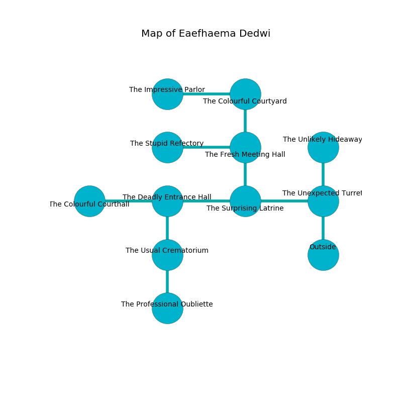

%Ruin Dogs

##Eaefhaema Dedwi
###Overview
Eaefhaema Dedwi is located on a ruined tree. Some areas of Eaefhaema Dedwi are inaccessible. The ruin is coming to life. It is occupied by Yuan-Ti. Modesto Hicks The Bone-Idle, a Frost Giant is here. The Yuan-Ti are ruled by Modesto Hicks The Bone-Idle. He  is founding a new religion. 

###Artifact
####The Steady Supervisor

The Steady Supervisor has the form of a smooth doll. It is a dark yellow color. It smells like metal. When eaten it grants a wish. 

###Locations

####the unexpected turret
The air tastes like grape skin here. There are a Young Copper Dragon and a Mimic here. The stone walls are scratched. 

* To the west a dark walkway connects to [the surprising latrine](#the-surprising-latrine).
* To the north a dripping opening leads to [the unlikely hideaway](#the-unlikely-hideaway).
* To the south is the entrance.

####the surprising latrine
There are a Frost Giant, a Manticore, a Mastiff, and an Owl here. The air tastes like taco here. The stone walls are scratched. 

* To the west a dripping cave leads to [the deadly entrance hall](#the-deadly-entrance-hall).
* To the east a dark walkway connects to [the unexpected turret](#the-unexpected-turret).
* To the north a flooded opening opens to [the fresh meeting hall](#the-fresh-meeting-hall).

####the deadly entrance hall
The floor is sticky. The air smells like nut skin here. 

* To the west a hazy pathway leads to [the colourful courthall](#the-colourful-courthall).
* To the east a dripping cave leads to [the surprising latrine](#the-surprising-latrine).
* To the south a dark hall leads to [the usual crematorium](#the-usual-crematorium).

####the fresh meeting hall
The concrete walls are covered in mold. Green lichens are growing in broken urns. The floor is flooded with three inch deep cool water. 

* To the west a dark cave opens to [the stupid refectory](#the-stupid-refectory).
* To the north a torchlit passageway opens to [the colourful courtyard](#the-colourful-courtyard).
* To the south a flooded opening opens to [the surprising latrine](#the-surprising-latrine).

####the usual crematorium

There is an engraving on the ceiling written in common. 

> I am lost in Eaefhaema Dedwi.
>
> Hide here.
>

* To the north a dark hall connects to [the deadly entrance hall](#the-deadly-entrance-hall).
* To the south a torchlit threshold leads to [the professional oubliette](#the-professional-oubliette).

####the colourful courtyard
The floor is flooded with nine inch deep cold water. 

* [The Steady Supervisor](#The-Steady-Supervisor) is here.
* To the west a long corridor leads to [the impressive parlor](#the-impressive-parlor).
* To the south a torchlit passageway opens to [the fresh meeting hall](#the-fresh-meeting-hall).

####the stupid refectory
There are four Yuan-Ti Purebloods and two Yuan-Ti Malisons here. Yellow mushrooms are decaying in a patch on the floor. The brick walls are ruined. One of the Yuan-Ti is pointing a ballista at the entrance. 

* To the east a dark cave opens to [the fresh meeting hall](#the-fresh-meeting-hall).

####the unlikely hideaway
The floor is glossy. Gray ferns are decaying in cracks in the floor. 

* To the south a dripping opening leads to [the unexpected turret](#the-unexpected-turret).

####the professional oubliette
There are a Death Dog, an Assassin, and a Mule here. 

* To the north a torchlit threshold opens to [the usual crematorium](#the-usual-crematorium).

####the colourful courthall
There are a Mage, an Old Faerie Dragon, and a Wyvern here. The floor is glossy. 

* [Modesto Hicks The Bone-Idle](#Modesto-Hicks-The-Bone-Idle) is here.
* To the east a hazy pathway opens to [the deadly entrance hall](#the-deadly-entrance-hall).

####the impressive parlor
Gray lichens are decaying in broken urns. The floor is cluttered with broken glass. 

* To the east a long corridor opens to [the colourful courtyard](#the-colourful-courtyard).

