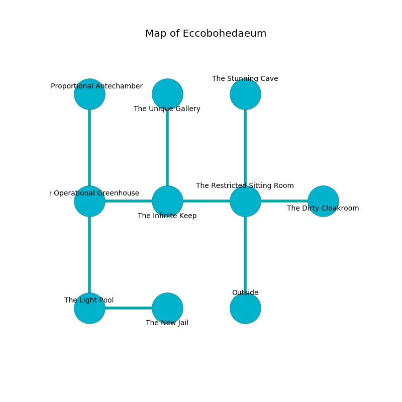

%Ruin Dogs

##Eccobohedaeum
###Overview
Eccobohedaeum is located in a crystal city. Some rooms of it are somewhat hot. A battle between raiders is happening outside. It is occupied by Myconids. Mauro Erdmann The Stubborn, a Gladiator is here. The Myconids worship Mauro Erdmann The Stubborn. He  is trying to understand [The Revolutionary Pavement](#The-Revolutionary-Pavement). 

###Artifact
####The Revolutionary Pavement

The Revolutionary Pavement looks like a smooth amulet. It smells like ylang. When worn it makes its owner invisible. 

###Locations

####the restricted sitting Room
There are three Myconid Sovereigns and a Myconid Adult here. Green mushrooms are sprouting in cracks in the floor. The floor is cluttered with debris. The air tastes like algae here. The glass walls are caving in. The Myconids are willing to negotiate. 

* [Mauro Erdmann The Stubborn](#Mauro-Erdmann-The-Stubborn) is here.
* To the west a windy gap leads to [the infinite keep](#the-infinite-keep).
* To the east a torchlit path leads to [the dirty cloakroom](#the-dirty-cloakroom).
* To the north a twisted hall leads to [the stunning cave](#the-stunning-cave).
* To the south is the entrance.

####the infinite keep
Blue mushrooms are growing in a patch on the floor. The air smells like lychee here. There are two Myconid Sovereigns and two Myconid Adults here. The Myconids are feasting. 

* To the west a narrow cave opens to [the operational greenhouse](#the-operational-greenhouse).
* To the east a windy gap connects to [the restricted sitting Room](#the-restricted-sitting-Room).
* To the north a hazy artery connects to [the unique gallery](#the-unique-gallery).

####the unique gallery
There are two Myconid Sovereigns and two Myconid Adults here. White razorgrass is sprouting in cracks in the floor. The floor is sticky. There is a trap here. When activated, a magical sound detector will collapse a column. The air smells like vegetables here. The concrete walls are covered in mold. The Myconids are willing to negotiate. 

There is an engraving on the wall written in common. 

> I tried leaving.
>

* To the south a hazy artery connects to [the infinite keep](#the-infinite-keep).

####the stunning cave
The air tastes like violet leaf here. There are a Doppelganger, a Crab, a Tridrone, a Manes, a Fire Snake, and a Killer Whale here. 

* To the south a twisted hall leads to [the restricted sitting Room](#the-restricted-sitting-Room).

####the dirty cloakroom
The floor is flooded with five inch deep cool water. The brick walls are scratched. The air smells like chestnut here. 

* To the west a torchlit path opens to [the restricted sitting Room](#the-restricted-sitting-Room).

####the operational greenhouse
Yellow ferns are decaying in cracks in the floor. The concrete walls are ruined. The air tastes like mastic here. 

There is an engraving on the wall written in Myconids Script. 

> Poor me! sorry fate
>
> outside, flawed, straight
>
> linear and oral
>
> sadness is moral
>

* [The Revolutionary Pavement](#The-Revolutionary-Pavement) is here.
* To the east a narrow cave opens to [the infinite keep](#the-infinite-keep).
* To the north a small gap leads to [the proportional antechamber](#the-proportional-antechamber).
* To the south a windy hallway leads to [the light pool](#the-light-pool).

####the light pool
The floor is bloodstained. Gray razorgrass is growing in cracks in the floor. The obsidion walls are ruined. 

* To the east a hazy hall connects to [the new jail](#the-new-jail).
* To the north a windy hallway connects to [the operational greenhouse](#the-operational-greenhouse).

####the new jail
The floor is glossy. The glass walls are unsettled. The air tastes like bread baked here. 

* To the west a hazy hall connects to [the light pool](#the-light-pool).

####the proportional antechamber
Green razorgrass is swaying in a patch on the floor. The floor is sticky. There are a Darkmantle, a Xorn, a Green Dragon Wyrmling, and a Worg here. 

* To the south a small gap leads to [the operational greenhouse](#the-operational-greenhouse).

