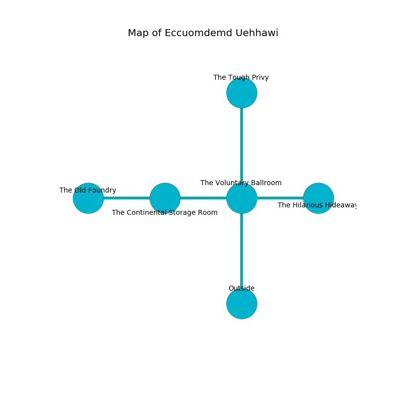

%Ruin Dogs

##Eccuomdemd Uehhawi
###Overview
Eccuomdemd Uehhawi is located in a flooded tree. Some rooms of Eccuomdemd Uehhawi are corrupted. A blizzard is happening outside. It is occupied by Ogres. Jesus Mcgriff The Stupid, a Quaggoth is here. The Ogres are ruled by Jesus Mcgriff The Stupid. He  is trying to use [Iehd Ghuof](#Iehd-Ghuof). 

###Artifact
####Iehd Ghuof

Iehd Ghuof has the form of a transparent sphere. Power slips from it. It is a dark green color. It smells like cologne. When smelled it frightens children. 

###Locations

####the voluntary ballroom
The brick walls are pristine. The air tastes like clary sage here. Red ferns are decaying from the walls. 

* To the west a twisted artery opens to [the continental storage room](#the-continental-storage-room).
* To the east a narrow hallway leads to [the hilarious hideaway](#the-hilarious-hideaway).
* To the north a flooded hallway leads to [the tough privy](#the-tough-privy).
* To the south is the entrance.

####the hilarious hideaway
The floor is bloodstained. Yellow mushrooms are sprouting from the ceiling. There are a Mummy, a Goblin, a Gnoll, and an Ankheg here. The air smells like banana peel here. 

* To the west a narrow hallway leads to [the voluntary ballroom](#the-voluntary-ballroom).

####the tough privy
The metallic walls are unsettled. The air smells like cypress here. The floor is glossy. 

* To the south a flooded hallway leads to [the voluntary ballroom](#the-voluntary-ballroom).

####the continental storage room
There are three Half-Ogres here. The air smells like vetiver here. There is a trap here. When activated, a magical sound detector will collapse a column. The floor is bloodstained. One of the Ogres is pointing a ballista at the entrance. 

* [Iehd Ghuof](#Iehd-Ghuof) is here.
* To the west a small threshold opens to [the old foundry](#the-old-foundry).
* To the east a twisted artery leads to [the voluntary ballroom](#the-voluntary-ballroom).

####the old foundry
White razorgrass is sprouting in cracks in the floor. The floor is cluttered with rocks. There are an Imp and a Githzerai Monk here. 

* [Jesus Mcgriff The Stupid](#Jesus-Mcgriff-The-Stupid) is here.
* To the east a small threshold opens to [the continental storage room](#the-continental-storage-room).

