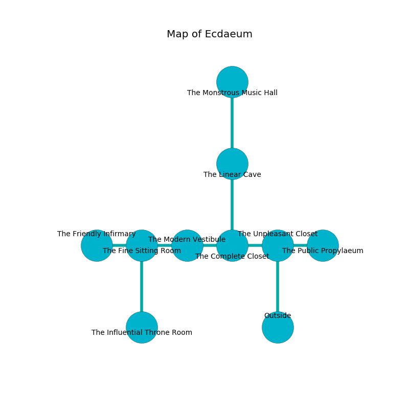

%Ruin Dogs

##Ecdaeum
###Overview
Ecdaeum is located on a flooded plain. Regions of Ecdaeum are unbearably hot. A blizzard is happening outside. It is occupied by Sahuagins. Nestor Southard The Quick-Tempered, a Kuo-Toa Archpriest is here. The Sahuagins are ruled by Nestor Southard The Quick-Tempered. He  is trying to understand [The Harmful Leadership](#The-Harmful-Leadership). 

###Artifact
####The Harmful Leadership

The Harmful Leadership has the form of a broken monument. It is a shifting white color. When rubbed it tunnels into the earth. 

###Locations

####the unpleasant closet
The air smells like clary sage here. There are a Goblin, a Grick, and an Elephant here. The floor is glossy. 

There is an engraving on a monolith written in Sahuagins Script. 

> I am looting Ecdaeum.
>

* To the west a windy hall leads to [the complete closet](#the-complete-closet).
* To the east a windy corridor opens to [the public propylaeum](#the-public-propylaeum).
* To the south is the entrance.

####the complete closet
The floor is glossy. The obsidion walls are unsettled. There are three Sahuagin Priestesses here. The Sahuagins are willing to fight to the death. 

* There is an orange here.
* To the west a dripping cavern opens to [the modern vestibule](#the-modern-vestibule).
* To the east a windy hall leads to [the unpleasant closet](#the-unpleasant-closet).
* To the north a dripping corridor opens to [the linear cave](#the-linear-cave).

####the linear cave
The floor is glossy. 

* To the north a hazy threshold opens to [the monstrous music hall](#the-monstrous-music-hall).
* To the south a dripping corridor opens to [the complete closet](#the-complete-closet).

####the modern vestibule
The floor is cluttered with broken glass. 

* To the west a dripping path leads to [the fine sitting Room](#the-fine-sitting-Room).
* To the east a dripping cavern opens to [the complete closet](#the-complete-closet).

####the fine sitting Room
There are a Gray Ooze, a Galeb Duhr, a Thri-Kreen, and a Giant Badger here. The air smells like pumpkin here. Gray mushrooms are swaying from the walls. 

* [The Harmful Leadership](#The-Harmful-Leadership) is here.
* To the west a dark path leads to [the friendly infirmary](#the-friendly-infirmary).
* To the east a dripping path leads to [the modern vestibule](#the-modern-vestibule).
* To the south a narrow opening connects to [the influential throne room](#the-influential-throne-room).

####the monstrous music hall
Yellow razorgrass is decaying from the walls. The floor is flooded with eight inch deep lukewarm water. The air tastes like cologne here. 

There is an engraving on a monolith written in common. 

> I worship [The Harmful Leadership](#The-Harmful-Leadership).
>
> I tried leaving.
>

* [Nestor Southard The Quick-Tempered](#Nestor-Southard-The-Quick-Tempered) is here.
* To the south a hazy threshold connects to [the linear cave](#the-linear-cave).

####the influential throne room
There are a Swarm of Rats, a Ghost, a Giant Crab, two Lions, and  here. Red moss is decaying from the ceiling. The glass walls are caving in. The air smells like privet here. The floor is bloodstained. 

* There is a stocking here.
* To the north a narrow opening opens to [the fine sitting Room](#the-fine-sitting-Room).

####the public propylaeum
There are three Sahuagin Priestesses here. The mirrored walls are ruined. The floor is cluttered with rocks. If the Sahuagins notice the Ruin Dogs, one of them will retreat and alert [Nestor Southard](#Nestor-Southard). 

* To the west a windy corridor leads to [the unpleasant closet](#the-unpleasant-closet).

####the friendly infirmary
There are a Raven, a Kuo-Toa Archpriest, and an Orc here. Red mushrooms are sprouting in cracks in the floor. 

* To the east a dark path leads to [the fine sitting Room](#the-fine-sitting-Room).

