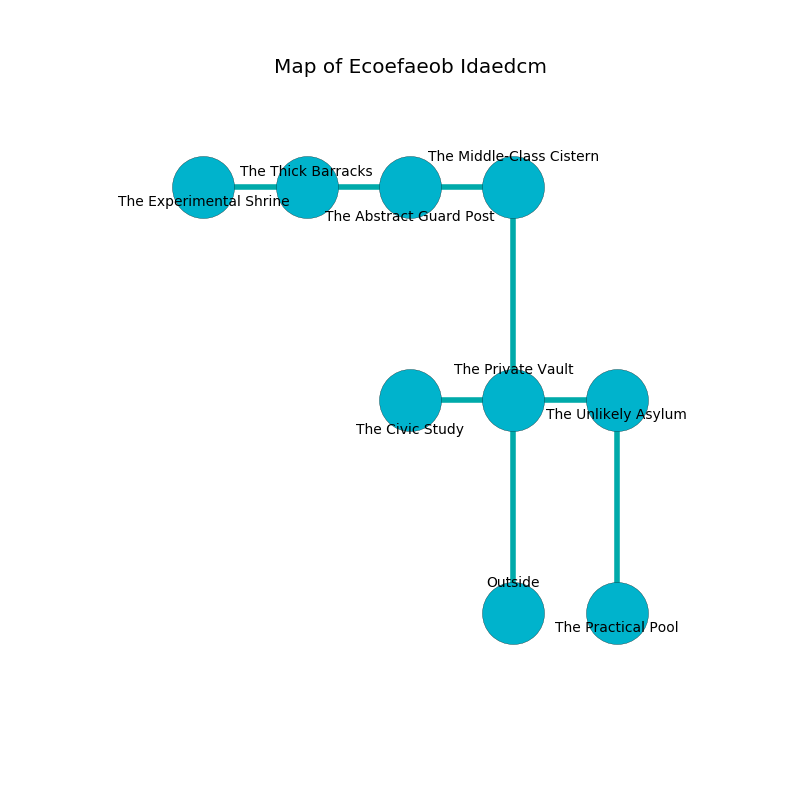

%Ruin Dogs

##Ecoefaeob Idaedcm
###Overview
Ecoefaeob Idaedcm is located in a giant tree. Regions of Ecoefaeob Idaedcm are flooded. A windstorm is happening outside. It is occupied by Deep Gnomes. Fernando Grubbs The Bossy, a Yuan-Ti Malison is here. The Deep Gnomes have been charmed by Fernando Grubbs The Bossy. He  is trying to exploit [Doddafghwi Cumiaelafedaeum](#Doddafghwi-Cumiaelafedaeum). 

###Artifact
####Doddafghwi Cumiaelafedaeum

Doddafghwi Cumiaelafedaeum is a powerful artifact in the shape of a hard rock. It smells like radish. Light shifts from it. When eaten it becomes a deadly projectile. 

###Locations

####the private vault
The wooden walls are caving in. Green mushrooms are growing from the walls. The floor is cluttered with rocks. 

There is an engraving on the wall written in Deep Gnomes Script. 

> Maybe try fighting.
>

* To the west a hazy corridor connects to [the civic study](#the-civic-study).
* To the east a windy cave connects to [the unlikely asylum](#the-unlikely-asylum).
* To the north a windy cave opens to [the middle-class cistern](#the-middle-class-cistern).
* To the south is the entrance.

####the middle-class cistern
Blue ferns are growing in broken urns. The wooden walls are bloodstained. The floor is smooth. There are eight Deep Gnomes here. The Deep Gnomes are willing to negotiate. 

* There is a bucket here.
* To the west a flooded path leads to [the abstract guard post](#the-abstract-guard-post).
* To the south a windy cave leads to [the private vault](#the-private-vault).

####the abstract guard post
Blue ferns are growing from the ceiling. There is a trap here. When activated, a magical proximity detector will launch a rolling boulder. The air smells like marshmallow here. The floor is glossy. 

* To the west a torchlit artery leads to [the thick barracks](#the-thick-barracks).
* To the east a flooded path leads to [the middle-class cistern](#the-middle-class-cistern).

####the unlikely asylum
The brick walls are unsettled. The floor is glossy. The air smells like black currant here. There are eight Deep Gnomes here. One of the Deep Gnomes is working a mechanism that can flood the room. 

There is an engraving on a monolith written in Deep Gnomes Script. 

> I am lonely.
>

* To the west a windy cave opens to [the private vault](#the-private-vault).
* To the south a narrow hall connects to [the practical pool](#the-practical-pool).

####the civic study
The brick walls are scratched. Gray ferns are swaying in broken urns. There is a trap here. When activated, a pressure plate will ring a bell. The air smells like chocolate here. The floor is cluttered with rocks. There is a Helmed Horror here. 

* There is a brain here.
* There is a shirt here.
* There is a belt here.
* To the east a hazy corridor opens to [the private vault](#the-private-vault).

####the thick barracks
The crystal walls are ruined. Gray mushrooms are growing in a patch on the floor. The air smells like asparagus here. 

* [Doddafghwi Cumiaelafedaeum](#Doddafghwi-Cumiaelafedaeum) is here.
* To the west a dark cave opens to [the experimental shrine](#the-experimental-shrine).
* To the east a torchlit artery connects to [the abstract guard post](#the-abstract-guard-post).

####the practical pool
The air tastes like flowers here. The metallic walls are bloodstained. Green lichens are swaying from the walls. 

* [Fernando Grubbs The Bossy](#Fernando-Grubbs-The-Bossy) is here.
* To the north a narrow hall opens to [the unlikely asylum](#the-unlikely-asylum).

####the experimental shrine
The air smells like fudge here. The floor is bloodstained. There are a Plesiosaurus and an Allosaurus here. 

* There is a gold coin here.
* There is a spear here.
* There is a sword here.
* To the east a dark cave opens to [the thick barracks](#the-thick-barracks).

