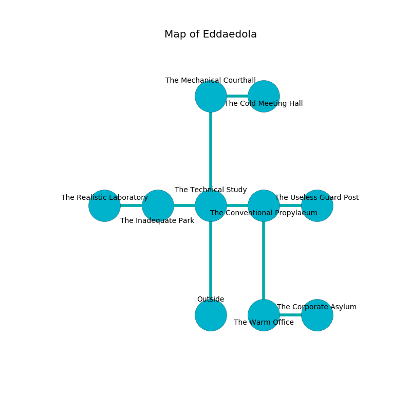

%Ruin Dogs

##Eddaedola
###Overview
Eddaedola is located under a crystal city. Parts of it are foggy. The ruin is collapsing slowly. It is occupied by Humans. Avery Archer The Fussy, a Mind Flayer Arcanist is here. The Humans worship Avery Archer The Fussy. He  is trying to hide [Dfuodha Duub](#Dfuodha-Duub). 

###Artifact
####Dfuodha Duub

Dfuodha Duub has the form of a mushy orb. It is a sickly brown color. When gazed upon it changes the past. 

###Locations

####the technical study
The air smells like alfalfa here. Green lichens are swaying from the ceiling. 

There is an engraving on a tablet written in common. 

> I hid something in Eddaedola.
>
> Try giving up.
>

* To the west a small hallway opens to [the inadequate park](#the-inadequate-park).
* To the east a torchlit hallway leads to [the conventional propylaeum](#the-conventional-propylaeum).
* To the north a twisted cavern connects to [the mechanical courthall](#the-mechanical-courthall).
* To the south is the entrance.

####the mechanical courthall
The floor is glossy. There is a trap here. When activated, a magical sound detector will flood the room with water. The wooden walls are ruined. 

* There is a fork here.
* There is a salamander here.
* [Avery Archer The Fussy](#Avery-Archer-The-Fussy) is here.
* To the east a dripping artery opens to [the cold meeting hall](#the-cold-meeting-hall).
* To the south a twisted cavern opens to [the technical study](#the-technical-study).

####the conventional propylaeum
There are a Fomorian and a Revenant here. The air tastes like seashore here. The mirrored walls are pristine. 

* To the west a torchlit hallway opens to [the technical study](#the-technical-study).
* To the east a dripping passageway connects to [the useless guard post](#the-useless-guard-post).
* To the south a torchlit passageway opens to [the warm office](#the-warm-office).

####the inadequate park
The wooden walls are pristine. There are a Barbed Devil, a Water Elemental, a Myconid Sprout, a Dust Mephit, and a Mule here. Green ferns are decaying from the walls. There is a trap here. When activated, a tripwire will cast a curse. 

* There is a bridge here.
* [Dfuodha Duub](#Dfuodha-Duub) is here.
* To the west a long gap opens to [the realistic laboratory](#the-realistic-laboratory).
* To the east a small hallway opens to [the technical study](#the-technical-study).

####the warm office
There are a Commoner, a Scout, two Berserkers, a Cultist, a Knight, a Priest, and  here. The air tastes like fat here. One of the Humans is on watch, the rest are sleeping. 

There is an engraving on the floor written in common. 

> [Dfuodha Duub](#Dfuodha-Duub)
>
> corporate and discreet
>
> brown, jealous, married
>
> but wrong
>
> safe and well
>
> ever cautious
>
> [Dfuodha Duub](#Dfuodha-Duub)
>
> closed, bureaucratic, innocent
>
> but never handy
>

* To the east a small gap leads to [the corporate asylum](#the-corporate-asylum).
* To the north a torchlit passageway connects to [the conventional propylaeum](#the-conventional-propylaeum).

####the corporate asylum

* There is a match here.
* To the west a small gap leads to [the warm office](#the-warm-office).

####the cold meeting hall
The air tastes like whiskey here. Yellow lichens are decaying in a patch on the floor. 

There is an engraving on the wall written in Humans Script. 

> Oh my! meak we
>
> yet never addicted
>
> but never free
>
> fate is restricted
>

* To the west a dripping artery connects to [the mechanical courthall](#the-mechanical-courthall).

####the useless guard post
There are a Cult Fanatic, a Giant Lizard, a Lizardfolk, a Fire Elemental, and a Hell Hound here. The metallic walls are scratched. 

* To the west a dripping passageway connects to [the conventional propylaeum](#the-conventional-propylaeum).

####the realistic laboratory
The air tastes like lavender here. The floor is flooded with four inch deep lukewarm water. There are two Cult Fanatics, two Cultists, two Priests,  here. The glass walls are bloodstained. The Humans are celebrating. 

There is an engraving on a monolith written in Humans Script. 

> Maybe try leaving.
>

* To the east a long gap connects to [the inadequate park](#the-inadequate-park).

