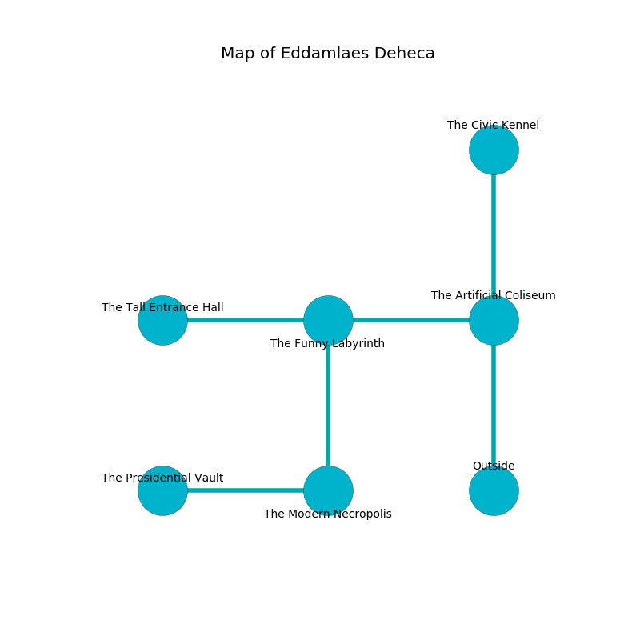

%Ruin Dogs

##Eddamlaes Deheca
###Overview
Eddamlaes Deheca is constructed on a volcanic tree. Some rooms of Eddamlaes Deheca are corrupted. A solar eclipse is happening outside. It is occupied by Ogres. Crystle Stover The Aggressive, a Gladiator is here. The Ogres have been charmed by Crystle Stover The Aggressive. She  is founding a new religion. 

###Artifact
####Uggamlaf

Uggamlaf has the form of a smooth spear. Fire slides near it. It smells like black currant. It is a pale yellow color. When worshipped it sings the hymn of the damned. 

###Locations

####the artificial coliseum
The floor is cluttered with ashes. There are a Giant Wasp, a Giant Owl, a Triceratops, and a Green Hag here. The air smells like ginger here. The mirrored walls are pristine. 

* There is a diamond here.
* To the west a torchlit walkway leads to [the funny labyrinth](#the-funny-labyrinth).
* To the north a hazy hall connects to [the civic kennel](#the-civic-kennel).
* To the south is the entrance.

####the funny labyrinth
The air smells like plum skin here. There are four Half-Ogres and an Ogre here. The Ogres are willing to negotiate. 

* To the west a flooded artery connects to [the tall entrance hall](#the-tall-entrance-hall).
* To the east a torchlit walkway opens to [the artificial coliseum](#the-artificial-coliseum).
* To the south a twisted artery opens to [the modern necropolis](#the-modern-necropolis).

####the civic kennel
The crystal walls are pristine. Gray mushrooms are growing from the ceiling. There are a Half-Ogre and three Ogres here. If the Ogres notice the Ruin Dogs, one of them will retreat and alert the others. 

There is an engraving on the wall written in common. 

> Do not try dying.
>

* There is a cord here.
* There is a cheese here.
* There is a spirit here.
* [Crystle Stover The Aggressive](#Crystle-Stover-The-Aggressive) is here.
* To the south a hazy hall connects to [the artificial coliseum](#the-artificial-coliseum).

####the modern necropolis
There are a Giant Rat, a Roper, a Mule, and a Giant Elk here. The air smells like egg nog here. Blue moss is sprouting from the walls. 

* [Uggamlaf](#Uggamlaf) is here.
* To the west a twisted cavern connects to [the presidential vault](#the-presidential-vault).
* To the north a twisted artery connects to [the funny labyrinth](#the-funny-labyrinth).

####the tall entrance hall

* To the east a flooded artery connects to [the funny labyrinth](#the-funny-labyrinth).

####the presidential vault
The air smells like seashore here. Red moss is sprouting from the walls. 

There is an engraving on the floor written in common. 

> I am worshipping this place.
>

* To the east a twisted cavern connects to [the modern necropolis](#the-modern-necropolis).

