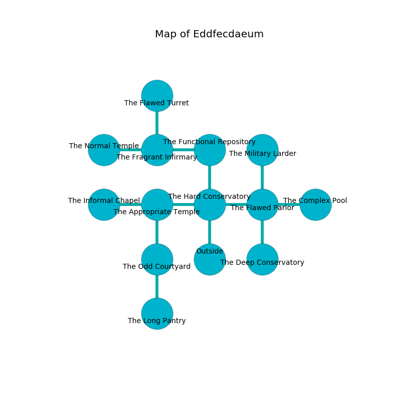

%Ruin Dogs

##Eddfecdaeum
###Overview
Eddfecdaeum is constructed on a volcanic tree. Some areas of Eddfecdaeum are flooded. The ruin is burning. It is occupied by Duergars. Kendall Armstrong The Indecisive, a Cyclops is here. The Duergars worship Kendall Armstrong The Indecisive. She  is trying to recover [Dad](#Dad). 

###Artifact
####Dad

Dad is a powerful artifact in the shape of a sharp meteorite. It smells like grilling. It is a medium pink color. When thrown it shows an image of the future. 

###Locations

####the hard conservatory

* To the west a long passageway connects to [the appropriate temple](#the-appropriate-temple).
* To the east a twisted hall leads to [the flawed parlor](#the-flawed-parlor).
* To the north a dark passageway connects to [the functional repository](#the-functional-repository).
* To the south is the entrance.

####the functional repository
There are six Duergars here. The floor is bloodstained. Yellow lichens are sprouting in a patch on the floor. The concrete walls are pristine. The Duergars are defending this room from intruders. 

There is an engraving on a monolith written in common. 

> Dear me! weak you
>
> ever new
>
> ever odd
>
> fate is new
>

* To the west a windy walkway connects to [the fragrant infirmary](#the-fragrant-infirmary).
* To the south a dark passageway leads to [the hard conservatory](#the-hard-conservatory).

####the fragrant infirmary
The floor is smooth. There are a Thug, a Blue Dragon Wyrmling, a Green Dragon Wyrmling, a Blood Hawk, and a Githzerai Monk here. 

There is an engraving on a tablet written in common. 

> Maybe try swimming.
>

* [Dad](#Dad) is here.
* To the west a flooded passageway opens to [the normal temple](#the-normal-temple).
* To the east a windy walkway connects to [the functional repository](#the-functional-repository).
* To the north a narrow hall connects to [the flawed turret](#the-flawed-turret).

####the appropriate temple
The air smells like black currant here. The stone walls are bloodstained. The floor is glossy. Blue lichens are sprouting in a patch on the floor. 

* To the west a dripping passageway opens to [the informal chapel](#the-informal-chapel).
* To the east a long passageway connects to [the hard conservatory](#the-hard-conservatory).
* To the south a small passageway opens to [the odd courtyard](#the-odd-courtyard).

####the flawed turret
Gray ferns are growing in broken urns. There is a trap here. When activated, a tripwire will close a portcullis. 

* [Kendall Armstrong The Indecisive](#Kendall-Armstrong-The-Indecisive) is here.
* To the south a narrow hall leads to [the fragrant infirmary](#the-fragrant-infirmary).

####the flawed parlor
There are a Wight, a Giant Bat, a Myconid Sprout, and a Mimic here. The floor is bloodstained. 

* To the west a twisted hall leads to [the hard conservatory](#the-hard-conservatory).
* To the east a twisted passageway opens to [the complex pool](#the-complex-pool).
* To the north a hazy walkway leads to [the military larder](#the-military-larder).
* To the south a narrow hall leads to [the deep conservatory](#the-deep-conservatory).

####the complex pool
The glass walls are caving in. The floor is cluttered with debris. Gray ferns are decaying in broken urns. There are six Duergars here. One of the Duergars is working a mechanism that can engulf the room in a fiery blaze. 

* To the west a twisted passageway connects to [the flawed parlor](#the-flawed-parlor).

####the odd courtyard
The air smells like feces here. The floor is smooth. Green mushrooms are growing in broken urns. 

* There is a specter here.
* To the north a small passageway opens to [the appropriate temple](#the-appropriate-temple).
* To the south a hazy opening connects to [the long pantry](#the-long-pantry).

####the deep conservatory
The concrete walls are unsettled. There are a Giant Constrictor Snake, a Tribal Warrior, a Green Hag, a Bandit Captain, and a Swarm of Rats here. 

There is an engraving on the ceiling written in common. 

> Dig here.
>

* To the north a narrow hall opens to [the flawed parlor](#the-flawed-parlor).

####the long pantry
The floor is sticky. There are a Swarm of Bats, a Gladiator, two Mimics, and  here. There is a trap here. When activated, a magical proximity detector will launch a hail of needles. 

* To the north a hazy opening opens to [the odd courtyard](#the-odd-courtyard).

####the informal chapel
The crystal walls are pristine. There are six Duergars here. Blue razorgrass is growing from the walls. The Duergars are willing to negotiate. 

* To the east a dripping passageway leads to [the appropriate temple](#the-appropriate-temple).

####the military larder
The floor is flooded with two inch deep scalding water. Red mushrooms are growing from the ceiling. The metallic walls are covered in mold. There is a Vrock here. 

There is an engraving on the floor written in Duergars Script. 

> We are corrupted
>
> but never feminine
>
> aggressive and express
>
> you must never be punished
>

* There is a card here.
* To the south a hazy walkway opens to [the flawed parlor](#the-flawed-parlor).

####the normal temple
Yellow lichens are decaying from the ceiling. There is a Young Brass Dragon here. 

* To the east a flooded passageway connects to [the fragrant infirmary](#the-fragrant-infirmary).

