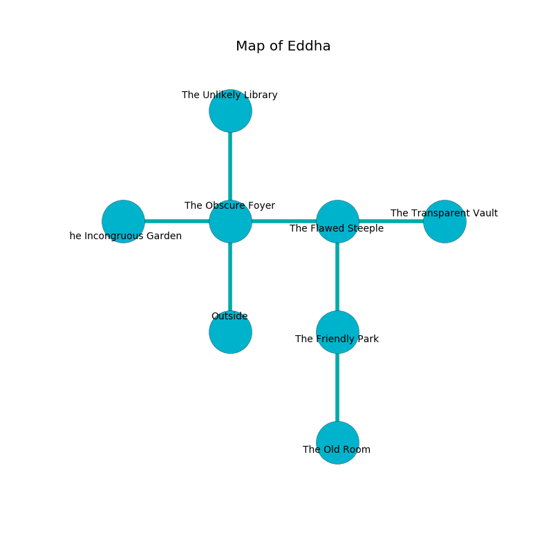

%Ruin Dogs

##Eddha
###Overview
Eddha is located under a poisoned tree. Regions of it are corrupted. The ruin is coming to life. It is occupied by Dryads. Harley Carlin The Detached, a Fire Giant is here. The Dryads are ruled by Harley Carlin The Detached. He  is founding a new religion. 

###Artifact
####Fauaeueh

Fauaeueh has the form of a sharp orb. Cacophony incinerates around it. When smelled it aids memory. 

###Locations

####the obscure foyer
The air tastes like ripe banana here. The brick walls are caving in. The floor is smooth. 

* [Fauaeueh](#Fauaeueh) is here.
* To the west a small gap connects to [the incongruous garden](#the-incongruous-garden).
* To the east a dark hall leads to [the flawed steeple](#the-flawed-steeple).
* To the north a twisted cavern leads to [the unlikely library](#the-unlikely-library).
* To the south is the entrance.

####the flawed steeple
The floor is bloodstained. The air smells like gasoline here. Red razorgrass is growing in broken urns. 

* There is a rail here.
* To the west a dark hall leads to [the obscure foyer](#the-obscure-foyer).
* To the east a dark cave leads to [the transparent vault](#the-transparent-vault).
* To the south a torchlit walkway connects to [the friendly park](#the-friendly-park).

####the unlikely library

* To the south a twisted cavern leads to [the obscure foyer](#the-obscure-foyer).

####the friendly park
The air smells like baked potato here. Yellow ferns are swaying in cracks in the floor. 

* To the north a torchlit walkway connects to [the flawed steeple](#the-flawed-steeple).
* To the south a long walkway connects to [the old room](#the-old-room).

####the old room
The brick walls are unsettled. Green razorgrass is sprouting in a patch on the floor. There are ten Dryads here. If the Dryads notice the Ruin Dogs, one of them will retreat and alert the others. 

* To the north a long walkway connects to [the friendly park](#the-friendly-park).

####the transparent vault
The floor is cluttered with shells. The wooden walls are pristine. The air tastes like salmon here. 

There is an engraving on the wall written in Dryads Script. 

> I tried jumping.
>

* To the west a dark cave connects to [the flawed steeple](#the-flawed-steeple).

####the incongruous garden
The air smells like paint here. 

* [Harley Carlin The Detached](#Harley-Carlin-The-Detached) is here.
* To the east a small gap connects to [the obscure foyer](#the-obscure-foyer).

