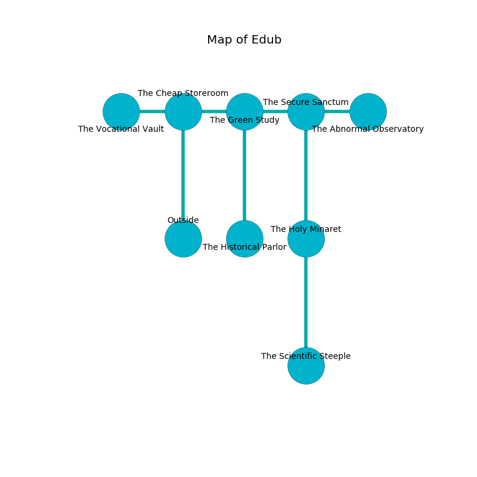

%Ruin Dogs

##Edub
###Overview
Edub is located in a broken rift. Some areas of Edub are flooded. The ruin is collapsing slowly. It is occupied by Kuo-Toa. Lia Weems The Overemotional, a Kuo-Toa Archpriest is here. The Kuo-Toa are the soldiers of Lia Weems The Overemotional. She  is founding a new religion. 

###Artifact
####Cuffacdaeum

Cuffacdaeum has the form of a hard sphere. It smells like onion. When held it destroys itself. 

###Locations

####the cheap storeroom
The air tastes like banana peel here. The floor is bloodstained. There are a Kuo-Toa Whip, a Kuo-Toa Archpriest, and a Kuo-Toa here. The Kuo-Toa are willing to negotiate. 

* To the west a narrow pathway opens to [the vocational vault](#the-vocational-vault).
* To the east a dark path opens to [the green study](#the-green-study).
* To the south is the entrance.

####the green study
The floor is sticky. White mushrooms are decaying from the walls. There is a Kuo-Toa Archpriest here. One of the Kuo-Toa Archpriest is pointing a ballista at the entrance. 

* To the west a dark path leads to [the cheap storeroom](#the-cheap-storeroom).
* To the east a torchlit pathway connects to [the secure sanctum](#the-secure-sanctum).
* To the south a flooded cave leads to [the historical parlor](#the-historical-parlor).

####the historical parlor
The floor is glossy. Blue ferns are growing from the ceiling. The air smells like tequila here. 

* To the north a flooded cave leads to [the green study](#the-green-study).

####the secure sanctum
The crystal walls are unsettled. There are three Kuo-Toa Whips, a Kuo-Toa Monitor, two Kuo-Toa,  here. The Kuo-Toa are willing to fight to the death. 

* To the west a torchlit pathway connects to [the green study](#the-green-study).
* To the east a hazy gap opens to [the abnormal observatory](#the-abnormal-observatory).
* To the south a torchlit cave connects to [the holy minaret](#the-holy-minaret).

####the holy minaret
There is a trap here. When activated, a pressure plate will fire an acid arrow. The floor is bloodstained. The wooden walls are scratched. Red ferns are growing from the walls. 

* [Cuffacdaeum](#Cuffacdaeum) is here.
* To the north a torchlit cave leads to [the secure sanctum](#the-secure-sanctum).
* To the south a hazy hall connects to [the scientific steeple](#the-scientific-steeple).

####the abnormal observatory
The wooden walls are caving in. There are a Peryton and a Bulette here. 

* To the west a hazy gap opens to [the secure sanctum](#the-secure-sanctum).

####the vocational vault
The glass walls are pristine. Yellow mushrooms are growing in cracks in the floor. 

There is an engraving on the floor written in Kuo-Toa Script. 

> Dear me! pitiful you
>
> latest, conservative, true
>
> awful, light, diplomatic
>
> hope is automatic
>

* To the east a narrow pathway connects to [the cheap storeroom](#the-cheap-storeroom).

####the scientific steeple
There is a trap here. When activated, a pressure plate will collapse a wall. Gray moss is growing in broken urns. The floor is bloodstained. 

* There is a flag here.
* There is an eye here.
* [Lia Weems The Overemotional](#Lia-Weems-The-Overemotional) is here.
* To the north a hazy hall leads to [the holy minaret](#the-holy-minaret).

