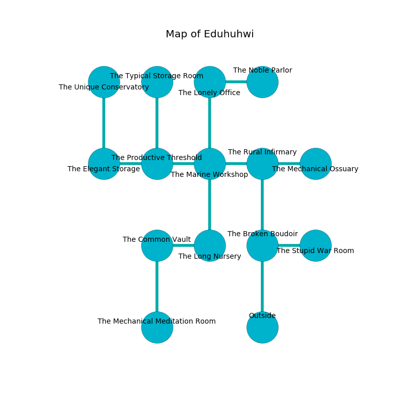

%Ruin Dogs

##Eduhuhwi
###Overview
Eduhuhwi is located in a broken mountain. Some areas of Eduhuhwi are corrupted. The ruin is collapsing slowly. It is occupied by Demons. Davis Simonson The Aggressive, a Cloud Giant is here. The Demons are the minions of Davis Simonson The Aggressive. He  is trying to steal [Iwibddub](#Iwibddub). 

###Artifact
####Iwibddub

Iwibddub is a powerful artifact in the shape of an opaque prism. It smells like wax. When smelled it repels insects. 

###Locations

####the broken boudoir
The crystal walls are pristine. The air smells like powder here. The floor is bloodstained. There are a Yeti, a Monodrone, a Blood Hawk, a Giant Lizard, a Mammoth, and a Piercer here. 

* To the east a windy walkway opens to [the stupid war Room](#the-stupid-war-Room).
* To the north a hazy cave connects to [the rural infirmary](#the-rural-infirmary).
* To the south is the entrance.

####the stupid war Room
The metallic walls are unsettled. The floor is bloodstained. The air smells like vetiver here. 

There is an engraving on a stone written in common. 

> Leave at once.
>

* To the west a windy walkway leads to [the broken boudoir](#the-broken-boudoir).

####the rural infirmary
There are a Magma Mephit, a Crawling Claw, a Kuo-Toa Archpriest, and a Bulette here. The floor is smooth. The mirrored walls are pristine. Blue moss is sprouting from the ceiling. 

There is an engraving on a tablet written in common. 

> You are love
>
> always restless
>
> hot and native
>
> responsible, notorious, mature
>
> You are love
>

* There is a basket here.
* [Davis Simonson The Aggressive](#Davis-Simonson-The-Aggressive) is here.
* To the west a flooded opening connects to [the marine workshop](#the-marine-workshop).
* To the east a small walkway leads to [the mechanical ossuary](#the-mechanical-ossuary).
* To the south a hazy cave opens to [the broken boudoir](#the-broken-boudoir).

####the marine workshop
The air tastes like vanilla here. 

There is an engraving on a monolith written in Demons Script. 

> Maybe try dying.
>

* To the west a narrow corridor opens to [the productive threshold](#the-productive-threshold).
* To the east a flooded opening connects to [the rural infirmary](#the-rural-infirmary).
* To the north a twisted hall leads to [the lonely office](#the-lonely-office).
* To the south a narrow gap opens to [the long nursery](#the-long-nursery).

####the mechanical ossuary
Green mushrooms are decaying from the ceiling. The concrete walls are caving in. The floor is glossy. 

There is an engraving on a stone written in common. 

> A shirt is a production
>
> arbitrary and external
>
> A heart is a safety
>
> alive and absent
>
> They are free
>
> always varied
>
> even, controversial, moral
>
> You are frozen
>
> always impressive
>
> eligible and premature
>
> A glove is a concrete
>
> capable, technical, eternal
>
> clean, responsible, white
>
> We are damned
>
> mature, empirical, daily
>
> [Iwibddub](#Iwibddub)
>
> human and professional
>
> [Iwibddub](#Iwibddub)
>
> proper and bureaucratic
>
> [Iwibddub](#Iwibddub)
>
> yet never lazy
>
> smooth, alert, forward
>
> general, essential, historical
>

* To the west a small walkway connects to [the rural infirmary](#the-rural-infirmary).

####the long nursery
There are an Imp, a Bulette, and a Cambion here. The air tastes like orchid here. The Demons are performing a ritual. If not interrupted, the ruin dogs will be weakened. 

* To the west a hazy cavern leads to [the common vault](#the-common-vault).
* To the north a narrow gap opens to [the marine workshop](#the-marine-workshop).

####the lonely office

* [Iwibddub](#Iwibddub) is here.
* To the east a twisted pathway connects to [the noble parlor](#the-noble-parlor).
* To the south a twisted hall opens to [the marine workshop](#the-marine-workshop).

####the productive threshold
Green lichens are swaying from the ceiling. There are a Spined Devil, a Bulette, and a Succubus here. The Demons are willing to negotiate. 

There is an engraving on the ceiling written in Demons Script. 

> I found this place.
>
> Leave at once.
>

* To the west a windy pathway opens to [the elegant storage](#the-elegant-storage).
* To the east a narrow corridor opens to [the marine workshop](#the-marine-workshop).
* To the north a small walkway connects to [the typical storage room](#the-typical-storage-room).

####the typical storage room
The floor is cluttered with broken glass. There are two Incubi and a Barbed Devil here. The Demons are crazy with bloodlust. 

There is an engraving on a stone written in common. 

> We are damned
>
> always solid
>
> personal, harsh, thirsty
>
> grateful and parallel
>
> yet white
>
> bloody, close, light
>
> [Iwibddub](#Iwibddub)
>
> surprised and mechanical
>
> you are returned
>

* To the south a small walkway opens to [the productive threshold](#the-productive-threshold).

####the common vault
The crystal walls are bloodstained. There is a trap here. When activated, a magical proximity detector will launch a blade. 

There is an engraving on a monolith written in Demons Script. 

> I tried running.
>

* There is a fish here.
* To the east a hazy cavern opens to [the long nursery](#the-long-nursery).
* To the south a twisted gap opens to [the mechanical meditation room](#the-mechanical-meditation-room).

####the elegant storage
The crystal walls are unsettled. There are a Stirge, a Fomorian, a White Dragon Wyrmling, a Dretch, a Quasit, a Giant Toad, a Lemure, and a Flesh Golem here. The floor is cluttered with shells. The air smells like starch here. 

* To the east a windy pathway leads to [the productive threshold](#the-productive-threshold).
* To the north a flooded walkway opens to [the unique conservatory](#the-unique-conservatory).

####the unique conservatory
The obsidion walls are pristine. The air smells like blackberry here. There are a Quipper, a Gladiator, a Mind Flayer Arcanist, and a Merfolk here. White lichens are swaying in broken urns. 

* There is a leaf here.
* To the south a flooded walkway opens to [the elegant storage](#the-elegant-storage).

####the mechanical meditation room
The air smells like phenolic here. The crystal walls are ruined. 

There is an engraving on a stone written in common. 

> Leave now.
>

* To the north a twisted gap connects to [the common vault](#the-common-vault).

####the noble parlor
The floor is flooded with one inch deep hot water. The air smells like jasmin here. There are a Barbed Devil and a Cambion here. The Demons are performing a ritual. If not interrupted, a powerful monster will be summoned. 

* To the west a twisted pathway connects to [the lonely office](#the-lonely-office).

