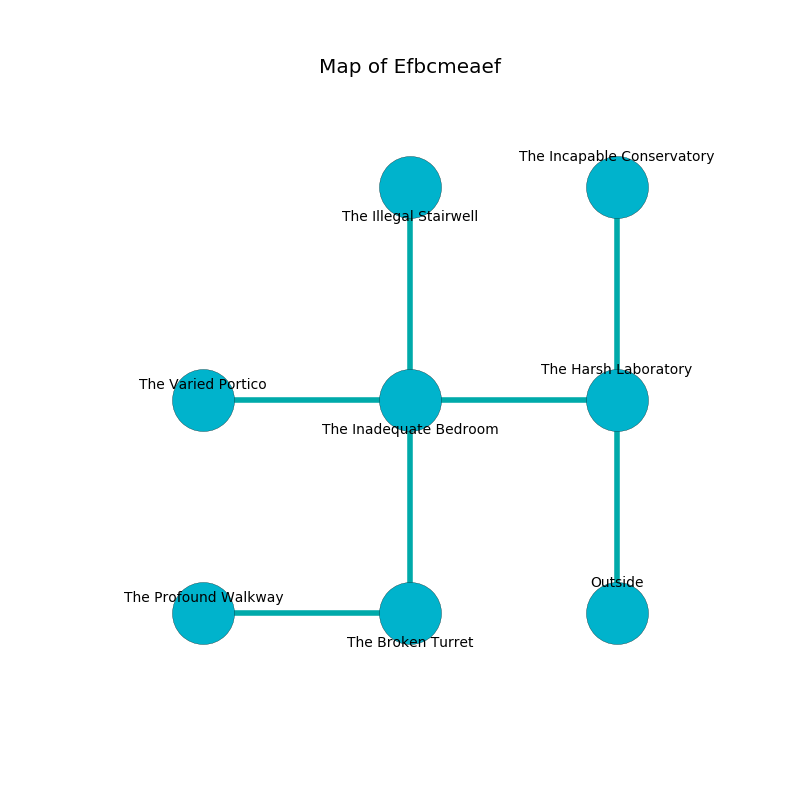

%Ruin Dogs

##Efbcmeaef
###Overview
Efbcmeaef is located under a crystal mountain. Some areas of Efbcmeaef are flooded. A blizzard is happening outside. It is occupied by Quaggoths. Seymour Ali The Flirtatious, a Vampire Spawn is here. The Quaggoths are the slaves of Seymour Ali The Flirtatious. He  is trying to find [Iodafuaeiuf](#Iodafuaeiuf). 

###Artifact
####Iodafuaeiuf

Iodafuaeiuf looks like a sharp meteorite. It smells like logenberry. It is a dark orange color. When touched it dissappears. 

###Locations

####the harsh laboratory
Yellow razorgrass is swaying from the walls. There are a Giant Wolf Spider, a Swarm of Quippers, a Giant Sea Horse, and a Roper here. The crystal walls are bloodstained. The floor is glossy. The air smells like old wood here. 

* To the west a hazy walkway connects to [the inadequate bedroom](#the-inadequate-bedroom).
* To the north a dark hall connects to [the incapable conservatory](#the-incapable-conservatory).
* To the south is the entrance.

####the incapable conservatory
Gray moss is growing from the ceiling. The obsidion walls are caving in. 

There is an engraving on a stone written in Quaggoths Script. 

> A hammer is a wine
>
> ugly, green, diplomatic
>
> you are destroyed
>

* [Seymour Ali The Flirtatious](#Seymour-Ali-The-Flirtatious) is here.
* To the south a dark hall leads to [the harsh laboratory](#the-harsh-laboratory).

####the inadequate bedroom
There are two Quaggoths here. The air smells like wine here. The crystal walls are covered in mold. The Quaggoths are performing a ritual. If not interrupted, a powerful monster will be summoned. 

* [Iodafuaeiuf](#Iodafuaeiuf) is here.
* To the west a hazy cavern connects to [the varied portico](#the-varied-portico).
* To the east a hazy walkway leads to [the harsh laboratory](#the-harsh-laboratory).
* To the north a small walkway opens to [the illegal stairwell](#the-illegal-stairwell).
* To the south a dripping gap leads to [the broken turret](#the-broken-turret).

####the broken turret
There are a Mud Mephit, an Aarakocra, a Plesiosaurus, and an Owlbear here. The floor is flooded with one inch deep hot water. The air tastes like rose here. Blue moss is sprouting from the ceiling. 

* To the west a torchlit hall leads to [the profound walkway](#the-profound-walkway).
* To the north a dripping gap opens to [the inadequate bedroom](#the-inadequate-bedroom).

####the profound walkway
White moss is swaying from the ceiling. The air smells like balsamic here. The floor is cluttered with rocks. There are a Quaggoth Thonot and a Quaggoth here. The Quaggoths are crazy with bloodlust. 

* To the east a torchlit hall connects to [the broken turret](#the-broken-turret).

####the illegal stairwell
There are a Wraith, a Crawling Claw, a Commoner, a Violet Fungus, and a Griffon here. Yellow mushrooms are swaying in broken urns. The floor is flooded with nine inch deep scalding water. 

There is an engraving on a stone written in Quaggoths Script. 

> I was injured in Efbcmeaef.
>
> Do not try hiding.
>

* There is a boot here.
* To the south a small walkway connects to [the inadequate bedroom](#the-inadequate-bedroom).

####the varied portico
There are two Quaggoths here. The Quaggoths are performing a ritual. If not interrupted, the Quaggoths will become more powerful. 

* To the east a hazy cavern connects to [the inadequate bedroom](#the-inadequate-bedroom).

