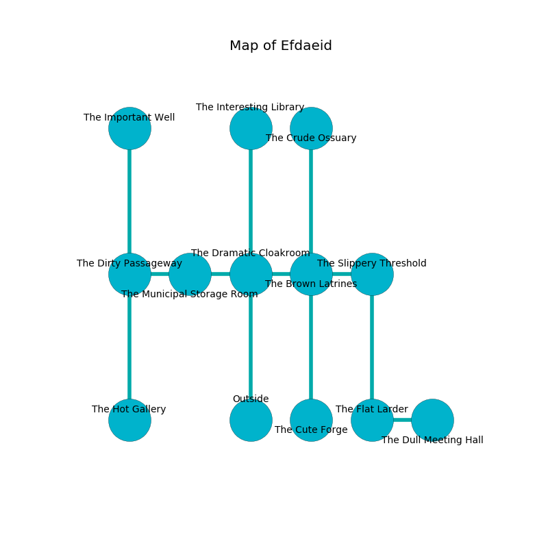

%Ruin Dogs

##Efdaeid
###Overview
Efdaeid is constructed on a ruined city. Some rooms of it are cursed. The ruin is sinking into the earth. It is occupied by Gnolls. Edgar Jamison The Compulsive, a Cloud Giant is here. The Gnolls are ruled by Edgar Jamison The Compulsive. He  is trying to research [Udcacdaeum](#Udcacdaeum). 

###Artifact
####Udcacdaeum

Udcacdaeum has the form of an opaque crystal. Cacophony slips around it. When held it levitates surrounding objects. 

###Locations

####the dramatic cloakroom
The obsidion walls are bloodstained. There are two Gnoll Fangs of Yeenoghu, three Gnolls, a Gnoll Pack Lord,  here. The air tastes like peanut butter here. The Gnolls are fighting amongst themselves. 

* To the west a dripping cave connects to [the municipal storage room](#the-municipal-storage-room).
* To the east a narrow walkway connects to [the brown latrines](#the-brown-latrines).
* To the north a windy pathway opens to [the interesting library](#the-interesting-library).
* To the south is the entrance.

####the brown latrines
The air tastes like plastic here. Blue ferns are swaying in a patch on the floor. The mirrored walls are pristine. There are a Swarm of Ravens, a Blue Dragon Wyrmling, a Duergar, a Troll, a Young Copper Dragon, and a Constrictor Snake here. 

* To the west a narrow walkway opens to [the dramatic cloakroom](#the-dramatic-cloakroom).
* To the east a dripping hall connects to [the slippery threshold](#the-slippery-threshold).
* To the north a flooded corridor opens to [the crude ossuary](#the-crude-ossuary).
* To the south a small opening connects to [the cute forge](#the-cute-forge).

####the municipal storage room
The air smells like spice here. The glass walls are caving in. The floor is sticky. There are a Banshee and a Nycaloth here. 

* There is a trophy here.
* To the west a small passageway opens to [the dirty passageway](#the-dirty-passageway).
* To the east a dripping cave leads to [the dramatic cloakroom](#the-dramatic-cloakroom).

####the dirty passageway
The floor is glossy. 

* To the east a small passageway opens to [the municipal storage room](#the-municipal-storage-room).
* To the north a twisted passageway leads to [the important well](#the-important-well).
* To the south a hazy path leads to [the hot gallery](#the-hot-gallery).

####the crude ossuary
There are two Gnolls and five Gnoll Pack Lords here. The floor is smooth. The Gnolls are willing to negotiate. 

* To the south a flooded corridor connects to [the brown latrines](#the-brown-latrines).

####the slippery threshold
The air tastes like grease here. There is a trap here. When activated, a magical proximity detector will fire an acid arrow. There are three Gnoll Fangs of Yeenoghu here. The brick walls are scratched. The Gnolls are willing to negotiate. 

* To the west a dripping hall connects to [the brown latrines](#the-brown-latrines).
* To the south a small corridor opens to [the flat larder](#the-flat-larder).

####the hot gallery
The crystal walls are caving in. There are a Medusa and a Blue Slaad here. The air tastes like ambergris here. The floor is cluttered with broken glass. 

There is an engraving on a monolith written in common. 

> Dear me! meak fate
>
> ever late
>
> offensive and poor
>
> nothing is mature
>

* To the north a hazy path opens to [the dirty passageway](#the-dirty-passageway).

####the interesting library
Red moss is growing in a patch on the floor. 

* To the south a windy pathway opens to [the dramatic cloakroom](#the-dramatic-cloakroom).

####the flat larder
The glass walls are ruined. White moss is sprouting from the ceiling. There are three Gnoll Fangs of Yeenoghu and two Gnolls here. The air smells like burnt sugar here. There is a trap here. When activated, a tripwire will launch a hail of needles. The Gnolls are caring for babies. 

* [Udcacdaeum](#Udcacdaeum) is here.
* [Edgar Jamison The Compulsive](#Edgar-Jamison-The-Compulsive) is here.
* To the east a long passageway leads to [the dull meeting hall](#the-dull-meeting-hall).
* To the north a small corridor opens to [the slippery threshold](#the-slippery-threshold).

####the important well
The floor is bloodstained. The crystal walls are pristine. There are a Gnoll Fang of Yeenoghu, a Gnoll, three Gnoll Pack Lords,  here. The Gnolls are feasting. 

* To the south a twisted passageway leads to [the dirty passageway](#the-dirty-passageway).

####the cute forge
The crystal walls are unsettled. 

* To the north a small opening connects to [the brown latrines](#the-brown-latrines).

####the dull meeting hall
The air smells like fir needle here. There is a Yochlol here. Red mushrooms are growing from the walls. The floor is sticky. There is a trap here. When activated, a magical sound detector will launch a javelin. 

There is an engraving on the floor written in Gnolls Script. 

> All of us are hidden
>
> open and international
>
> ample, eager, conservative
>
> you are not hidden
>

* There is a drawer here.
* To the west a long passageway opens to [the flat larder](#the-flat-larder).

