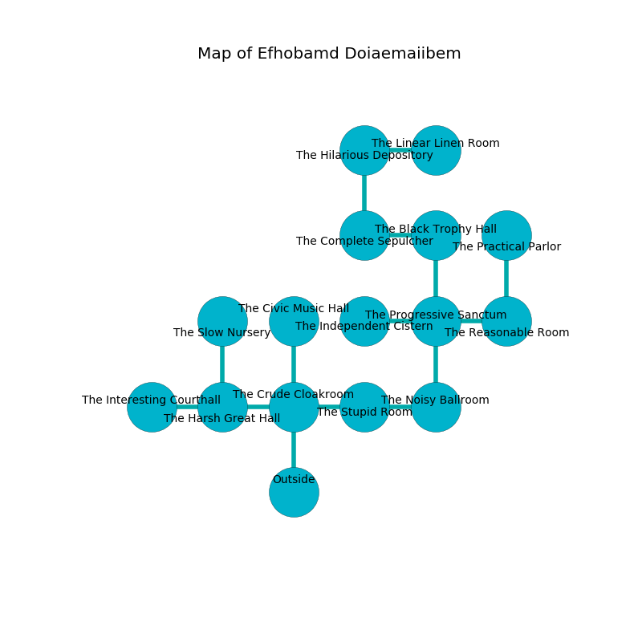

%Ruin Dogs

##Efhobamd Doiaemaiibem
###Overview
Efhobamd Doiaemaiibem is constructed on an alien mountain. Regions of Efhobamd Doiaemaiibem are foggy. A solar eclipse is happening outside. It is occupied by Ogres. Willene Hurst The Quarrelsome, a Cloud Giant is here. The Ogres are the minions of Willene Hurst The Quarrelsome. She  is trying to exploit [Uiah](#Uiah). 

###Artifact
####Uiah

Uiah has the form of a soft crystal. When worn it tunnels into the earth. 

###Locations

####the crude cloakroom
Green lichens are swaying in cracks in the floor. The air tastes like fudge here. The floor is flooded with seven inch deep cool water. 

* To the west a twisted corridor opens to [the harsh great hall](#the-harsh-great-hall).
* To the east a hazy threshold opens to [the stupid room](#the-stupid-room).
* To the north a small hall leads to [the civic music hall](#the-civic-music-hall).
* To the south is the entrance.

####the stupid room
The air tastes like gravy here. Blue ferns are growing from the ceiling. There are five Half-Ogres and three Ogres here. The obsidion walls are pristine. One of the Ogres is working a mechanism that can flood the room. 

* To the west a hazy threshold leads to [the crude cloakroom](#the-crude-cloakroom).
* To the east a flooded path leads to [the noisy ballroom](#the-noisy-ballroom).

####the noisy ballroom
Green razorgrass is growing in a patch on the floor. The air smells like avocado here. 

* There is a sheep here.
* [Willene Hurst The Quarrelsome](#Willene-Hurst-The-Quarrelsome) is here.
* To the west a flooded path leads to [the stupid room](#the-stupid-room).
* To the north a torchlit artery opens to [the progressive sanctum](#the-progressive-sanctum).

####the harsh great hall
The stone walls are pristine. Green razorgrass is swaying in cracks in the floor. There are four Half-Ogres and three Ogres here. If the Ogres notice the Ruin Dogs, one of them will retreat and alert [Willene Hurst](#Willene-Hurst). 

* [Uiah](#Uiah) is here.
* To the west a narrow opening connects to [the interesting courthall](#the-interesting-courthall).
* To the east a twisted corridor leads to [the crude cloakroom](#the-crude-cloakroom).
* To the north a flooded pathway connects to [the slow nursery](#the-slow-nursery).

####the progressive sanctum
The floor is glossy. Red mushrooms are decaying in cracks in the floor. The glass walls are unsettled. 

* There is a jewel here.
* To the west a twisted walkway leads to [the independent cistern](#the-independent-cistern).
* To the east a narrow hall opens to [the reasonable room](#the-reasonable-room).
* To the north a dark passageway leads to [the black trophy hall](#the-black-trophy-hall).
* To the south a torchlit artery connects to [the noisy ballroom](#the-noisy-ballroom).

####the slow nursery

* To the south a flooded pathway leads to [the harsh great hall](#the-harsh-great-hall).

####the independent cistern
The air smells like bergamot here. Blue lichens are decaying in cracks in the floor. The mirrored walls are scratched. 

* There is a bucket here.
* There is a wand here.
* To the east a twisted walkway connects to [the progressive sanctum](#the-progressive-sanctum).

####the reasonable room
The floor is bloodstained. Green lichens are decaying in broken urns. 

* To the west a narrow hall leads to [the progressive sanctum](#the-progressive-sanctum).
* To the north a dark passageway connects to [the practical parlor](#the-practical-parlor).

####the black trophy hall
There are a Winter Wolf, an Ice Mephit, a Yeti, an Orc Eye of Gruumsh, and a Mimic here. There is a trap here. When activated, a pressure plate will launch a swinging block. The stone walls are caving in. 

* To the west a torchlit path connects to [the complete sepulcher](#the-complete-sepulcher).
* To the south a dark passageway opens to [the progressive sanctum](#the-progressive-sanctum).

####the complete sepulcher
The floor is cluttered with shells. The air tastes like gravy here. Red moss is decaying in cracks in the floor. There are an Ice Mephit, a Chain Devil, a Mage, and an Animated Armor here. 

* To the east a torchlit path opens to [the black trophy hall](#the-black-trophy-hall).
* To the north a windy hallway connects to [the hilarious depository](#the-hilarious-depository).

####the civic music hall
The concrete walls are pristine. The air tastes like buttery	cabbage here. 

* There is a stamp here.
* To the south a small hall connects to [the crude cloakroom](#the-crude-cloakroom).

####the hilarious depository
There are six Half-Ogres and two Ogres here. The air tastes like fermentation here. The floor is smooth. The Ogres are feasting. 

* To the east a small passageway connects to [the linear linen room](#the-linear-linen-room).
* To the south a windy hallway leads to [the complete sepulcher](#the-complete-sepulcher).

####the linear linen room
The brick walls are bloodstained. White moss is growing in cracks in the floor. The floor is glossy. There are two Half-Ogres and four Ogres here. The Ogres are willing to fight to the death. 

* To the west a small passageway leads to [the hilarious depository](#the-hilarious-depository).

####the practical parlor
The air tastes like fungus here. The glass walls are pristine. 

* To the south a dark passageway leads to [the reasonable room](#the-reasonable-room).

####the interesting courthall
The air tastes like spruce here. There is a trap here. When activated, a tripwire will flood the room with water. The floor is smooth. 

There is an engraving on a stone written in common. 

> All of us are maddened
>
> but never effective
>
> you will be destroyed
>

* To the east a narrow opening opens to [the harsh great hall](#the-harsh-great-hall).

