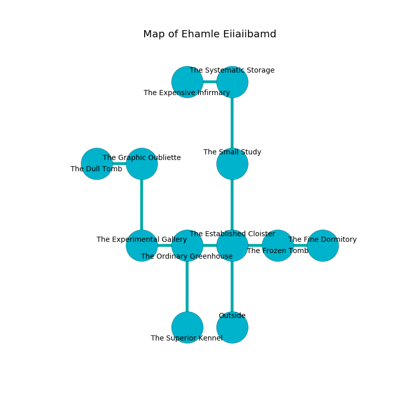

%Ruin Dogs

##Ehamle Eiiaiibamd
###Overview
Ehamle Eiiaiibamd is located on a crystal mountain. Parts of it are incredibly cold. The ruin is sinking into the earth. It is occupied by Humans. Fermin Villasenor The Materialistic, a Cloud Giant is here. The Humans are the minions of Fermin Villasenor The Materialistic. He  is founding a new religion. 

###Artifact
####The Restricted Bottom

The Restricted Bottom has the form of a smooth cube. It is a sickly purple color. When smelled it changes probabilities. 

###Locations

####the established cloister
There are a Guard, a Tribal Warrior, a Gladiator, and a Mage here. The air tastes like smoke here. The floor is bloodstained. One of the Humans is working a mechanism that can pour hornets from the ceiling. 

* There is a monkey here.
* There is a tree here.
* To the west a narrow corridor leads to [the ordinary greenhouse](#the-ordinary-greenhouse).
* To the east a dark cave connects to [the frozen tomb](#the-frozen-tomb).
* To the north a dark opening opens to [the small study](#the-small-study).
* To the south is the entrance.

####the small study
Gray ferns are sprouting in cracks in the floor. The floor is bloodstained. 

* There is a trophy here.
* To the north a flooded opening opens to [the systematic storage](#the-systematic-storage).
* To the south a dark opening leads to [the established cloister](#the-established-cloister).

####the ordinary greenhouse

* To the west a narrow cavern connects to [the experimental gallery](#the-experimental-gallery).
* To the east a narrow corridor opens to [the established cloister](#the-established-cloister).
* To the south a windy path connects to [the superior kennel](#the-superior-kennel).

####the experimental gallery
There are a Sprite, a Badger, an Allosaurus, a Homunculus, a Drow Elite Warrior, a Quaggoth, a Steam Mephit, and a Copper Dragon Wyrmling here. The air smells like stringent here. The floor is bloodstained. 

* There is a wall here.
* [Fermin Villasenor The Materialistic](#Fermin-Villasenor-The-Materialistic) is here.
* To the east a narrow cavern leads to [the ordinary greenhouse](#the-ordinary-greenhouse).
* To the north a torchlit gap leads to [the graphic oubliette](#the-graphic-oubliette).

####the frozen tomb
The concrete walls are pristine. The floor is sticky. The air smells like tomato here. 

* [The Restricted Bottom](#The-Restricted-Bottom) is here.
* To the west a dark cave leads to [the established cloister](#the-established-cloister).
* To the east a hazy threshold connects to [the fine dormitory](#the-fine-dormitory).

####the superior kennel
The air tastes like praline here. There are a Cult Fanatic, a Berserker, two Knights, a Bandit Captain, a Scout, and  here. If the Humans notice the Ruin Dogs, one of them will retreat and alert the others. 

* There is a jewel here.
* There is a boat here.
* To the north a windy path connects to [the ordinary greenhouse](#the-ordinary-greenhouse).

####the graphic oubliette
The stone walls are caving in. The air smells like bread crust here. The floor is smooth. There is a trap here. When activated, a magical proximity detector will launch a fireball. 

There is an engraving on the ceiling written in Humans Script. 

> O terrible soul
>
> tough and archaeological
>
> extraordinary and whole
>
> hope is logical
>

* To the west a long hallway leads to [the dull tomb](#the-dull-tomb).
* To the south a torchlit gap opens to [the experimental gallery](#the-experimental-gallery).

####the dull tomb
There are a Guard, a Mage, two Druids, and  here. The concrete walls are scratched. The air tastes like medicine here. The Humans are crazy with bloodlust. 

* There is a rat here.
* To the east a long hallway connects to [the graphic oubliette](#the-graphic-oubliette).

####the systematic storage
The floor is glossy. The wooden walls are scratched. There are a Stone Golem, a Young Brass Dragon, and a Gelatinous Cube here. The air smells like roasted peanut here. 

* To the west a narrow path leads to [the expensive infirmary](#the-expensive-infirmary).
* To the south a flooded opening connects to [the small study](#the-small-study).

####the expensive infirmary
There are a Guard, a Badger, a Mind Flayer, a Yuan-Ti Abomination, and a Swarm of Insects here. 

* There is a key here.
* To the east a narrow path opens to [the systematic storage](#the-systematic-storage).

####the fine dormitory
The air tastes like grease here. Red ferns are decaying in broken urns. The concrete walls are caving in. 

* To the west a hazy threshold connects to [the frozen tomb](#the-frozen-tomb).

