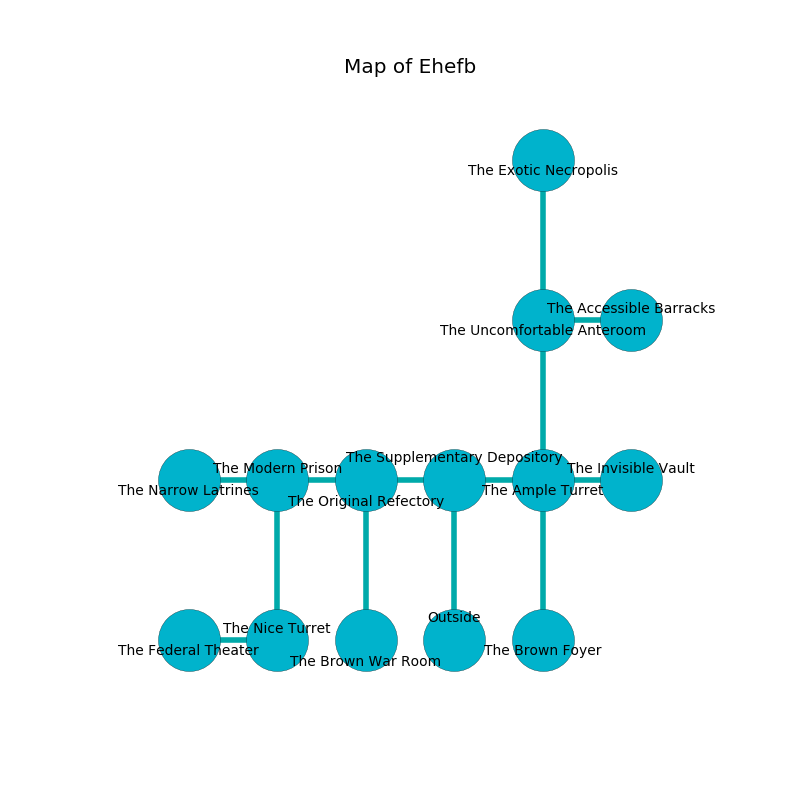

%Ruin Dogs

##Ehefb
###Overview
Ehefb is constructed on a broken tree. Regions of it are corrupted. A windstorm is happening outside. It is occupied by Thri-Kreens. Mammie Nieves The Quick-Tempered, a Fire Giant is here. The Thri-Kreens are ruled by Mammie Nieves The Quick-Tempered. She  is trying to find [The Helpful Bank](#The-Helpful-Bank). 

###Artifact
####The Helpful Bank

The Helpful Bank is a powerful artifact in the shape of a broken amulet. Power pours from it. It is a bright gray color. When worshipped it projects energy. 

###Locations

####the supplementary depository
There is a trap here. When activated, a magical sound detector will collapse a wall. Yellow mushrooms are growing from the ceiling. 

* There is a frame here.
* To the west a narrow opening leads to [the original refectory](#the-original-refectory).
* To the east a dark corridor leads to [the ample turret](#the-ample-turret).
* To the south is the entrance.

####the original refectory
The metallic walls are caving in. The air tastes like filbert here. There are a Giant Wolf Spider, a Galeb Duhr, a Merrow, a Duodrone, a Hell Hound, a Manes, a Sahuagin, an Orog, and a Camel here. 

There is an engraving on a stone written in common. 

> I am lost.
>
> Leave at once.
>

* To the west a dark artery leads to [the modern prison](#the-modern-prison).
* To the east a narrow opening leads to [the supplementary depository](#the-supplementary-depository).
* To the south a torchlit artery connects to [the brown war Room](#the-brown-war-Room).

####the modern prison
The floor is flooded with three inch deep cool water. Red razorgrass is swaying in broken urns. 

* There is a lock here.
* To the west a windy path connects to [the narrow latrines](#the-narrow-latrines).
* To the east a dark artery connects to [the original refectory](#the-original-refectory).
* To the south a small cavern leads to [the nice turret](#the-nice-turret).

####the nice turret
The air smells like acorn here. The floor is smooth. White lichens are swaying in a patch on the floor. 

There is an engraving on a stone written in common. 

> Oh the world is sadistic
>
> loose, loyal, pleasant
>
> but never optimistic
>
> hope is present
>

* To the west a narrow cave opens to [the federal theater](#the-federal-theater).
* To the north a small cavern leads to [the modern prison](#the-modern-prison).

####the ample turret
The floor is cluttered with debris. The stone walls are covered in mold. There are nine Thri-Kreens here. One of the Thri-Kreens is pointing a ballista at the entrance. 

* To the west a dark corridor leads to [the supplementary depository](#the-supplementary-depository).
* To the east a long passageway opens to [the invisible vault](#the-invisible-vault).
* To the north a flooded pathway connects to [the uncomfortable anteroom](#the-uncomfortable-anteroom).
* To the south a torchlit cave opens to [the brown foyer](#the-brown-foyer).

####the brown war Room
The air smells like dry	durian here. Gray razorgrass is sprouting in a patch on the floor. The floor is flooded with nine inch deep lukewarm water. 

* [Mammie Nieves The Quick-Tempered](#Mammie-Nieves-The-Quick-Tempered) is here.
* To the north a torchlit artery opens to [the original refectory](#the-original-refectory).

####the narrow latrines
The floor is smooth. Green lichens are swaying from the ceiling. The mirrored walls are unsettled. There are nine Thri-Kreens here. The air smells like cantaloupe here. One of the Thri-Kreens is on watch, the rest are caring for babies. 

There is an engraving on a tablet written in common. 

> I am seeking [The Helpful Bank](#The-Helpful-Bank).
>
> Try giving up.
>

* To the east a windy path opens to [the modern prison](#the-modern-prison).

####the uncomfortable anteroom
The floor is sticky. There are nine Thri-Kreens here. Red lichens are decaying in a patch on the floor. One of the Thri-Kreens is pointing a ballista at the entrance. 

* [The Helpful Bank](#The-Helpful-Bank) is here.
* To the east a flooded hallway leads to [the accessible barracks](#the-accessible-barracks).
* To the north a torchlit pathway leads to [the exotic necropolis](#the-exotic-necropolis).
* To the south a flooded pathway connects to [the ample turret](#the-ample-turret).

####the brown foyer
The floor is smooth. There are a Minotaur and a Chain Devil here. The wooden walls are pristine. 

* To the north a torchlit cave leads to [the ample turret](#the-ample-turret).

####the exotic necropolis

* To the south a torchlit pathway opens to [the uncomfortable anteroom](#the-uncomfortable-anteroom).

####the federal theater
The air smells like candy here. White ferns are sprouting from the walls. There is a trap here. When activated, a tripwire will open a trapdoor in the floor. 

* There is a spring here.
* To the east a narrow cave connects to [the nice turret](#the-nice-turret).

####the invisible vault
There are nine Thri-Kreens here. The floor is flooded with eight inch deep cool water. Green moss is growing from the ceiling. The Thri-Kreens are performing a ritual. If not interrupted, a powerful monster will be summoned. 

* To the west a long passageway opens to [the ample turret](#the-ample-turret).

####the accessible barracks
There are nine Thri-Kreens here. The air smells like pomegranate here. One of the Thri-Kreens is pointing a ballista at the entrance. 

* To the west a flooded hallway leads to [the uncomfortable anteroom](#the-uncomfortable-anteroom).

