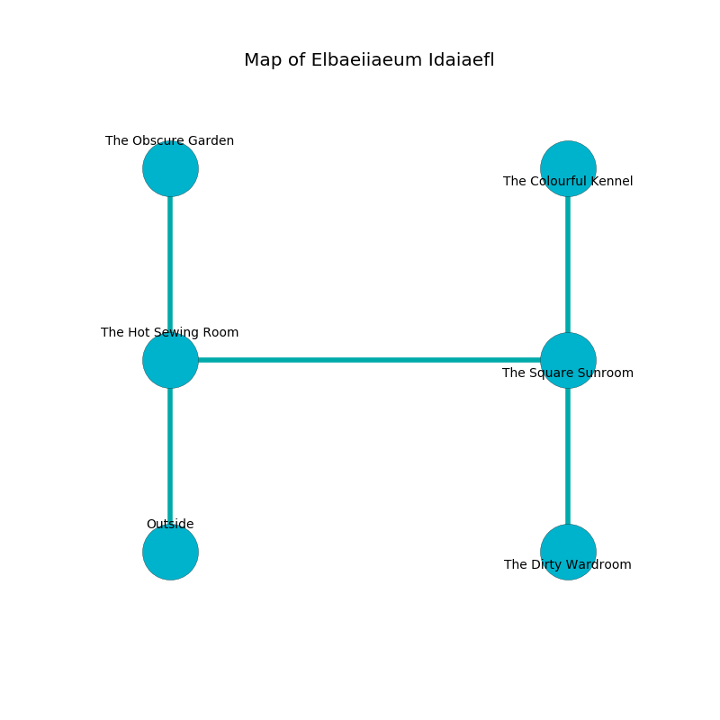

%Ruin Dogs

##Elbaeiiaeum Idaiaefl
###Overview
Elbaeiiaeum Idaiaefl is located on a volcanic mountain. Parts of it are corrupted. A massive storm is happening outside. It is occupied by Centaurs. Lisette Mabe The Big-Headed, a Lizardfolk Shaman is here. The Centaurs are the minions of Lisette Mabe The Big-Headed. She  is founding a new religion. 

###Artifact
####The Sad Employment

The Sad Employment looks like a wet prism. Light bends from it. When eaten it become energized with a powerful vibration. 

###Locations

####the hot sewing room
The glass walls are covered in mold. Red mushrooms are sprouting from the walls. The air tastes like grapefruit here. There is a trap here. When activated, a pressure plate will ring a bell. The floor is flooded with one inch deep scalding water. 

There is an engraving on the floor written in Centaurs Script. 

> All of us are corrupted
>
> but never well
>
> judicial and acceptable
>
> chronic and holy
>
> yet never petty
>

* [Lisette Mabe The Big-Headed](#Lisette-Mabe-The-Big-Headed) is here.
* To the east a dripping opening connects to [the square sunroom](#the-square-sunroom).
* To the north a dark path leads to [the obscure garden](#the-obscure-garden).
* To the south is the entrance.

####the square sunroom
The floor is sticky. There are a Darkmantle, a Tribal Warrior, a Blood Hawk, and an Ankylosaurus here. The obsidion walls are unsettled. 

* [The Sad Employment](#The-Sad-Employment) is here.
* To the west a dripping opening opens to [the hot sewing room](#the-hot-sewing-room).
* To the north a small passageway opens to [the colourful kennel](#the-colourful-kennel).
* To the south a hazy cavern connects to [the dirty wardroom](#the-dirty-wardroom).

####the obscure garden
The air tastes like gasoline here. The concrete walls are caving in. 

* To the south a dark path connects to [the hot sewing room](#the-hot-sewing-room).

####the dirty wardroom
The crystal walls are ruined. Gray lichens are swaying in cracks in the floor. The floor is glossy. 

* To the north a hazy cavern leads to [the square sunroom](#the-square-sunroom).

####the colourful kennel
There are two Centaurs here. The crystal walls are bloodstained. The air smells like hay here. One of the Centaurs is on watch, the rest are meditating. 

* To the south a small passageway connects to [the square sunroom](#the-square-sunroom).

