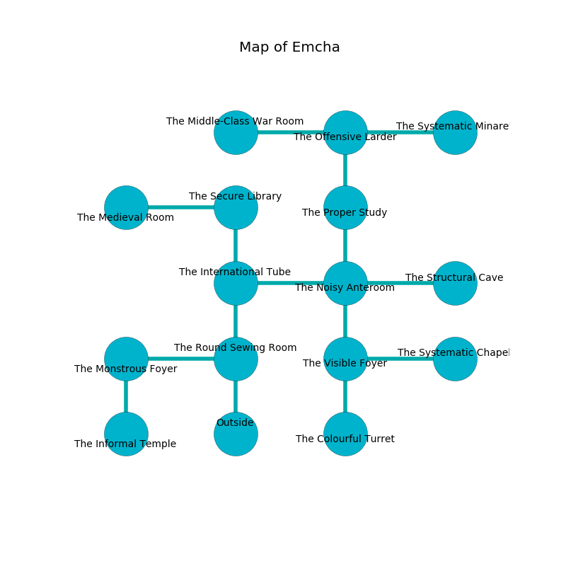

%Ruin Dogs

##Emcha
###Overview
Emcha is located on a haunted city. Parts of it are cursed. A lunar eclipse is happening outside. It is occupied by Duergars. Chelsea Lowery The Lazy, a Drow Priestess of Lolth is here. The Duergars are the soldiers of Chelsea Lowery The Lazy. She  is trying to hide [Duefl](#Duefl). 

###Artifact
####Duefl

Duefl is a powerful artifact in the shape of an opaque blade. It smells like shrimp. It is a shifting gray color. When carried it emits dust. 

###Locations

####the round sewing room
The air smells like peppermint here. The floor is sticky. 

* To the west a long cavern leads to [the monstrous foyer](#the-monstrous-foyer).
* To the north a windy corridor connects to [the international tube](#the-international-tube).
* To the south is the entrance.

####the international tube
There is a trap here. When activated, a tripwire will launch a swinging block. There are a Giant Octopus, a Dust Mephit, a Satyr, a Kuo-Toa, a Magmin, and a Chain Devil here. 

* To the east a small corridor opens to [the noisy anteroom](#the-noisy-anteroom).
* To the north a dripping opening opens to [the secure library](#the-secure-library).
* To the south a windy corridor opens to [the round sewing room](#the-round-sewing-room).

####the noisy anteroom
The brick walls are pristine. There are a Glabrezu, a Giant Sea Horse, and a Druid here. Blue ferns are growing in cracks in the floor. 

* To the west a small corridor leads to [the international tube](#the-international-tube).
* To the east a torchlit passageway opens to [the structural cave](#the-structural-cave).
* To the north a windy pathway connects to [the proper study](#the-proper-study).
* To the south a small cavern connects to [the visible foyer](#the-visible-foyer).

####the visible foyer
There are nine Duergars here. The floor is glossy. The air tastes like egg nog here. The wooden walls are caving in. The Duergars are willing to negotiate. 

There is an engraving on a tablet written in common. 

> Oh death is inhumane
>
> it is never vain
>
> gradual and vulnerable
>
> hope is vain
>

* To the east a long threshold opens to [the systematic chapel](#the-systematic-chapel).
* To the north a small cavern connects to [the noisy anteroom](#the-noisy-anteroom).
* To the south a narrow cavern opens to [the colourful turret](#the-colourful-turret).

####the monstrous foyer
There are nine Duergars here. The air smells like rhubarb here. The crystal walls are unsettled. The Duergars are willing to negotiate. 

* To the east a long cavern connects to [the round sewing room](#the-round-sewing-room).
* To the south a hazy artery opens to [the informal temple](#the-informal-temple).

####the colourful turret
There are a Water Elemental, a Berserker, a Flying Sword, a Xorn, a Giant Badger, a Pseudodragon, and a Piercer here. 

* There is a roof here.
* There is a brush here.
* To the north a narrow cavern opens to [the visible foyer](#the-visible-foyer).

####the informal temple
The crystal walls are pristine. The air tastes like huckleberry here. White moss is growing in cracks in the floor. 

* To the north a hazy artery opens to [the monstrous foyer](#the-monstrous-foyer).

####the proper study
Red razorgrass is decaying from the walls. The floor is smooth. There are nine Duergars here. The Duergars are berserk with rage. 

There is an engraving on the wall written in Duergars Script. 

> I am the best.
>
> I could not try digging.
>

* To the north a torchlit cave leads to [the offensive larder](#the-offensive-larder).
* To the south a windy pathway leads to [the noisy anteroom](#the-noisy-anteroom).

####the offensive larder
The floor is sticky. The obsidion walls are bloodstained. The air smells like sap here. 

* To the west a narrow artery leads to [the middle-class war Room](#the-middle-class-war-Room).
* To the east a windy opening opens to [the systematic minaret](#the-systematic-minaret).
* To the south a torchlit cave opens to [the proper study](#the-proper-study).

####the systematic chapel
The floor is glossy. There are a Drider, a Giant Centipede, a Quaggoth Spore Servant, a Poisonous Snake, a Mastiff, a Thri-Kreen, and a Green Dragon Wyrmling here. White lichens are decaying in cracks in the floor. 

* To the west a long threshold opens to [the visible foyer](#the-visible-foyer).

####the structural cave
The air smells like lemongrass here. Gray mushrooms are sprouting from the ceiling. 

* To the west a torchlit passageway leads to [the noisy anteroom](#the-noisy-anteroom).

####the middle-class war Room
There are nine Duergars here. Gray moss is sprouting in cracks in the floor. One of the Duergars is on watch, the rest are feasting. 

* To the east a narrow artery connects to [the offensive larder](#the-offensive-larder).

####the secure library
The floor is bloodstained. There are nine Duergars here. Gray razorgrass is sprouting from the walls. The obsidion walls are pristine. The air tastes like coffee here. If the Duergars notice the Ruin Dogs, one of them will retreat and alert the others. 

There is an engraving on the floor written in Duergars Script. 

> O weak you
>
> it is always normal
>
> it is never due
>
> sadness is abnormal
>

* [Duefl](#Duefl) is here.
* To the west a dripping cavern opens to [the medieval room](#the-medieval-room).
* To the south a dripping opening opens to [the international tube](#the-international-tube).

####the systematic minaret
Gray ferns are swaying from the ceiling. There are a Druid, a Quadrone, a Spider, an Octopus, a Gas Spore, a Giant Vulture, an Axe Beak, a Scarecrow, two Bandit Captains, and  here. The floor is sticky. 

* To the west a windy opening leads to [the offensive larder](#the-offensive-larder).

####the medieval room
The glass walls are caving in. The air smells like caraway here. 

* [Chelsea Lowery The Lazy](#Chelsea-Lowery-The-Lazy) is here.
* To the east a dripping cavern connects to [the secure library](#the-secure-library).

