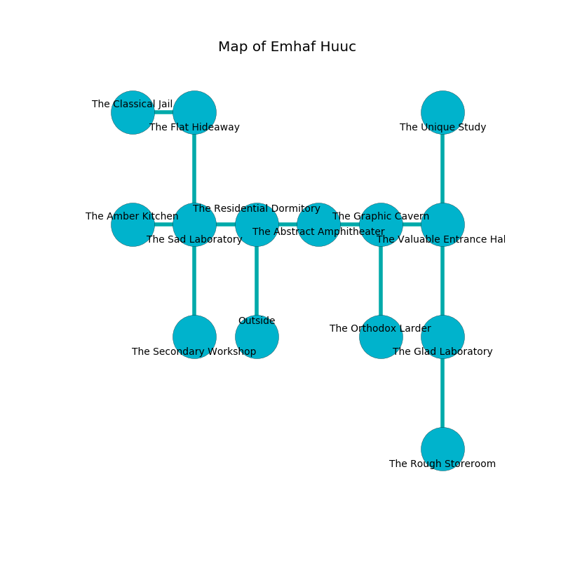

%Ruin Dogs

##Emhaf Huuc
###Overview
Emhaf Huuc is located under a crystal rift. Parts of it are frozen. The ruin is burning. It is occupied by Harpies. Angelo Smalls The Parsimonious, a Veteran is here. The Harpies are the soldiers of Angelo Smalls The Parsimonious. He  is founding a new religion. 

###Artifact
####Faiaefcmaf

Faiaefcmaf is a powerful artifact in the shape of a soft rock. When held it emits dust. 

###Locations

####the residential dormitory
The air smells like melon rind here. The floor is bloodstained. 

* To the west a windy pathway connects to [the sad laboratory](#the-sad-laboratory).
* To the east a twisted walkway connects to [the abstract amphitheater](#the-abstract-amphitheater).
* To the south is the entrance.

####the sad laboratory
The air tastes like papaya here. Yellow mushrooms are swaying from the ceiling. There are four Harpies here. The floor is smooth. If the Harpies notice the Ruin Dogs, one of them will retreat and alert the others. 

* To the west a hazy hall connects to [the amber kitchen](#the-amber-kitchen).
* To the east a windy pathway leads to [the residential dormitory](#the-residential-dormitory).
* To the north a torchlit artery opens to [the flat hideaway](#the-flat-hideaway).
* To the south a dripping opening leads to [the secondary workshop](#the-secondary-workshop).

####the abstract amphitheater
Gray moss is growing in broken urns. There are four Harpies here. The air smells like mango here. The Harpies are performing a ritual. If not interrupted, the ruin dogs will be weakened. 

* To the west a twisted walkway leads to [the residential dormitory](#the-residential-dormitory).
* To the east a dripping walkway leads to [the graphic cavern](#the-graphic-cavern).

####the graphic cavern
There is a trap here. When activated, a magical sound detector will collapse a wall. 

* There is a dagger here.
* To the west a dripping walkway opens to [the abstract amphitheater](#the-abstract-amphitheater).
* To the east a dripping threshold opens to [the valuable entrance hall](#the-valuable-entrance-hall).
* To the south a long hall opens to [the orthodox larder](#the-orthodox-larder).

####the valuable entrance hall
There are four Harpies here. Blue mushrooms are sprouting in a patch on the floor. The floor is sticky. The wooden walls are ruined. The Harpies are performing a ritual. If not interrupted, the ruin dogs will be weakened. 

* To the west a dripping threshold leads to [the graphic cavern](#the-graphic-cavern).
* To the north a flooded hall opens to [the unique study](#the-unique-study).
* To the south a narrow corridor connects to [the glad laboratory](#the-glad-laboratory).

####the amber kitchen
There is a trap here. When activated, a magical rune will extend a spring loaded spear. The metallic walls are pristine. 

* To the east a hazy hall connects to [the sad laboratory](#the-sad-laboratory).

####the orthodox larder
The floor is smooth. The mirrored walls are scratched. Yellow mushrooms are decaying from the ceiling. 

* To the north a long hall connects to [the graphic cavern](#the-graphic-cavern).

####the flat hideaway
The floor is smooth. There are a Winter Wolf and a Harpy here. 

* [Angelo Smalls The Parsimonious](#Angelo-Smalls-The-Parsimonious) is here.
* To the west a dripping cavern opens to [the classical jail](#the-classical-jail).
* To the south a torchlit artery opens to [the sad laboratory](#the-sad-laboratory).

####the secondary workshop
There are a Deep Gnome and an Elephant here. The floor is sticky. 

* To the north a dripping opening connects to [the sad laboratory](#the-sad-laboratory).

####the classical jail
There are four Harpies here. The stone walls are unsettled. Blue razorgrass is sprouting from the walls. The Harpies are meditating. 

* There is a key here.
* To the east a dripping cavern leads to [the flat hideaway](#the-flat-hideaway).

####the unique study
Blue moss is swaying in broken urns. The crystal walls are unsettled. 

There is an engraving on the floor written in common. 

> I am lost in Emhaf Huuc.
>

* To the south a flooded hall leads to [the valuable entrance hall](#the-valuable-entrance-hall).

####the glad laboratory
The air smells like raw	reseda here. The floor is sticky. 

There is an engraving on a monolith written in common. 

> I am hiding in this place.
>
> Leave now.
>

* There is a hammer here.
* [Faiaefcmaf](#Faiaefcmaf) is here.
* To the north a narrow corridor opens to [the valuable entrance hall](#the-valuable-entrance-hall).
* To the south a flooded hallway opens to [the rough storeroom](#the-rough-storeroom).

####the rough storeroom
There is a trap here. When activated, a pressure plate will collapse a wall. The floor is glossy. 

* There is a match here.
* To the north a flooded hallway connects to [the glad laboratory](#the-glad-laboratory).

