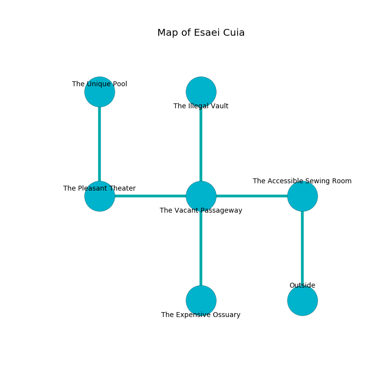

%Ruin Dogs

##Esaei Cuia
###Overview
Esaei Cuia is constructed on a broken rift. Parts of Esaei Cuia are incredibly hot. The ruin is burning. It is occupied by Drows. Jade Womack The Cantankerous, a Frost Giant is here. The Drows are battling Jade Womack The Cantankerous. She  is trying to understand [Cofwi](#Cofwi). 

###Artifact
####Cofwi

Cofwi has the form of a hard sphere. It is a bright white color. Cacophony flows towards it. When rubbed it flies into the air. 

###Locations

####the accessible sewing room
The floor is bloodstained. The air tastes like ham here. Gray lichens are sprouting in cracks in the floor. 

* To the west a torchlit cave opens to [the vacant passageway](#the-vacant-passageway).
* To the south is the entrance.

####the vacant passageway
There are a Hill Giant, a Chuul, and a Quaggoth here. Green ferns are decaying in a patch on the floor. The floor is cluttered with debris. 

There is an engraving on a tablet written in common. 

> [Cofwi](#Cofwi)
>
> odd, influential, mutual
>
> A curtain is a guitar
>
> late and mild
>
> yet never aloof
>
> [Cofwi](#Cofwi)
>
> but delicate
>
> [Cofwi](#Cofwi)
>
> satisfied and right
>
> [Cofwi](#Cofwi)
>
> yet never convenient
>
> [Cofwi](#Cofwi)
>
> yet profound
>
> [Cofwi](#Cofwi)
>

* To the west a windy pathway leads to [the pleasant theater](#the-pleasant-theater).
* To the east a torchlit cave connects to [the accessible sewing room](#the-accessible-sewing-room).
* To the north a dripping hall leads to [the illegal vault](#the-illegal-vault).
* To the south a dripping artery opens to [the expensive ossuary](#the-expensive-ossuary).

####the pleasant theater
There are a Half-Red Dragon Veteran, a Black Bear, and a Bone Naga here. 

* [Cofwi](#Cofwi) is here.
* [Jade Womack The Cantankerous](#Jade-Womack-The-Cantankerous) is here.
* To the east a windy pathway leads to [the vacant passageway](#the-vacant-passageway).
* To the north a flooded gap leads to [the unique pool](#the-unique-pool).

####the illegal vault
There are a Shield Guardian, a Kenku, an Umber Hulk, a Crab, and a Tridrone here. White ferns are decaying from the ceiling. The air tastes like mimosa here. 

* To the south a dripping hall opens to [the vacant passageway](#the-vacant-passageway).

####the expensive ossuary
The metallic walls are scratched. There are thirty two Drows here. One of the Drows is on watch, the rest are caring for babies. 

* To the north a dripping artery connects to [the vacant passageway](#the-vacant-passageway).

####the unique pool
There is a trap here. When activated, a magical sound detector will launch a poison needle. Yellow moss is swaying from the ceiling. The stone walls are scratched. The air tastes like tallow here. 

* To the south a flooded gap leads to [the pleasant theater](#the-pleasant-theater).

