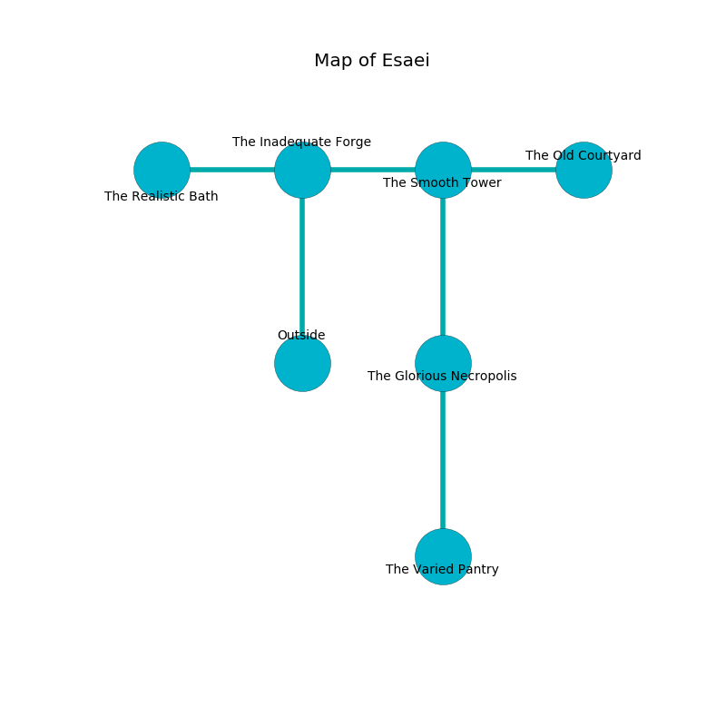

%Ruin Dogs

##Esaei
###Overview
Esaei is located in an obsidion city. Some areas of it are cursed. A battle between raiders is happening outside. It is occupied by Drows. Devin Rosenthal The Possessive, a Yuan-Ti Abomination is here. The Drows have been charmed by Devin Rosenthal The Possessive. He  is trying to use [The Glad Hero](#The-Glad-Hero). 

###Artifact
####The Glad Hero

The Glad Hero looks like a warm gem. It is a bright pink color. Magic slides near it. It smells like fruit. When picked up it projects energy. 

###Locations

####the inadequate forge
There are a Hydra, a Commoner, a Boar, a Swarm of Insects, an Ice Mephit, a Swarm of Quippers, an Elephant, and a Merfolk here. The air smells like metal here. The floor is flooded with five inch deep scalding water. 

* To the west a flooded hall connects to [the realistic bath](#the-realistic-bath).
* To the east a twisted opening opens to [the smooth tower](#the-smooth-tower).
* To the south is the entrance.

####the realistic bath
The floor is cluttered with shells. There are thirty two Drows here. Blue mushrooms are growing from the ceiling. The Drows are meditating. 

There is an engraving on a stone written in Drows Script. 

> [The Glad Hero](#The-Glad-Hero)
>
> but full-time
>
> yet important
>
> superior and wise
>

* To the east a flooded hall opens to [the inadequate forge](#the-inadequate-forge).

####the smooth tower
White ferns are swaying in cracks in the floor. 

* [The Glad Hero](#The-Glad-Hero) is here.
* To the west a twisted opening opens to [the inadequate forge](#the-inadequate-forge).
* To the east a flooded threshold leads to [the old courtyard](#the-old-courtyard).
* To the south a narrow hall leads to [the glorious necropolis](#the-glorious-necropolis).

####the glorious necropolis
The metallic walls are unsettled. There are a Veteran, a Priest, and a Yuan-Ti Malison here. The air smells like spice here. There is a trap here. When activated, a pressure plate will launch stone blocks from the ceiling. 

* [Devin Rosenthal The Possessive](#Devin-Rosenthal-The-Possessive) is here.
* To the north a narrow hall leads to [the smooth tower](#the-smooth-tower).
* To the south a dark artery connects to [the varied pantry](#the-varied-pantry).

####the varied pantry
The obsidion walls are scratched. The floor is cluttered with ashes. There is a trap here. When activated, a tripwire will shoot a lightning bolt. There are thirty two Drows here. One of the Drows is on watch, the rest are feasting. 

* There is a bone here.
* To the north a dark artery opens to [the glorious necropolis](#the-glorious-necropolis).

####the old courtyard
The floor is flooded with one inch deep scalding water. 

* There is a knot here.
* To the west a flooded threshold connects to [the smooth tower](#the-smooth-tower).

